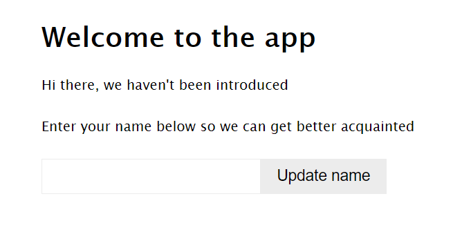
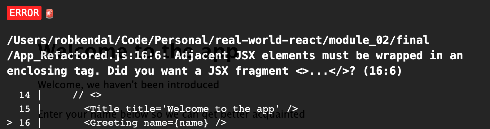
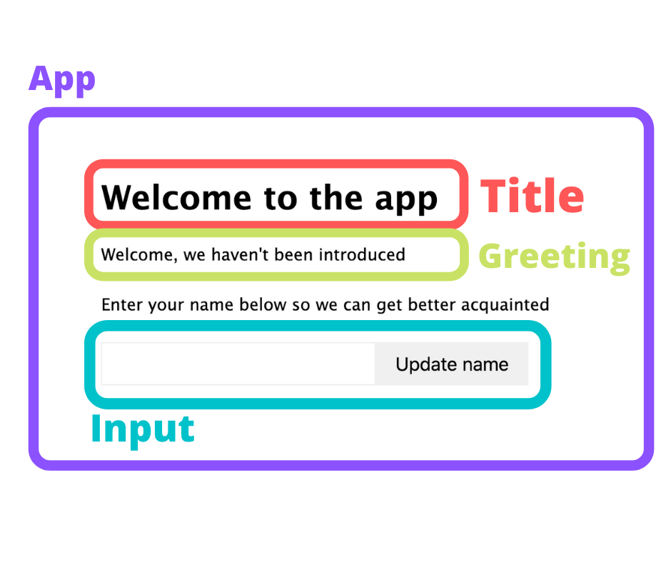

# React - A Modern UI Library

Welcome to to Front-End Foundations with "Real World React". Let's see what the course will cover and what you'll learn.

## Why this course

Real World React will teach you how to successfully build web applications with modern frontend techniques, using the `ReactJS` library.

`ReactJS` (or simply React) is a popular UI library developed by Facebook and first published in May 2013. It allows for a modular and declarative approach to building user interfaces for web-based applications. It has grown very popular over the past few years and is one of the most sought after libraries to learn and use by new and upcoming developers.

However, React on its own is only one piece of the puzzle and it doesn't, out of the box, provide for some of the missing pieces of common frontend development. Pieces such as:

- Connecting to an API or external data source and retrieving data to power your app.

- Navigating around your app to different pages or areas.

- Managing the "`state`" of your application's data at a higher level (i.e. outside of components).

The problem is, these missing pieces are vital parts of any modern web application, as well as any realistic development scenario. It's key to understand both their concepts and how to approach them in React development. 

On completion of this course, you'll not only have a knowledge of modern React development, but also the skills required to build real-world apps that talk to real data.

You don't have to be a coding jedi or have years of experience as this course is designed for beginners. However, you should be familiar with the basics of frontend development, including `HTML`, `CSS` and `JavaScript`. It would be helpful to have an understanding of basic concepts around RESTful APIs and how to interact with them, but it's not essential.

## Course topics

You'll join us on a deep dive into core React concepts. As you progress through this course, you will learn more about how React works, how you can use it to build complex web applications, and how to combine it with third-party libraries and frameworks to 'join the dots'. You will gain a detailed understanding of how you might use React in a real world setting.

### Week 1

Included in part one of the course are the following lessons:


- Lesson 1 - React JS: an introduction to React, a modern UI library.

- Lesson 2 - React Core Concepts: what they are and how to use them.

- Lesson 3 - Fetching data: using APIs in your code, and popular helper libraries such as Axios.

### Week 2

The outline for week two of the course includes the following lessons:

- Lesson 4 - Deploying your first app: using Netlify to deploy our app to the public.

- Lesson 5 - Thinking in React: structuring your projects, breaking functionality into components

- Lesson 6 - React Hooks deep dive: learn what each Hook does and how to use them

- Lesson 7 - Navigation in complex apps: moving users around different areas of your application

### Week 3

The outline for week two of the course includes the following lessons:

- Lesson 8 - Redux: using Redux and useReducer Hooks to manage app state

- Lesson 9 - Redux Alternatives: Add the Redux Toolkit

- Lesson 10 - Final Project: The Dinosaur Search Ap. Putting it altogether by building your very own application


## What is React

React is a declarative JavaScript library introduced by Facebook in 2013. You'll look at how React came about and determine some of the skills you'll need as a React developer.

Let's start by looking at React's definition from the official React JS website:

"[React](https://reactjs.org/) is a declarative, efficient, and flexible JavaScript library for building user interfaces. It lets you compose complex UIs from small and isolated pieces of code called “components”."

React allows you to break down your complex user interfaces into smaller, bite-sized pieces of functionality that operate on their own; managing their `state`, given some sort of `input` data referred to as `props`. These smaller components are brought together as building blocks for larger, more complex user interfaces that interact via passed in `data` and `events`.

**Components** are written using a combination of JavaScript and HTML, mixed together into files that commonly carry a `.JSX` file type (although this is not strictly necessary).

React is declarative in nature. To clarify this, when React is described as 'declarative', it means you can tell React what you want it to do, or display, without having to worry about how this will be achieved.

As an example, if you update `text` and `color` on a page using plain JavaScript, it would look like this (an imperative way):

```
const myHTMLElement = document.querySelector('#my-element');

// Update the text
myHTMLElement.innerHTML = 'updated text';

// Update the color
myHTMLElement.style.color = 'red';
```

Using React, the above example can be displayed in a declarative way:

```
function MyReactComponent = ({text, textColor}) => (
 <p style={{color: textColor}}>
  { text }
 </p>
);
```

You can see in the second example you only have to describe your desired final state of the UI without physically walking through each change to the UI you want to make.

The other nice thing about React, is it uses an adoptive approach. So, inside your websites and applications, you can use as much or as little of React as you wish, as suits your needs.

React remains one of the most popular JavaScript libraries for building robust user interfaces today, and more and more people are keen to learn and adopt it into their development toolbox.

React (much like comparable libraries such as Vue JS), is mainly JavaScript. There are a few conventions, approaches, and syntax unique to React, but the  majority of what you will produce will be JavaScript. Within that JavaScript, you'll write `HTML`-like blocks of code referred to as `JSX`. Not strictly `HTML`, it is almost identical to what you would write in a standard `.HTML` file.

Let’s look at an example:

```
import React from 'react';
import Title from './components/Title.jsx';

const App = ({ firstName, lastName }) => {
  const getFullName = () => {
    return `${firstName} ${lastName}`;
  };

  return (
    <div>
      <Title />
      <p>
        Welcome {getFullName()} to Front-End Foundations React!
      </p>
    </div>
  );
};

export default App;
```

The first two lines are standard JavaScript `import` statements. You include React because it needs to be in scope to use it, and then you import a component called `Title`.

```
import React from ‘react’;
import Title from ‘./components/Title.jsx’;
```

Next, create a functional `component`:

```
const App = ({ firstName, lastName }) => {
  const getFullName = () => {
    return `${firstName} ${lastName}`;
  };

  return (
    <div>
      <Title />
      <p>
        Welcome {getFullName()} to The Beginner’s Guide to Real World React!
      </p>
    </div>
  );
};
```

A **functional** component is just that…a function! You’re using the **arrow function** syntax to write it, but you can see there’s nothing fancy or complex about it.

The main ‘React-y’ part comes when you look at what your component returns, which is `JSX`:

```
<div>
  <Title />
  <p>
    Welcome { getFullName() } to Front-End Foundations React!
  </p>
</div>
```

It looks like `HTML`, and to a degree it is. From a declaration point of view, there’s not much difference. There are a few subtle differences unique to React. For example, the `<Title />` line where you reference your imported component isn’t a native `HTML` element. This is a component tag in the `JSX` that React knows to interpret as ‘**please load in my component called ‘Title’’**. Second, where you call your full name method — `{ getFullName() }` — this wouldn’t work in standard `HTML`. The method wouldn’t be called, rather you’d just get the string ‘`{ getFullName() }`’ output to the browser.

## Which Front-End Framework is Best

So to answer the question, it really depends on the individual. I feel it’s much easier (and preferable) to get a solid grounding in the fundamentals of JavaScript, HTML, and CSS before adopting a library such as React. That said, since the primary content you’ll be producing in React is ‘just’ JavaScript, you can jump straight into React too.

Any library, framework, platform, language, design, pattern are all just tools.

With that said, you’re here to become React Jedi,s so let’s choose React and start your learning journey.

## React Drawbacks

React is not very opinionated compared to some of its alternatives (which can be a blessing or a curse depending on your outlook), and it is primarily focused on rendering data into the `DOM`.

This can be a double-edged sword: on one hand, it’s relatively light-weight and easy to learn the basics to get going quickly. On the other hand, by being so `DOM`-focused, it lacks some of the other vital puzzle pieces involved in web app development.

For example;, if you want users to navigate around your application or manage your application’s `state` at a broader level, you’re going to need to use additional, third-party libraries such as `Redux` and `React Router`.

A common complaint with React is the learning curve. It is not as steep a framework as Angular, but it does not have the simplest learning curve and can leave some aspiring React developers stumped with particular mechanisms such as updating `state` and passing data via the `props` object.

For experienced developers or teams using agreed development standards, this might be less of a problem. However, for newcomers to both React and frontend development in general, being turned loose with the React library without a clear set of best practices or other guidelines can lead to poor coding standards, code quality issues, and frustration as you receive conflicting advice on how to approach `component` development.

Don’t worry.  In this course, you’ll explore some of the most popular and common approaches to fill in the blanks React leaves you with.

## First React App - The Greeting App

Before you dive into more deep and challenging topics, let's have some fun building an app. Your first React app will present your users with an input, and send them a friendly greeting message. You build a really simple React app that accepts a `name` from your user and displays this as part of a nice greeting message.

Let’s look at what you’ll be building.



This is the finished example you will build, before you refactor it. Once it’s running, you see a simple `title` to welcome the user to the app, and a set of instructions to invite the user to enter their `name` and click the ‘`update`’ button.

If I enter my details and hit the update button, you see the text ‘we haven’t been introduced’ is replaced with my name, ‘Vicki Bealman’.

This is a straightforward project, not too complex, but highlights a number of key React concepts you’ll be building on throughout the course.

Next, you break the Greeting App down into its `component` parts and take a sneak peak under the hood at how everything pins together.

## :pushpin: L01 Hands On Guided Learning: Build the Greeting App

Welcome to your very first React hands-on practice assignment, as part of this React Course.

The first real example you will build is a really simple greeting app that’s going to accept a `name` in an `input` box and output it back as part of a welcoming message.

## Requirements

1. Read all the guided learning text carefully for understanding.
2. Follow all instructions and coding step-by-step.
3. Create all files and folders for the Greeting App.
4. Complete all coding as demonstrated in all files.
5. Zip `L01ReactHandsOnPractice` Folder
6. Attach the zipped folder below where indicated for submission.

### Add Parcel Bundler

You can use React by loading it using a `script` tag from a package repository like `unpkg`. However, what you find with most real-life React projects is they will be adding the React libraries with `npm` and usually use a code bundler such as `Webpack`, or even the Create React App starter project (which uses `Webpack` under the hood).

You' will do something similar so you get familiar with using a common means to build and run a React project. For this, use `Parcel JS`.

`Parcel JS` is a simple code bundler much like `Webpack`, but without much of the complex configuration and setup. In its own words `Parcel JS` is a ‘blazing fast, zero-config web application bundler’.

Open the [Parcel JS](https://parceljs.org) website and head to the ‘getting started’ section for additional information. 

- Install it globally on your machine by using the commands on this page:

:writing_hand:

`npm i -g parcel-bundler`

Or

`yarn -global add parcel-bundler`

Open a brand new project in **VS Code**.

:writing_hand:

1. `cd desktop`

2. `cd softwaredevelopment`

3. `cd FEFReact`

4. `mkdir L01ReactHandsOnPractice`

5. `git init`


## Add React to the Project

You have a new, empty folder you opened in VS Code. You have a `.gitignore` file and a `readme` because you connected the project with a git repository. 

- You’re not going to use those files and you can ignore them for now.

You don’t need to do any configuration to make it work, because you’re using `Parcel`. You **do need** to add React to your project.

Open your terminal in VS Code, and it will open in the current working directory of your project. From here, complete three steps to get your project up and running with everything you need:

1. Initialize your project

2. Add the React dependencies

3. Add a shortcut script to build and run your code

### Initialize the Project

1. The first step is to initialize your project with a `package.json` file. Run the command:

:writing_hand:

`npm init -y`

2. Add the `-y` flag which will automatically answer `yes` to all the initialization questions; ‘who's the author?’, ‘what's the license?’, and questions you don’t care about for our example.

### Add React Dependencies

3. Next, add `React` to the project. There are two packages you need; `React`, and `React DOM`. 
- `React` is the star of the show and includes the core `React` library. 
- `React DOM` is a secondary package responsible for rendering  `components` to the `DOM` in the browser.

4. Back in your terminal, type the following command to add both packages to the project:

:writing_hand:

`npm install react react-dom`

### Add Scripts for Building and Running the Code

5. The final part of setup involves the `package.json` file. You should see the `react` and `react-dom` dependencies in there.

After you build your app, call `Parcel` to bundle everything, and run it. It’s not a huge job, but you can add a simple shortcut to help out.

In your `package.json` file, add a new property, ‘`scripts`’ and add a new command property under this and call it ‘`start`’. Next, add the command:

:writing_hand:

`parcel index.html —open`

The new part of the `package.json` file should look like this:

:writing_hand:

```
"scripts": {
    "start": "parcel ./src/index.html --open"
  },
```

You have just written a terminal shortcut that will allow you to type `npm start` and have your `Parcel` command open your starting file, and the `--open` flag tells `Parcle` to open the running code in a browser once the files have been compiled and Parcel’s development server is up and running.

`Parcel` works by giving the app an entry point, in this case, your `index.html` file which you build next. From there, `Parcel` determines which files it needs to include in the bundle based on your imports and file references.

## Code the Project Files

On to the exciting part: build out your app! For smaller projects like this, just start by creating all the files you need, and then filling them in as you go along.

For your greeting app, create four files. So create them now. You'll need:

1. A **style**s file, called `styles.css`. You just have some basic styles to make your app look slightly more interesting than the out-of-the-box HTML.

:writing_hand:

`touch styles.css`

2. Your **Parcel** starting point, `index.html`. This is the very first entry point Parcel is going to look for to `render` your app.

:writing_hand:

`touch index.html`

3. A starting point for the JavaScript, which will be `index.js`.

:writing_hand:

`touch index.js`

4. And finally, your main React component, which you call `app.js`. This is your main entry point for the React side of things.

:writing_hand:

`touch app.js`

After you have the files created, fill them in. Start with your `styles.css` file.

### Styles.css

Your styles file isn’t absolutely essential at this point, but it’s nice to have a few basic styles improve the built-in look and feel browsers give by default.

:writing_hand:

<details>
<summary>Styles.css</summary>

```
body {
  font-size: 16px;
  line-height: 1.4;
  font-family: 'Lucida Sans', 'Lucida Sans Regular', 'Lucida Grande',
    'Lucida Sans Unicode', Geneva, Verdana, sans-serif;
  margin: 5em;
}

p {
  margin-bottom: 1.6em;
}

input {
  padding: 0.5em 1em;
  line-height: 1;
  font-size: 18px;
  border: 1px solid #ececec;
}

button {
  border: 1px solid #ececec;
  background: #ececec;
  padding: 0.5em 1em;
  cursor: pointer;
  font-size: 18px;
}

button:hover {
  background: #c9c6c6;
}
```
</details>

You see some simple styles that just affect the `body`, `font size`, and `line-height`. Later, you add an `input` and a `button` to your app, so you also added some nice styles for those.

'Save' and move to your entry point; your `index.html` file.

### index.html

Add `HTML` to your `index.html` file. 

- I suggest using **Emmet Extension** that comes with VS Code, because it allows you to type the name of the `HTML` elements, like ‘`head`’ or ‘`title`’, hit the tab key, and Emmet will output the complete `HTML` element’s tag rather than having to type it all out by hand. It’s a nice little timesaver.

:writing_hand:

<details>
<summary>index.html</summary>

```
<html>
  <head>
    <title>My first React example</title>
  </head>
  <body>
    <div id="root"></div>
    <script src="index.js"></script>
  </body>
</html>
```
</details>

Add the `HTML` tag first. Inside that, add a `<head>` tag, and within that, add a `<title>` tag. Give it a `title` of ‘`My first React example`’.

You need a `<body>` tag, so add that. Within the `<body>` tag, you need two things:

1. An element to render your React output into.

2. A script tag to reference your JavaScript entry point, `index.js` (which you create once you’re done here).

For the first one, add a `<main>` element and give it an `ID` of ‘`output`’. Finally, add your `<script>` tag that references `index.js`.

When `Parcel` runs, it looks in the `index.html` file first for any `script` tags. When it finds one pointing to `index.js`, it looks there to see what other JavaScript files it needs to import and chain together, to bundle into your working app.

### index.html contents

:writing_hand:

```
<html>
  <head>
    <title>My first React example</title>
  </head>
  <body>
    <div id="root"></div>
    <script src="index.js"></script>
  </body>
</html>
```

Save the file and move to the main JavaScript entry point; the `index.js` file.

## index.js

Inside your `index.js` file is where the magic happens. It’s the first place you really set up your React app to load and inject content into your `HTML` page. This is going to be a small file where you add your very first piece of React code.

Do a few things inside this file:

1. Import `React`

2. Import your main App `component`; the starting point for your React app

3. Use `React DOM` to `render` your App to the browser

### Import React and the App Component

Import two React packages: `React` and `React DOM`. 

#### index.js

:writing_hand:

```
import React from 'react';
import ReactDOM from 'react-dom/client';
​
import App from './App';
```

**Note** 

When doing anything with React, you must import it at the **top** of the file. 

- This is bringing React into **scope**. 

For this file, you need the `React-DOM/client` package, which is responsible for rendering React code to the browser.

Import your `App` component, which will complete greeting the user.

Make sure your app gets rendered to the browser. To do that, call the `render` method from the `React-Dom/client `package you imported.

#### index.js

:writing_hand:

```
ReactDOM.createRoot(document.getElelmentById('root')).render (<App />;)
```

`ReactDOM.render()` accepts two arguments:

1. The component you want to render (`APP`).

2. Where you want to render it, i.e. the '`root`' `div` in your `HTML` element from the `index.html` file.

To add your `App` component into the `ReactDOM.render()` method, get your first peep of `JSX`, React’s XML-like syntax. It looks very similar to `XML` or `HTML` and later on, you add `paragraph` tags and `input` elements into your components. It’s important to know the difference. What you’re using here is `JSX` which is propriety `React` syntax.

For the second part, use the built-in `document.getElelmentById` method to find the `<root>` element you created in your `index.html` file. You gave it an `ID` of `output` so you’ll use that here to find it.

Save the file and move to your `App` component.

### App.js

**Note** 

The name of the file has been capitalized to ‘`App.js`’. This is not 100% necessary, but it’s a convention used among React projects to capitalize any component file names.

The last piece of the puzzle is to build out your `App` component to make something happen and greet your users.

If you use React, you need to have React in scope. Import React at the top of the file.

#### App.js

:writing_hand:

```
import React, { Component } from 'react';
```

### Scaffold the app

Outline the basics of the component and then export that component so it can be used in another file, or another component.

It will look like this:

:writing_hand:

```
class App extends React.Component {
  // TODO - implement component contents
}

export default App;
```

Use a class-based component, an older less-preferable means to build components. However, you’ see them out in the wild, so it’s useful to take a look at how they’re built. For future lessons, you use the more modern functional components with **React Hooks** which look quite different.

For **class-based** components, you  `extend` React’s Component class. Type the `extends` keyword after your class declaration, and then extend the `React.Component` class there.

To make this look a little cleaner, import the `Component` class as part of your React import at the top of the file. Add it as a named import like this:

**App.js**

:writing_hand:

`import React, { Component } from 'react';`

By doing that, you replace the `React.Component` part with just `Component`.

Finally, add a `default export` for this component which is just `App`. Add this right after your class declaration.

:writing_hand:

**App.js**

`export default App;`

You’re not quite finished yet, but have the building blocks in. If you run this now, nothing would happen because your component doesn’t return anything.

### Add a Title

All React components have to provide a `return` which is usually a block of `JSX`. With class-based components, you have to first provide a `render()` method and then add a `return` statement within the `render()` method.

To get started and to test your app, return a `heading`. Add a `render()` method, add a `return` statement within that, and add a simple message using an `<h1>` tag.

:writing_hand:

**App.js**

```
render() {
 return (
  <h1>Welcome to Software Development</h1>
 );
}
```

Great! Jump over to your terminal and type `npm start` to start Parcel building, and run your app. Parcel’s going to find your `index.html` file, follow it to your	`index.js` file. This will load your `App` component, and then Parcel will bundle that all up, optimize it, and start a local development server that runs at http://localhost:1234.

The development server should start and open a web page where you see your lovely welcome message, ‘`Welcome to Software Development`’.

#### Tip!

Another nice thing about Parcel’s local development server is hot reloads, responding to file changes on saving and refreshing the browser!

### Prevent JSX errors with React Fragments

An important thing to note about `JSX` is you can only return one top-level element. To highlight this, if you type a `paragraph` tag in here and say ‘`this is a paragraph`’, then click save, you'll see we get a nasty error message.



The error message states ‘`Adjacent JSX elements must be wrapped in an enclosing tag. Did you want to use a JSX fragment?`’

You have adjacent, top-level elements in your `return` statement. To fix this, wrap these elements in a containing element. Wrap them in a `div` and click save.

When the `app` reloads you see your message and paragraph and, more importantly, no error.

Adding a `div` element is fine for your example here, but you might have situations where you don’t want additional markup output to the browser, and wrapping everything in a `div` or some other element won’t be sufficient.

For these cases, use the `React.Fragment` syntax. Replace your containing `div` element with either the `React.Fragment` syntax or its shorthand:

#### index.html

:writing_hand:

<details>
<summary>index.html</summary>

```
// both of these statements are equal
<React.Fragment>
 <h1>Welcome to Software Development</h1>
 <p>This is a paragraph</p>
</React.Fragment>

<>
 <h1>Welcome to Software Development</h1>
 <p>This is a paragraph</p>
</>
```
</details>


The shorthand version looks much neater and cleaner. Use this version wherever it’s needed.

#### Note!

`React` and the `DOM`: React uses its own copy of the `DOM` which is called the **Virtual DOM**. React handles changes to this internal copy of the `DOM` and the real `DOM` in the browser to keep everything in sync. Although `JSX` looks almost identical to the same HTML you’d type into a `.html` file, it’s important to understand it doesn’t map directly to the `HTML` that’s eventually output to the browser.

### Add a Dynamic Message

Expand your app. In the first paragraph, return user's name once they type it in. Modify paragraph tag to include some executable code.

:writing_hand:

**index.html**

```
<p>Hi there, {this.state.displayName}</p>
```

If you do this in `HTML`, you just get a paragraph with the text, ‘`Hi there, {this.state.displayName}`’. Because you use `JSX`, anything between the curly braces will be interpreted as executable JavaScript by React and evaluated as such.

Notice a call to a class property called `state`. Each component has access to its `state` and its `local storage`. You store values in a `state` as well as retrieve them, which is what you’re doing here.

Your line, `{this.state.displayName}` is really saying ‘get me the `displayName` value out of this component’s `state`’.

You haven't added your `state `yet, so do that now.

### Add State to Your app

Within a class-based component, just like a regular JavaScript class, initialize any state values in the constructor.

**App.js**

:writing_hand:

```
constructor(props) {
  super(props);

  this.state = {
    displayName: ''
  };
}
```

React automatically wires up your constructor when the component is created, and it passes it a properties object, called `props` for short (you see this often when dealing with React).

The first thing to do in your constructor is call the parent class constructor (the parent class is the Component class you extended right at the beginning) using `super` method, passing in the `props` object.

To add your component’s `state` property, simply call `this.state` and set it to an object that contains whatever data you need it to. For now, just add the `displayName` property and set it to an empty string.

#### Note!

An important thing to know about `state` is that it is **immutable**. This means it can be updated by using React’s `setState()` method, but never edit `state` directly. The only time you ever set `state` directly is in a constructor.

You don’t have to initialize `state` in the constructor as you’re doing here, but it’s a good habit to get into so anyone coming into the class can see what properties should be expected to exist on the `state object`, and what their `values` or their `types` should be.

### Handle User Input

You have your dynamic welcome message, but you need to allow the user to enter their name so you can greet them personally.

Add some instructions and an input box:

:writing_hand:

#### App.js

```
        <p>Enter your name below so we can get better acquainted</p>
        <input value={this.state.name} onChange={this.handleChange} />
        <button onClick={this.handleClick}>Update name</button>
```

Set your input’s `value` to another `state `value, `{this.state.name}`. By doing this you turn it into a controlled component. HTML form elements like `input`s, `select`s, and `text` areas are typically uncontrolled components because they handle their own `state` and `values`.

By letting React handle your input’s `value` from `state`, it becomes a controlled component, which means React is responsible for maintaining the `state` of any `value` we assign to it.

Since you added a new `state` value reference here, update your component’s `state` in the constructor:

:writing_hand:

**App.js**

```
constructor(props) {
  super(props);

  this.state = {
    displayName: '',
   // add our name value
    name: ''
  };
}
```

If you stop there, however, the value of the input will always be an empty string. You need a way to update this `value` in `state` whenever someone updates the text.

Add an event handler to the `input` element. The perfect place to do this update will be as part of the `onChange` event, which fires every time the text in the `input` changes.

Add the `onChange` event to the `input` and add a handler function, `handleChange` which you define next.

:writing_hand:

**App.js**

```
        <input value={this.state.name} onChange={this.handleChange} />
```

Now, define the `handleChange` event. Add it before the `render()` method in our class.

:writing_hand:

**App.js**

```
  handleChange = evt => {
    this.setState({
      name: evt.target.value
    });
  };
```

The handler function is a simple `arrow` function that accepts one argument, which is an event object React automatically passes in for you (also known as a synthetic event). You call it `evt` here, but you might see it called `e` or `event`.

In this function, update your `state`’s `name` value with whatever text your user has entered. To do that, use React’s built-in `state` updating method, `setState()`.

Call `setState()` and pass it an object that contains any `property:value` pair you want to update in `state`. You want to update the `name `property with a value of your text input which you can grab from the `evt` argument using `evt.target.value`.

### Trigger a Greeting with a Button

For this to really be a true app, give your users a way to trigger a greeting message update after they’ve updated their name in the `input` box.

Add a button just under your `input` with a similar event handler, but this time the event will be `onClick` instead of `onChange`. You also give it some text, ‘`Update name`’:

:writing_hand:

**App.js**

```
  handleClick = evt => {
    this.setState({
      displayName: this.state.name
    });
  };
```

The `onClick` event is very similar to `onChange` and again it’ll receive a synthetic event argument you’ll just call `evt` again.

Your `click` handler method is doing the same update to `state` by calling the `setState()` method, but this time you’re updating your `displayName` value.

The `displayName` value is going to be the same as the final value they enter in the `input` box, which you already set to the `state` value, `name`. So that’s what you use to update `state` within your `handleClick` method.

## Test Your Greeting

Now that you have everything you need, save your `App.js` file, and take a peek in the browser. Enter a `name` in the `input` box and click ‘`Update name`’.

Instead of ‘`Hi there` ’, you get ‘Hi there, Vicki Bealman’ (or whatever name you entered).

### Finishing touches

The very last part of your Greeting App is to add a little polish. Remember those styles you added at the start? Now, add them to the `app` by importing them just before the class component:

#### App.js

:writing_hand:

**App.js**

`import './styles.css';`

Save and take another look in the browser. It’s not an emmy award-winning app just yet, but you can see it looks a lot better already.

Last but not least, you have an initial message, ‘`Hi there`, ‘ and then just nothing. You make this a little more interesting by adding in a default message ’`we haven’t been introduced`’.

Do this by amending your initial greeting message using a logical `OR` statement. This sounds fancy, but it’s really a shorthand `if` statement in JavaScript you see used often in React to say ‘**evaluate both sides of this argument and return whichever is true**’.

#### App.js

:writing_hand:

**App.js**

```
<p>
          Hi there, {this.state.displayName || "we haven't been introduced"}
        </p>
```

Because your `state` value `this.state.displayName` is empty (`false`) by default, React will look at this and return the right-hand side of the argument, our default string.

**Congratulations**! Boom; that's it. That's your very first entrance into building a React app.

In the next section, you refactor your `App` component into smaller components and introduce some React Hooks.

### Submit

Include the submit zip folder box here, with link to open code solution after submission.

## Solution (Reveal after submission)

When complete, your `App.js` file should look like this:

<details>
<summary>Complete App.js File</summary>

```
import React, { Component } from 'react';

import './styles.css';
class App extends Component {
  constructor(props) {
    super(props);

    this.state = {
      name: '',
      displayName: ''
    };
  }

  handleChange = evt => {
    this.setState({
      name: evt.target.value
    });
  };

  handleClick = evt => {
    this.setState({
      displayName: this.state.name
    });
  };

  render() {
    return (
      <>
        <h1>Welcome to the app</h1>
        <p>
          Hi there, {this.state.displayName || "we haven't been introduced"}
        </p>
        <p>Enter your name below so we can get better acquainted</p>
        <input value={this.state.name} onChange={this.handleChange} />
        <button onClick={this.handleClick}>Update name</button>
      </>
    );
  }
}

export default App;
```
</details>

## :pushpin: L01 Hands On Guided Learning #2: Build the Greeting App

Welcome to your second React hands-on practice assignment, as part of this React Course.

You will build on the Greeting App you completed previously. 

## Requirements

1. Copy the completed project `L01ReactHandsOnPractice` folder. 
2. Save copy as `L01ReactHandsOnProactice2` inside your `FEFReact folder.
3. Open `L01ReactHandsOnProactice2` in VS Code
4. Read all the guided learning text carefully for understanding.
5. Follow all instructions and coding step-by-step.
6. Create all files and folders for the Greeting App.
7. Complete all coding as demonstrated in all files.
8. Zip `L01ReactHandsOnPractice2` Folder
9. Attach the zipped folder below where indicated for submission.


## Refactor the Greeting App

With your Greeting App, you will learn to 'think in React' by breaking down your small `App` into components and refactoring it to use them.

You built your first app and it’s looking and working great. Currently, it’s using the class-based component approach, but you will refactor it to achieve a few things:

- Think about your apps in a component, modular fashion.

- Try your hand at breaking down a larger component into smaller ones.

- Introduce the common functional component approach to building your React components.

At the moment, you have one large class-based component with all the different things going on, including your event handlers for on change and on click. You have a dynamic greeting and a title in there too.

It's not a very large component, but you can see how easily it could get out of hand as you add more and more features and functionality to it. It’s not very modular and it’s certainly not very reusable.

It's good practice to analyze your `components` and try to break them down into smaller ones where possible and where it makes sense. This way, you will encapsulate functionality into smaller working parts that can be duplicated and used in different places throughout your app.

### Thinking in Components

It’s useful to look at a larger component as a whole, and then think about the smaller, independent parts of functionality it contains. These smaller moving parts can be broken down into other components and used elsewhere; they’ll no longer be tied to this single, larger containing component.

To do that with your `App` component, look at what it’s currently doing and see there are three distinct functions it performs that would be good candidates for separate `components`:

1. **Displays a welcome message in a heading level one tag**:

	- This could have different styling applied in different parts of the app, or accept different messages on different pages, so it’s a good fit to be separated.

2. **Displays a dynamic message to the user including data from state**:

	- This greeting is simple and generic. You may see it on the home page, or in the main navigation, of an e-commerce site to greet whoever’s logged in.

3. **Accepts input from the user and triggers an event on click of a button**:

	- You’re using the input and button combination to accept a name, but it might also work on a contact form, or as part of a search form. Being able to have these two connected elements in one place, in a separate component makes it a great candidate for refactoring now.

Here’s a diagram of how you can group these separate areas of functionality into independent components: `Title`, `Greeting`, and `Input`. These child `components` will be imported into their parent, the `App` component.



### Plan the Refactor

You have an idea of the `components` you need to build, and now you just need a set of steps to carry out your refactoring work.

Those steps might look like this:

1. Create a `components` folder to hold your new `components`.

2. Create three new `components`;

	- `Title`
	- `Greeting`
	- `Input`

3. Refactor the `App` component to use your new `component`s.

4. Refactor the `App` component from class-based to a functional component.

## Refactor Setup

Now you have a plan. Do some setup work before you start. Like you did in the last section, create all the files you need first, and fill them in with code as you go along, building out the components and refactoring them as you go.

1. First, add a new folder, and call it `components`. 

:writing_hand: 

`mkdir components`

2. Within your `/components` folder, create three empty `component` files with the `.jsx` file extension (remembering to capitalize the first character in the file name):

:writing_hand: 

- **Title.jsx**
	`touch /components/Title.jsx`
- **Greeting.jsx**
	`touch /components/Greeting.jsx`
- **Input.jsx**
	`touch /components/Input.jsx`

Files with the `.jsx` extension are specific to the React library, and will typically contain the familiar HTML-like syntax you’ve seen in earlier sections. It’s important to note that this file extension is down to personal preference. JSX files will be converted into raw JavaScript by a tool such as Babel JS before being run in the browser. Some people prefer to have presentational components that just accept static data and display it, using the `.jsx` file extension to denote them. The important thing to remember is you can use either `.js` or `.jsx` to name your files. There is no difference, only personal preference.

Start moving through the files and coding them.

### Title.jsx

Start by repeating:

1. ‘React must be in scope in order to use it!’

2. Import React first before you do anything else.

Instead of the class-based approach previously used for your `App` component, the `Title` component will be your very first functional one. Define a functional component as just that, a function.

However, rather than define a function and then set it as the default export, do so in one line:

:writing_hand: 

**Title.jsx**

```
export default props => <h1>Welcome to Software Development</h1>;
```

**Note**

This is a nice style to have for smaller, less complex components, especially if they’re purely presentational, like here. However, if your components start to grow, or feature complex functionality that may cause bugs, it makes sense to define your function and assign it to a variable (i.e. a `const`) and then export it immediately afterward. This is because the React debugging tools struggle to identify components defined and exported in a single line as we are doing here.

You have a default export which is a function that accepts a props object and uses an implicit return (that is without the return keyword and some JSX within parentheses). Because you’re not doing any other logic, manipulating `state`, etc. you’re just returning some JSX, you use this implicit return to make things look a little neater and remove unnecessary lines of code.

That’s it…sort of. You have a `<h1>` being returned, but you have a fixed string, ‘Welcome to Software Development’. That’s fine for your Greeting App, but not very reusable if you want to have this component on another page that says something different.

Make this title dynamic. Instead of it being hardcoded to a string, use your curly brace syntax again and use a value you can pass in via your props object.

:writing_hand: 

**Title.jsx**

```
export default props => <h1>{props.title}</h1>;
```

However, take this another step further. Because you know you’re only passing in a `title` value via props, reference this value directly using object destructuring.

:writing_hand: 

**Title.jsx**

```
export default ({ title }) => <h1>{title}</h1>;
```

Props will expect and be passed a property called `title`, so by replacing props with some curly braces, now start to directly name properties you expect props to have. This is JavaScript’s destructuring syntax and it’s really helpful!

As well as replacing the props argument in your function, replace the `{props.title}` with just `{title`,} too.

You’re left with a really simple, small, reusable `component`. It can be used wherever you need across your `app` in different areas. It’s also useful if you need to make changes to the way titles look, such as styling, size, color, tag attributes; all those changes can be made in this one, single place.

**Note**

What you're making right now is a very contrived example to get a feel for React, but it's good to start thinking in terms of how you can use this in real world applications as you start learning and growing and building things for yourself.

This is something you do further on in the course as your apps start to grow and get bigger. But for now, this is your `title` component ready to go.

#### Completed Title Component

Here’s your finished Title component:

**Title.jsx**

```
import React from 'react';

export default ({ title }) => <h1>{title}</h1>;
```
### Greeting.jsx

Tackle the greeting message from your `App` component:

:writing_hand: 

**Greeting.jsx**

```
<p>Hi there, {this.state.displayName || "we haven't been introduced"}</p>
```

You have a paragraph tag with a string and a ‘`displayName`’ value you get from `state`. Pull this out into your `Greeting` component.

Start by importing React:

:writing_hand: 

**Greeting.jsx**

`import React from 'react';`

Like your `Title` component, do an inline default `export` next, along with an implicit `return`, because all you're doing is returning one line which is going to be your greeting with a dynamic name value.

:writing_hand: 

**Greeting.jsx**

```
export default ({ name = "we haven't been introduced" }) => (
  <p>Hi there, {name}</p>
);
```

You also repeat the destructuring syntax here to pull out the name value from props. The difference this time is you add a default value for the name variable, just in case it’s not set.

You could do the same as you had in your `app`, `{name || “we haven’t been introduced”`} using the logical `OR` operator, but this way is a little neater. 

You `Greeting` component is built.

#### Complete Greeting Component

Here's your complete Greeting component:

**Greeting.jsx**

```
import React from 'react';

export default ({ name = "we haven't been introduced" }) => (
  <p>Hi there, {name}</p>
);
```
### Input.jsx

The next thing to build is your combined `input` and `button` component. This one's going to be slightly larger, but still not very complex.

Import React into your component. This time you’re also going to add an extra named import `useState`.

:writing_hand: 

**Input.jsx**

`import React, { useState } from 'react';`

Because your input element relies on your `App` component’s `state` to manage its value, you use `state` in your new `Input` component. However, the `Input` component is a stateless, functional component, not a class-based one. To use `state` in a functional component, you use a feature of React called `Hooks`. In your case, to access `state` from a functional component, use the `useState` Hook.

**Tip!**

Hooks were introduced as part of React v16.8. They allow access to `state` and other React features without writing a class. You cover Hooks in greater detail in the next lesson, including `useState`. For now, focus on getting the components built as you code along and become familiar with the `useStat`e syntax for accessing `state` in a functional component.

You imported React, now define your `Input` component and export it. Be sure to copy in the `input` and `button` elements from your `App` component.

:writing_hand: 

<details>
<summary>Input.jsx</summary>

```
const Input = props => {
  return (
    <>
      <input value={this.state.name} onChange={this.handleChange} />
      <button onClick={this.handleClick}>Update name</button>
    </>
  );
};

export default Input;
```
</details>

Notice how you capitalized your `const` variable `Input`. This is the naming convention, not a rule. Since you create a `component`, it’s best practice to capitalize `component`s’ names.

### Update the Input Element

You can't have the `input` and the `button` side by side like this, becaue it'll throw an error. To avoid this, you wrap them in a React fragment.

The previous two components, `Greeting` and `Title`, both used an implicit return because they didn’t have any logic to deal with. They just returned their JSX elements. Your `Input` component needs to do a little more, specifically set values with the `useState` Hook.

Because of this, you explicitly define a return statement that contains your desired JSX output (i.e. the `input` and `button` elements). This is different from the `App` component, which has to define a `render()` method, which then returns some JSX. You also see that because the `Input` component is a function, you don’t need to define a constructor, or call a parent class’ `super()` method.

Your app is looking sharp so far, but you need to make a couple of edits for it to work.

:writing_hand:

**Input.jsx**

```
<input value={this.state.name} onChange={this.handleChange} />
```

Looking at the input element in your return statement, you still reference a `state` value and a `handleChange` event from your `App` component. Neither of these two things works because of the differences between your `App` component, which is class-based, and your `Input` component, which is functional.

Luckily, you can replace both these things with the `useState` Hook! First, define the Hook at the top of your component and then start using it with the input element.

:writing_hand:

**Input.jx**

`const [name, setName] = useState('');`

It may look a little strange if you’re not familiar with this sort of syntax, but the `useState` Hook works like this:

`useState` is a method React provides as part of its core library.

You call it, passing in whatever default value you want this particular item in `state` to represent. For example; you’re calling it using `useState(‘’)` which will set the value in `state` as an empty string.

The method returns an array with two items. The first item represents the value held in `state`, and the second item is a method that can be used to update the first item in `state`.

Use the array destructuring syntax in JavaScript to access both of these items.

In your component, you define a `const` which is a destructured array. This array contains two items: the first is the value held in `state`, call it `name`, but remember this is a title you’re giving it. You could call it anything, but call it `name` as that’s meaningful right now.

The second item will be the method `useState` provides to update the first value, the value held in `state`. Again, you can call it whatever you like, but the sensible convention is to call it the same as the name of the `state` value, prefixed the word ‘`set`’. Call it `setName`.

Now, whenever you want to update the value of `name` in `state`, call the `setName()` method, passing in a new value.

Looking back at your `input` element, you’re ready to update its attributes to use your new `state` Hook variables, `name` and `setName()`.

:writing_hand:

**Input.jsx**

```
      <input value={name} onChange={evt => setName(evt.target.value)} />
```

The first edit is to change the location of your `state` data for the `value={}` attribute on your input element. Change `value={this.state.name}` to remove the reference to `this.state` that only applies to a class. The value is now going to be stored in your name variable returned from the `useState` Hook.

Updating this reference gives  `value={name}`.

The next thing is replace the call to the missing `this.handleChange` method referenced in the `onChange={}` attribute.

:writing_hand:

**Input.jsx**

```
onChange = { evt => setName(evt.target.value) }
```

Since you use the `setName()` method you got from your `useState` Hook, you can actually simplify how you call this and do it inline, in the `onChange` attribute. Using a single line arrow function you just call `setName()` directly and use the same `evt.target.value` to reference the underlying value of the input element from the event (the evt argument) that you’re passed in by the `onChange` event.

Don't be be tempted to just call `setName()` directly without an arrow function like this, `onChange = { setName(evt.target.value) }`. Events like the `onChange` event, require you to pass a function that can be called when the time comes. By writing out the function directly and passing it arguments, you effectively invoke that function right away. This creates a problem, especially when you update `state` values, which causes React to render the component again, which, in turn, calls the function again, resulting in an infinite loop.

Next, update your `button` element.

### Update the Button Element

The `button` element presents an interesting situation. You need to trigger an update to `state` for the `displayName` property. However, that particular piece of `state` lives in the `App` component.

How can you update `state` data in another component?

Do it the same way you can pass data down to child components via the props object.  Send data back up using events and event handlers (see the next lesson for more information on this).

To do this, update your `button` element with a similar-looking anonymous arrow function you used for the `input` element.

:writing_hand:

**Input.jsx**

```
      <button onClick={() => props.handleClick(name)}>Update name</button>
```

This time, instead of calling a function on the `App` component’s class as you did previously (using `this.handleClick`), call the same function but from your props object. Pass in the up-to-date value for `name` from the local `state` data. 

#### Complete Input Component

Here's the complete `Input` component:

:writing_hand:

<details>
<summary>Input.jsx</summary>

```
import React, { useState } from 'react';

const Input = props => {
  const [name, setName] = useState('');

  return (
    <>
      <input value={name} onChange={evt => setName(evt.target.value)} />
      <button onClick={() => props.handleClick(name)}>Update name</button>
    </>
  );
};

export default Input;
```
</details>

## Update the App Component

With your three new components complete, it’s time to edit the `App` component to use them.

Import your new components.

:writing_hand:

**App.jsx**

```
import Title from './components/Title';
import Greeting from './components/Greeting';
import Input from './components/Input';
```

Next, you’re going to replace the exiting JSX with your imported components. Your new return statement should look much simpler now.

:writing_hand:

**App.jsx**

```
    return (
      <>
        <Title title='Welcome to the app' />
        <Greeting name={this.state.displayName} />
        <p>Enter your name below so we can get better acquainted</p>
        <Input handleClick={this.handleClick} />
      </>
    );
```

Look at the `<Title />` component reference. You added an attribute of `title=""` and passed in the string ‘`Welcome to Software Development`’. This means when your `Title` component calls `props.title` or references it as you have from destructuring, ‘`Welcome to Software Development`’ is what it will receive.

You do the same with your `Greeting` component, but this time, you’re passing the `name` attribute the `displayName` value from `state` using `this.state.displayName`.

Finally, you add your `Input` component, adding an attribute of `handleClick={}`, which needs to be a function the `Input` component can call via props.

### Other Small Changes

There are a few more changes to make to the `App` component before everything’s complete:

- Remove the `handleChange` event because you no longer need it. It’s handled in the `Input` component.

- Remove the `name` property from `state` because it’s also handled in your new `Input` component.

- Update the `handleClick` event to use the new `name` value that’s passed to it.

- Locate the `handleChange` event and remove it completely.

- Next, update the `state` object to remove the `name` property:

:writing_hand:

**App.jsx**

```
this.state = {
  name: '', // <--- remove this line
  displayName: ''
};
```

- Last, update the `handleClick` event to reference the `name` value that will be passed to it from the `Input` component.

Currently it’s referencing the `evt` object that was passed to it as an argument, so change this to `name` which will be the new string value passed in when this event is called within the `Input` component.

Then, in the `setState()` method, use `this.state.name` value which you just deleted.  Update this to use the `name` argument instead.

:writing_hand:

**App.jsx**

```
  handleClick = name => {
    this.setState({
      displayName: name
    });
  };
```

Now run this code and see everything working as before, but this time it’ll be using your shiny new components.

## Refactor the App Component

Make a couple more changes to the `App` component to modernize it and make the code a little smaller and more readable.

1. Convert `App` from a class-based component into a functional one.

2. Replace the current `state` mechanism with another use of the `useState` Hook.

### Convert a class-based Component to a Functional one

This process might seem a bit challenging, but it’s quite straightforward and gets easier the more you do it.

There are a few main parts to achieve it:

1. Replace the class keyword and general class declaration with a function `name` and `argument`(s).

2. Remove the constructor function (which is specific to classes), abstracting any logic you need out of there.

3. Move the `return()` statement outside of the `render()` method. Once this is done, delete the empty `render()` method.

4. Add the `const` keyword to any functions that are class properties.

The current `App` component class declaration and constructor will be replaced from this:

:writing_hand:

**App.js**

```
class App extends Component {
  constructor(props) {
    super(props);

    this.state = {
      displayName: ''
    };
  }
```

To this:

:writing_hand:

**App.js**

```
const App = props => {
  const [displayName, setDisplayName] = useState();
```

You need to use the `displayName` property from `state`, which is why you used the `useState` Hook again. Notice the same naming convention: you use `displayName` for the name of the value in `state`, and `setDisplayName` for the name of the function that will update this value in `state`.

To use the `useState` Hook, you import it where you currently import `Component` right at the top of the `App.js` file. You also remove the `Component` import, since you no longer use it.

:writing_hand:

**App.js**

```
import React, { useState } from 'react';
```

Remove the entire `handleClick` function because you replace it with your `setDisplayName` function call.

### Replace the render Method

Because the `render()` method is only needed for class-based components, replace it with the entire `return()` statement.

In practice, this:

:writing_hand:

<details>
<summary>App.js</summary>

```
  render() {
    return (
      <>
        <Title title='Welcome to Software Development' />
        <Greeting name={this.state.displayName} />
        <p>Enter your name below so we can get better acquainted</p>
        <Input handleClick={this.handleClick} />
      </>
    );
  }
  ```
  </details>

  Becomes this:

  :writing_hand:

  <details>
  <summary>App.js</summary>

  ```
      return (
      <>
        <Title title='Welcome to Software Development' />
        <Greeting name={this.state.displayName} />
        <p>Enter your name below so we can get better acquainted</p>
        <Input handleClick={this.handleClick} />
      </>
    );
```
</details>

### Update the displayName in State

You updated the `displayName` property to use Hooks, and you need to update two lines in your return statement.

The first isn’t a very big change, but since you don’t have access to a class property called `this.state`, just remove it completely, referencing `displayName` directly.

:writing_hand:

**App.js**

```
      <Greeting name={displayName} />
```

The very last thing to do is replace the call to a non-existent `this.handleClick` you passed into the Input component, with a direct call to the Hook method, `setDisplayName`.

:writing_hand:

**App.js**

```
      <Input handleClick={name => setDisplayName(name)} />
```

Again, to prevent an infinite loop or some other issue, you passed in an inline arrow function instead. It will receive a `name` value as an argument when the `Input` component calls this function, and immediately call the `setDisplayName()` method to update the `displayName` value in `state`.

Fantastic!! Everything for this Greetings App is finished. Save everything and refresh the page in the browser to see it in action. Everything should look and behave as it did before.

This refactoring process isn’t too painful, but you can see already how your `App` component is much smaller, much neater, and more modular. What you have now is a bunch of smaller components that contain their own logic and can be used throughout your app, as it grows and starts to expand with more sections.

### Submit

Include the submit zip folder box here, with link to open code solution after submission.

## Solution (Available after project submitted above.)

When complete, your `App.js` file should look like this:

<details>
<summary>The complete App.js file</summary>

```
import React, { useState } from 'react';

import './styles.css';

// Components
import Title from './components/Title';
import Greeting from './components/Greeting';
import Input from './components/Input';

const App = props => {
  const [displayName, setDisplayName] = useState();

  return (
    <>
      <Title title='Welcome to the app' />
      <Greeting name={displayName} />
      <p>Enter your name below so we can get better acquainted</p>
      <Input handleClick={name => setDisplayName(name)} />
    </>
  );
};

export default App;
```
</details>


