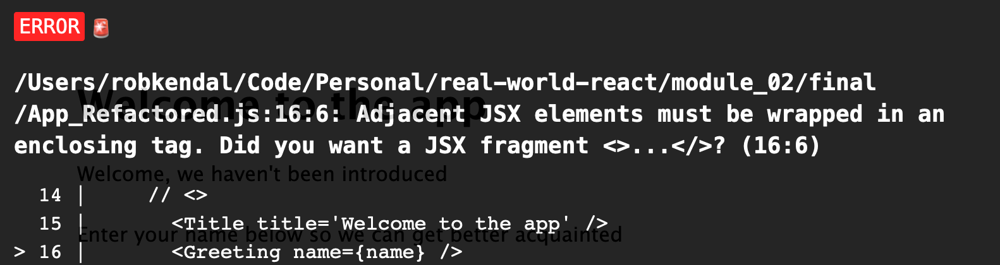

# React - A Modern UI Library

Welcome to to Front-End Foundations with Real World React. Let's see what the course will cover and what you'll learn.

## Why this course

Real World React will teach you how to successfully build web applications with modern frontend techniques, using the `ReactJS` library.

`ReactJS` (or simply React) is a popular UI library developed by Facebook and first published in May 2013. It allows for a modular and declarative approach to building user interfaces for web-based applications. It has grown very popular over the past few years and is one of the most sought after libraries to learn and use by new and upcoming developers.

However, React on its own is only one piece of the puzzle and it doesn't, out of the box, provide for some of the missing pieces of common frontend development. Pieces such as:

- Connecting to an API or external data source and retrieving data to power your app.

- Navigating around your app to different pages or areas.

- Managing the "`state`" of your application's data at a higher level (i.e. outside of components).

The problem is, these missing pieces are vital parts of any modern web application, as well as any realistic development scenario. It's key to understand both their concepts and how to approach them in React development. 

On completion of this course, you'll not only have a knowledge of modern React development, but also the skills required to build real-world apps that talk to real data.

You don't have to be a coding jedi or have years of experience as this course is designed for beginners. However, you should be familiar with the basics of frontend development, including `HTML`, `CSS` and `JavaScript`. It would be helpful to have an understanding of basic concepts around RESTful APIs and how to interact with them, but it's not essential.

## Course topics

You'll join us on a deep dive into core React concepts. As you progress through this course, you will learn more about how React works, how you can use it to build complex web applications, and how to combine it with third-party libraries and frameworks to 'join the dots'. You will gain a detailed understanding of how you might use React in a real world setting.

## Part I

In part one of the course, we'll take an end-to-end approach to React. We'll start with taking a look at the library itself and the problems it solves, before moving on to topics such as Hooks and handling data from an API. Finally, we'll talk about how to build and deploy our application to a popular service such as Netlify.

Included in part one of the course are the following lessons:


- Lesson 1 - React JS: an introduction to React, a modern UI library.

- Lesson 2 - React Hooks: what they are and how to use them.

- Lesson 3 - Fetching data: using APIs in your code, and popular helper libraries such as Axios.

- Lesson 4 - Deploying your first app: using Netlify to deploy our app to the public.

Part II

In part two, we'll cover similar topics to the first part but take a deeper dive into them and look at some of the challenges we face as React developers and how to overcome them. We'll also learn about navigating around our application, and managing `state` across our application using `Redux` -- a common stumbling block for aspiring React developers.

The outline for part two of the course includes the following lessons:

- Lesson 5 - Thinking in React: structuring your projects, breaking functionality into components

- Lesson 6 - React Hooks deep dive: learn what each Hook does and how to use them

- Lesson 7 - Navigation in complex apps: moving users around different areas of your application

- Lesson 8 - State management in complex apps: using Redux and useReducer Hooks to manage app state

- Lesson 9 - The Dinosaur Search App: putting it altogether by building our very own application


## What is React

React is a declarative JavaScript library introduced by Facebook in 2013. We'll look at how React came about and determine some of the skills you'll need as a React developer.

Let's start by looking at React's definition from the official React JS website:

"[React](https://reactjs.org/) is a declarative, efficient, and flexible JavaScript library for building user interfaces. It lets you compose complex UIs from small and isolated pieces of code called “components”."

React allows us to break down our complex user interfaces into smaller, bite-sized pieces of functionality that operate on their own; managing their `state`, given some sort of `input` data referred to as `props`. These smaller components are brought together as building blocks for larger, more complex user interfaces that interact via passed in `data` and `events`.

**Components** are written using a combination of JavaScript and HTML, mixed together into files that commonly carry a `.JSX` file type (although this is not strictly necessary).

React is declarative in nature. To clarify this, when React is described as 'declarative', it means we can tell React what we want it to do or display, without having to worry about how this will be achieved.

As an example, if we update `text` and `color` on a page using plain JavaScript, it would look like this (an imperative way):

```
const myHTMLElement = document.querySelector('#my-element');

// Update the text
myHTMLElement.innerHTML = 'updated text';

// Update the color
myHTMLElement.style.color = 'red';
```

Using React, the above example can be displayed in a declarative way:

```
function MyReactComponent = ({text, textColor}) => (
 <p style={{color: textColor}}>
  { text }
 </p>
);
```

You can see in the second example you only have to describe your desired final state of the UI without physically walking through each change to the UI you want to make.

The other nice thing about React is it uses an adoptive approach. So, inside your websites and applications, you can use as much or as little of React as you wish, as suits your needs.

React remains one of the most popular JavaScript libraries for building robust user interfaces today and more and more people are keen to learn and adopt it into their development toolbox.

React (much like comparable libraries such as Vue JS), is mainly JavaScript. There are a few conventions, approaches, and syntax unique to React, but the  majority of what you will produce will be JavaScript. Within that JavaScript you'll write `HTML`-like blocks of code referred to as `JSX`. Not strictly `HTML`, it is almost identical to what you would write in a standard `.HTML` file.

Let’s look at an example:

```
import React from 'react';
import Title from './components/Title.jsx';

const App = ({ firstName, lastName }) => {
  const getFullName = () => {
    return `${firstName} ${lastName}`;
  };

  return (
    <div>
      <Title />
      <p>
        Welcome {getFullName()} to Front-End Foundations React!
      </p>
    </div>
  );
};

export default App;
```

The first two lines are standard JavaScript `import` statements. You include React because it needs to be in scope to use it, and then you import a component called `Title`.

```
import React from ‘react’;
import Title from ‘./components/Title.jsx’;
```

Next, create a functional `component`:

```
const App = ({ firstName, lastName }) => {
  const getFullName = () => {
    return `${firstName} ${lastName}`;
  };

  return (
    <div>
      <Title />
      <p>
        Welcome {getFullName()} to The Beginner’s Guide to Real World React!
      </p>
    </div>
  );
};
```

A **functional** component is just that…a function! You’re using the **arrow function** syntax to write it, but you can see there’s nothing fancy or complex about it.

The main ‘React-y’ part comes when we look at what our component returns, which is `JSX`:

```
<div>
  <Title />
  <p>
    Welcome { getFullName() } to Front-End Foundations React!
  </p>
</div>
```

It looks like `HTML`, and to a degree it is. From a declaration point of view, there’s not much difference. There are a few subtle differences unique to React. For example, the `<Title />` line where you reference your imported component isn’t a native `HTML` element. This is a component tag in the `JSX` that React knows to interpret as ‘**please load in my component called ‘Title’’**. Second, where you call your full name method — `{ getFullName() }` — this wouldn’t work in standard `HTML`. The method wouldn’t be called, rather you’d just get the string ‘`{ getFullName() }`’ output to the browser.

## Which Front-End Framework is Best

So to answer the question, it really depends on the individual. I feel it’s much easier (and preferable) to get a solid grounding in the fundamentals of JavaScript, HTML, and CSS before adopting a library such as React. That said, since the primary content you’ll be producing in React is ‘just’ JavaScript, you can jump straight into React too.

Any library, framework, platform, language, design, pattern are all just tools.

With that said, we’re here to become React Jedis so let’s choose React and start our learning journey.

## React Drawbacks

React is not very opinionated compared to some of its alternatives (which can be a blessing or a curse depending on your outlook), and it is primarily focused on rendering data into the `DOM`.

This can be a double-edged sword: on one hand, it’s relatively light-weight and easy to learn the basics to get going quickly. On the other hand, by being so `DOM`-focused, it lacks some of the other vital puzzle pieces involved in web app development.

For example;, if you want users to navigate around your application or manage your application’s `state` at a broader level, you’re going to need to use additional, third-party libraries such as `Redux` and `React Router`.

A common complaint with React is the learning curve. It is not as steep as a framework as Angular, but it does not have the simplest learning curve and can leave some aspiring React developers stumped with particular mechanisms such as updating `state` and passing data via the `props` object.

For experienced developers or teams using agreed development standards, this might be less of a problem. However, for newcomers to both React and frontend development in general, being turned loose with the React library without a clear set of best practices or other guidelines can lead to poor coding standards, code quality issues, and frustration as you receive conflicting advice on how to approach `component` development.

Don’t worry.  In this course, you’ll explore some of the most popular and common approaches to fill in the blanks React leaves us with.

## First React App - The Greeting App

Before you dive into more deep and challenging topics, let's have some fun building an app. Your first React app will present your users with an input and send them a friendly greeting message.

In this very first React coding exercise, you’ll build a really simple React app that accepts a `name` from our user and displays this as part of a nice greeting message.

Let’s look at what you’ll be building.


This is the finished example you will build, before you refactor it. Once it’s running, you’ll see you have a simple `title` to welcome the user to the app, and a set of instructions to invite the user to enter their `name` and click the ‘`update`’ button.

If I enter my details and hit the update button, you see the text ‘we haven’t been introduced’ is replaced with my name, ‘Vicki Bealman’.

This is a straightforward demo that isn’t too complex, but highlights a number of key React concepts you’ll be building on throughout the course.

Next you will break the Greeting App down into its `component` parts and take a sneak peak under the hood at how everything pins together.

## L01 Hands On Practice: Build the Greeting App

Welcome to your very first React hands-on practice assignment, as part of this React Course.

The first real example you're going to build is a really simple greeting app that’s going to accept a `name` in an `input` box and output it back as part of a welcoming message.

## Requirements

1. Read all the guided learning text carefully for understanding.
2. Follow all instructions and coding step-by-step.
3. Create all files and folders for the Greeting App.
4. Complete all coding as demonstrated in all files.
5. Zip `L01ReactHandsOnPractice` Folder
6. Attach the zipped folder below where indicated for submission.

### Add Parcel Bundler

You can use React by loading it using a `script` tag from a package repository like `unpkg`. However, what you'll find with most real-life React projects is they will be adding the React libraries with `npm` and usually use a code bundler such as `Webpack`, or even the Create React App starter project (which uses `Webpack` under the hood).

You're going to do something similar so you get familiar with using a common means to build and run a React project. For this, you’re going to use `Parcel JS`.

`Parcel JS` is a simple code bundler very much like `Webpack` but without much of the complex configuration and setup. In its own words `Parcel JS` is a ‘blazing fast, zero-config web application bundler’.

Open the [Parcel JS](https://parceljs.org) website and head over to the ‘getting started’ section. Install it globally on your machine by using the commands on this page:

`npm i -g parcel-bundler`

Or

`yarn -global add parcel-bundler`

Now open up a brand new project in **VS Code**.

`cd desktop`

`cd softwaredevelopment`

`cd FEFReact`

`mkdir L01ReactHandsOnPractice`

`git init`


## Add React to the Project

You’ve got a new, empty folder you’ve opened in VS Code. You have a `.gitignore` file and a `readme` in here because you connected the project with a git repository. You’re not going to use those files and you can ignore them.

You don’t need to do any configuration to make it work, because you’re using `Parcel`. You **do need** to add React to your project.

Open your terminal in VS Code and it will open in the current working directory of your project. From here, you’re going to complete three steps to get your project up and running with everything you need:

1. Initialize your project

2. Add the React dependencies

3. Add a shortcut script to build and run your code

### Initialize the Project

The first step is to initialize your project with a `package.json` file. Run the command:

`npm init -y`

Add the `-y` flag which will automatically answer `yes` to all the initialization questions; ‘who's the author?’, ‘what's the license?’, and questions you don’t care about for our example.

### Add React Dependencies

Next, you're going to add `React` to the project. There are two packages you need; `React`, and `React DOM`. `React` is the star of the show and includes the core `React` library. `React DOM` is a secondary package responsible for rendering  `components` to the `DOM` in the browser.

Back in your terminal type the following command to add both packages to the project:

`npm install react react-dom`

### Add Scripts for Building and Running the Code

The final part of setup involves the `package.json` file. You should see the `react` and `react-dom` dependencies there.

Once you’ve built your app, you need to call `Parcel` to bundle everything and run it. It’s not a huge job, but you can add a simple shortcut to help out.

In your `package.json` file, add a new property, ‘`scripts`’ and add a new command property under this and call it ‘`start`’. Next, add the command:

`parcel index.html —open`

The new part of the `package.json` file should look like this:

```
"scripts": {
    "start": "parcel ./src/index.html --open"
  },
```

You have just written a terminal shortcut that will allow you to type `npm start` and have your `Parcel` command open your starting file, and the `--open` flag tells `Parcle` to open the running code in a browser once the files have been compiled and Parcel’s development server is up and running.

`Parcel` works by giving the app an entry point, in this case, your `index.html` file which you’ll be building next. From there, `Parcel` determines which files it needs to include in the bundle based on your imports and file references.

## Code the Project Files

On to the exciting part: building out your example. For smaller projects like this, just start by creating all the files you need and then filling them in as you go along.

For your greeting app, you're going to need to create four files. So let's create them now. You'll need:

A styles file, called `styles.css`. You'll just have some basic styles in there just to make your app look slightly more interesting than the out-of-the-box HTML.

`touch styles.css`

Your Parcel starting point, `index.html`. This is going to be the very first entry point Parcel is going to look for to `render` your app.

`touch index.html`

A starting point for the JavaScript, which will be `index.js`.

`touch index.js`

And finally, your main React component, which you'll call `app.js`. This is your main entry point for the React side of things.

`touch app.js`

After you have the files created, it’s time to fill them in. Starting with your `styles.css` file.

### Styles.css

Your styles file isn’t absolutely essential at this point, but it’s nice to have a few basic styles available to improve the built-in look and feel browsers give by default.

```
body {
  font-size: 16px;
  line-height: 1.4;
  font-family: 'Lucida Sans', 'Lucida Sans Regular', 'Lucida Grande',
    'Lucida Sans Unicode', Geneva, Verdana, sans-serif;
  margin: 5em;
}

p {
  margin-bottom: 1.6em;
}

input {
  padding: 0.5em 1em;
  line-height: 1;
  font-size: 18px;
  border: 1px solid #ececec;
}

button {
  border: 1px solid #ececec;
  background: #ececec;
  padding: 0.5em 1em;
  cursor: pointer;
  font-size: 18px;
}

button:hover {
  background: #c9c6c6;
}
```

You can see some simple styles that just affect the `body`, `font size`, and `line-height`. Later, you’ll add an `input` and a `button` to your app, so you also added some nice styles for those.

'Save' and move to your entry point; your `index.html` file.

### index.html

Add `HTML` to your `index.html` file. I suggest using **Emmet Extension** that comes with VS Code, because it allows you to type the name of the `HTML` elements, like ‘`head`’ or ‘`title`’, hit the tab key, and Emmet will output the complete `HTML` element’s tag rather than having to type it all out by hand. It’s a nice little timesaver.

```
<html>
  <head>
    <title>My first React example</title>
  </head>
  <body>
    <div id="root"></div>
    <script src="index.js"></script>
  </body>
</html>
```

Add the `HTML` tag first. Inside that you’ll add a `<head>` tag, and within that, you’ll add a `<title>` tag. Give it a `title` of ‘`My first React example`’.

You also need a `<body>` tag, so add that. Within the `<body>` tag, you need two things:

1. Some kind of element to render your React output into.

2. A script tag that references your JavaScript entry point, `index.js` (which you’ll create once you’re done here).

For the first one, add a `<main>` element and give it an `ID` of ‘`output`’. Finally, add your `<script>` tag that references `index.js`.

When `Parcel` runs, it looks in the `index.html` file first for any `script` tags. When it finds one pointing to `index.js`, it looks there to see what other JavaScript files it needs to import and chain together to bundle into your working app.

### index.html contents

```
<html>
  <head>
    <title>My first React example</title>
  </head>
  <body>
    <div id="root"></div>
    <script src="index.js"></script>
  </body>
</html>
```

Save the file and move to the main JavaScript entry point; the `index.js` file.

## index.js

Inside your `index.js` file is where the magic happens. It’s the first place you really set up your React app to load and inject it into your `HTML` page. This is going to be a small file where you’ll add your very first piece of React code.

Do a few things inside this file:

1. Import `React`

2. Import your main App `component`, the starting point for your React app

3. Use `React DOM` to `render` your App to the browser

### Import React and the App Component

Import two React packages: `React` and `React DOM`. 

#### index.js

```
import React from 'react';
import ReactDOM from 'react-dom';
​
import App from './App';
```

**Note**; when you're doing anything with React, you must import it at the **top** of the file. This is bringing React into **scope**. For this file, you also need the `React DOM` package, which is responsible for rendering your React code to the browser.

Import your `App` component, which will complete greeting the user.

You need to make sure your app gets rendered to the browser. To do that, call the `render()` method from the `React DOM `package you imported.

#### index.js

```
ReactDOM.render(<App />, document.querySelector('#root'));
```

`ReactDOM.render()` accepts two arguments:

1. The component you want to render (`APP`).

2. Where you want to render it, i.e. the `HTML` element from the `index.html` file.

To add your `App` component into the `ReactDOM.render()` method, you’ll get your first peep of `JSX`, React’s XML-like syntax. It looks very similar to `XML` or `HTML` and later on, you’ll add `paragraph` tags and `input` elements into your components. It’s important to know the difference. What you’re using here is `JSX` which is propriety `React` syntax.

For the second part, use the built-in `document.querySelector()` method to find the `<main>` element you created in your `index.html` file. You gave it an `ID` of `output` so you’ll use that here to find it.

Save the file and move to your `App` component.

### App.js

**Note**: the name of the file has been capitalized to ‘`App.js`’. This is not 100% necessary, but it’s a convention used among React projects to capitalize any component file names.

The last piece of the puzzle is to build out your `App` component to make something happen and greet your users.

If you're using React, you need to have React in scope. Import React at the top of the file.

#### App.js

```
import React, { Component } from 'react';
```

### Scaffold the app

Outline the basics of the component and then export that component so it can be used in another file, or another component.

It will look like this:

```
class App extends React.Component {
  // TODO - implement component contents
}

export default App;
```

Use a class-based component, which is an older less-preferable means to build components. However, you’ll see some of them out in the wild, so it’s useful to take a look at how they’re built. For future lessons, you’ll be using the more modern functional components with **React Hooks** which look quite different.

For **class-based** components, you need to `extend` React’s Component class. Do that by typing the `extends` keyword after our class declaration, and then extending the `React.Component` class there.

To make this look a little cleaner, import the `Component` class as part of your React import at the top of the file. Add it as a named import like this:

`import React, { Component } from 'react';`

By doing that, you can replace the `React.Component` part with just `Component`.

Finally, add a `default export` for this component which is just `App`. You’ll add this right after your class declaration.

`export default App;`

You’re not quite finished yet, but you’ve got the building blocks in there. If you run this now, nothing would happen because your component doesn’t return anything.

### Add a Title

All React components have to provide a `return` which is usually a block of `JSX`. With class-based components, you have to first provide a `render()` method and then add a `return` statement within the `render()` method.

To get started and to test your app, just return a `heading`. Add a `render()` method, add a `return` statement within that, and add a simple message using an `<h1>` tag.

```
render() {
 return (
  <h1>Welcome to Software Development</h1>
 );
}
```

Great! Jump over to your terminal and type `npm start` to start Parcel building and run your app. Parcel’s going to find your `index.html` file, follow it to your 	`index.js` file. This will load your `App` component and then Parcel will bundle that all up, optimize it, and start a local development server that runs at http://localhost:1234.

The development server should start up and open a web page where you’ll see your lovely welcome message, ‘`Welcome to Software Development`’.

#### Tip!

Another nice thing about Parcel’s local development server is it hot reloads, responding to file changes on saving and refreshing the browser!

### Preventing JSX errors with React Fragments

An important thing to note about `JSX` is you can only return one top-level element. To highlight this, if we type a `paragraph` tag in here and say ‘`this is a paragraph`’, then click save, you'll see we get a nasty error message.



The error message states ‘`Adjacent JSX elements must be wrapped in an enclosing tag. Did you want to use a JSX fragment?`’

You’ve got two adjacent, top-level elements in your `return` statement. To fix this, wrap these elements in a containing element. Wrap them in a `div` and click save.

When the `app` reloads you’ll see your message and paragraph and, more importantly, no error.

Adding a `div` element is fine for our example here, but you might have situations where you don’t want additional markup output to the browser, and wrapping everything in a `div` or some other element won’t be sufficient.

For these cases you can use the `React.Fragment` syntax. You can replace your containing `div` element with either the `React.Fragment` syntax or its shorthand:

#### index.html

```
// both of these statements are equal
<React.Fragment>
 <h1>Welcome to Software Development</h1>
 <p>This is a paragraph</p>
</React.Fragment>

<>
 <h1>Welcome to Software Development</h1>
 <p>This is a paragraph</p>
</>
```
The shorthand version looks a lot neater and cleaner. You’ll be using this version wherever it’s needed.

#### Note!

`React` and the `DOM`: React uses its own copy of the DOM which is called the **Virtual DOM**. React handles changes to this internal copy of the DOM and the real DOM in the browser to keep everything in sync. Although `JSX` looks almost identical to the same HTML you’d type into a `.html` file, it’s important to understand it doesn’t map directly to the `HTML` that’s eventually output to the browser.

### Add a Dynamic Message

Expand your app. In the first paragraph, you're going to return your user's name once they’ve typed it in. To do that you need to modify your paragraph tag to include some executable code.

```
<p>Hi there, {this.state.displayName}</p>
```

If you did this in `HTML`, you’d just get a paragraph with the text, ‘`Hi there, {this.state.displayName}`’. Because you’re using `JSX`, anything between the curly braces will be interpreted as executable JavaScript by React and evaluated as such.

You’ll also notice a call to a class property called `state`. Each component has access to its `state` and its `local storage`. You can store values in a `state` as well as retrieve them, which is what you’re doing here.

Your line, `{this.state.displayName}` is really saying ‘get me the `displayName` value out of this component’s `state`’.

You haven't added your `state `yet, so let’s do that now.