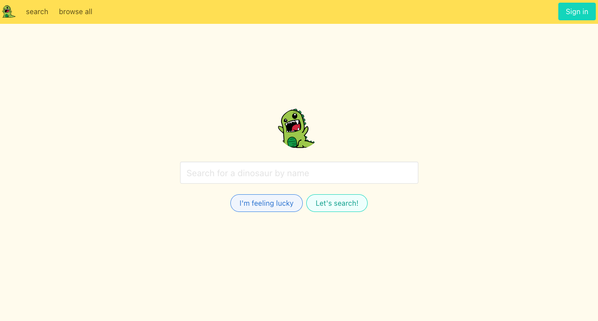
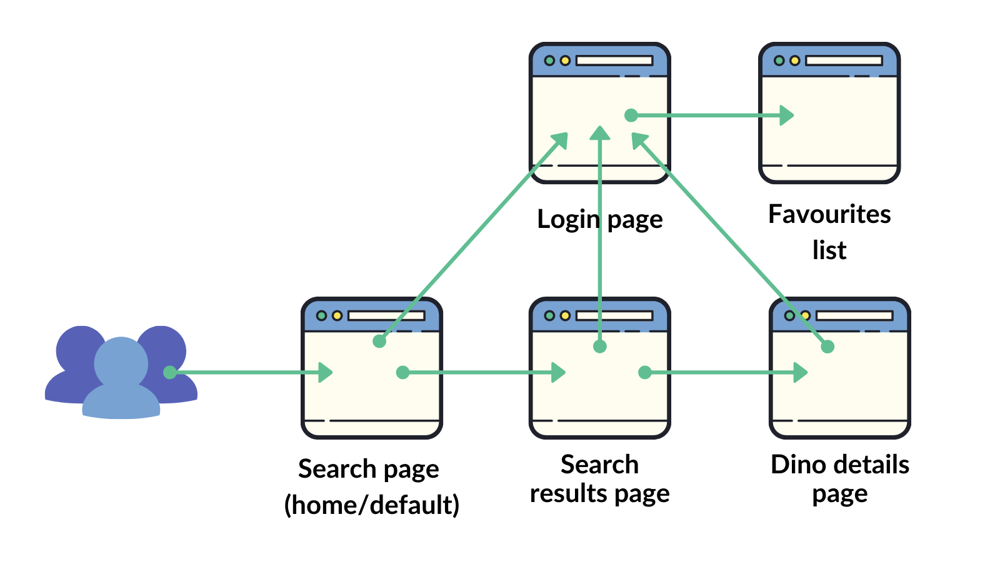
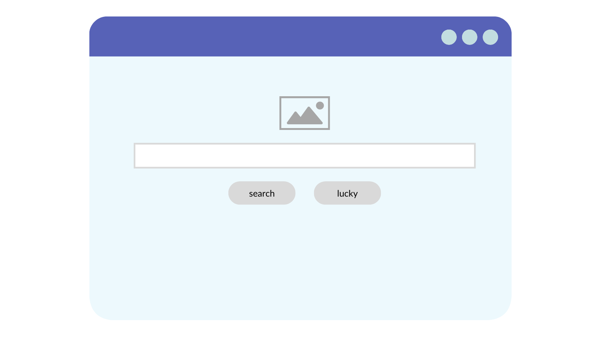
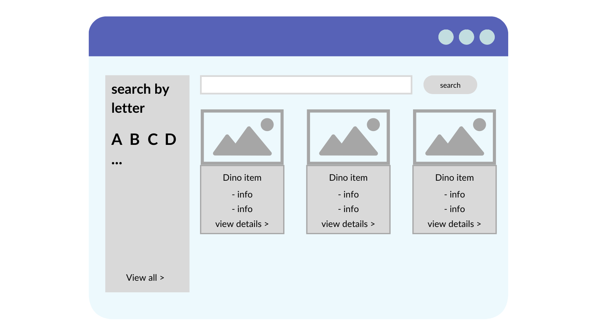
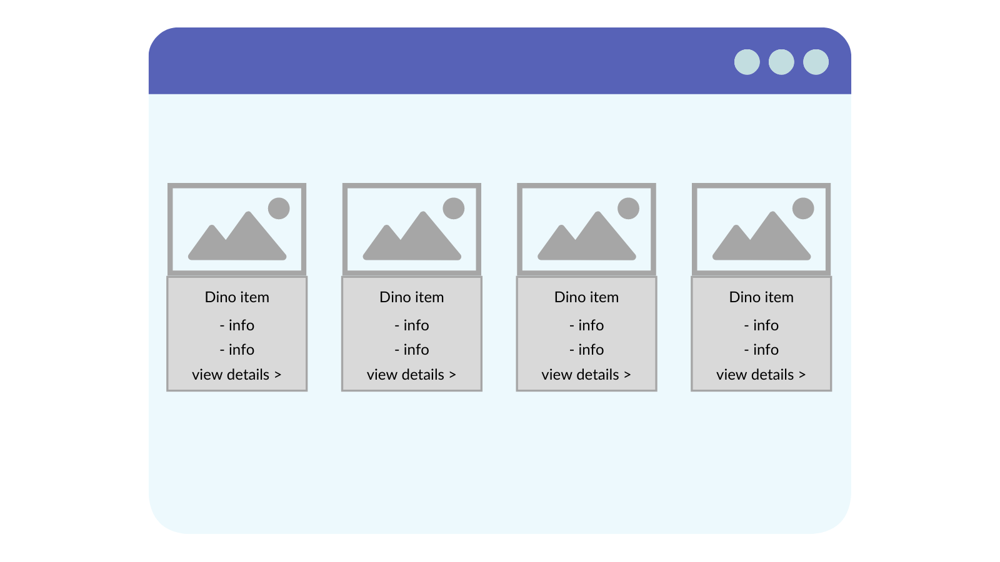
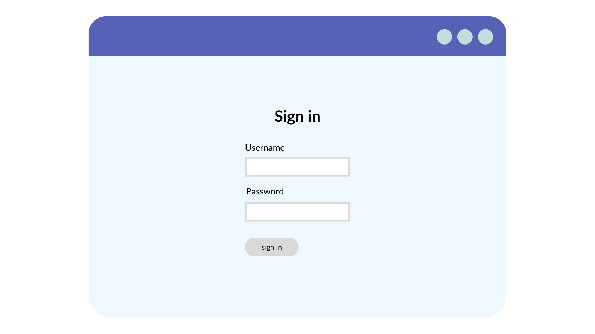

# Final Project: Dinosaur Search App

In this final lesson, you'll be putting your skills together and building a Dinosaur Search App.

Over the past nine lessons, you’ve covered a lot of ground. You’ve learned about React and the part it plays as a modular, component-driven approach to building modern, responsive front ends. 

Not only that but you’ve:

- Hooked it up to an API and made it more data-driven.

- Explored the common Hooks on offer, baked right into React.

- Extended the core React functionality with third-party libraries such as React Router.

You should be feeling pretty pleased with yourself for completing the projects you’ve built so far. Hopefully, by now, your React knowledge has grown to immense proportions and you’re feeling confident in your abilities to recognize the core concepts and build your own applications in this popular, powerful library.

### Introducing the Dinosaur Search App

In this final project, you’ll be pulling together all this React knowledge and building a more comprehensive app, The Dinosaur Search App. Imagine you have a team of palaeontologists who need to be able to look up information on a range of known dinosaurs. You can build an app to help them search for dino info and save a list of their favorites to refer to later. It’ll all be powered by an API that retrieves a list of all required dino data.

Let’s jump right in and take a look at what you’ll be building:

You have a simple navigation up top and start your journey at the main search page. From here, you can either enter a name (or part name) of a dinosaur and search on that, or hit the ‘I’m feeling lucky’ button and be taken to a page of results filled with dinos whose names start with a random letter of the alphabet.

Either option leads to the results page where you see a list of matching dinosaurs. From here you can favorite them directly, which will add them to a list in the global app state, allowing users to visit them in a separate area once they’re logged in. 

If you want to find out more about a particular dinosaur, simply click the button or dino’s name and you can visit a special details page with all the information neatly laid out, including a picture of the beast in question.

Finally, you can simulate a sign-in process which will then allow a logged-in user to view their saved favorites in a convenient list.

## L10FinalProject

### Step 1: Plan out the Build

With larger, more complex apps such as this, even as a minimum viable product, where the functionality might be bare bones to begin with, it can be helpful to start by mapping out two things:

- A user journey or flow. 

- Some basic wireframes. 

The user journey allowsyou to roughly map out which parts of the app connect to each other, and how a user might navigate around an app from a given starting point. With the wireframes, you’re really aiming to loosely pin together your intended UI, placing components into groups, breaking down sections into more modular chunks, and trying to think about what will live on what page or pages — especially important in a system such as React where modularity is key!

I’ve already mocked these two things out for you to give you a flavor of how this could look, so let’s take a quick peek and see how these activities can be very useful tools.

### User jJurney or Navigation Flow

Here’s an example navigation flow (or user journey) for your small dinosaur searching app. 

You can see that your users start out by hitting the search page, which will act as your home or default landing page. This kicks off the main flow of the app which should work like this:

1. From the starting search page, users trigger a search for a dinosaur. 

2. Next, they’re taken to a results page to see a list of matching dinosaurs returned from the API.

3. From here they can keep searching, or choose to view specific details of a particular dinosaur on the dino details page.

4. If they wish to sign into the app, they can visit the login page from any of the main navigation pages. They can only view the favorites page once they’ve authenticated. So, users must visit the login page and then the favorites. 

Of course, once they’re logged in, you’ll enable the favorites link from the main navigation, so they can get to it any time. For the purposes of this flow diagram, you want to explicitly call out the deliberate need to visit login then favorites. 

This is quite a simple diagram, but then you’re only building a relatively simple app (even though it’ll be more complex than the projects you’ve built so far). You might see lots of different versions of this sort of flow diagram in the wild, from actual flow diagrams with the correct diagram structures and types, to rough, hand-drawn sketches, and everything in between. Sometimes they might be larger in nature, encompassing more of an app all at once, or they might just show the flow for a particular area of functionality. 

Whatever their approach, the aim is to give you an at-a-glance idea of how a user will flow through various distinct parts or pages within your app. They can help immensely during the planning phase of any app you’re going to build. 

### Step 2: Wireframes

You’re not going to dwell on the wireframes too long, as I’m sure you’re keen to get building and put your React muscles to good use. Let’s move through the rough-and-ready wireframes for each of the pages you saw in the previous flow diagram. 

.png)

You can see that each page’s wireframe is much like the flow diagram: quite simple and low-fi. What you’re doing here is getting down on paper (so to speak) the general idea of which parts of the UI live on which pages and roughly how they are intended to look. 

Again, in the wild, you might see lots of different versions of this sort of thing, from hand-drawn sketches, physical paper models and simplistic low-fi versions, through to full-on UI mock-ups made by design teams. 

Just like the user journey diagrams, the idea with wireframes is to give a general starting direction for the feel of the UI; what sort of data will be displayed on the page, in what way, and  with which key interaction points (things like animations, parts of the UI that switch or change, and so on). 

They help so much by providing a reference point that you can keep coming back to whilst building a component or part of an application. 

## Step 3: Build the App

With this being a larger, more complex app than you’ve built thus far in the course, the remaining sections in this lesson will be broken down like this:

1. In section two you’ll get all of the project scaffolding and setup done, including looking at the API you’ll be using and adding in the skeleton React Router structure.

2. In section three you’ll add in some services that will act as kindly data-ferrying middlemen, providing data to your components and updating items in your Redux store. 

3. In section four you’ll flesh out the components and the UI parts of the app.

4. And finally, in section five, you’ll fire everything up and bask in your mighty coding glory as you take the Dinosaur Search App for a test flight.  

Let’s dive into the next section and get cracking. 

## Section 2: Project Setup and Scaffolding

You put the foundations of the Dinosaur Search App in place, such as creating a new React app and exploring the supporting API

You may be unsurprised to learn that dinosaurs are quite old and that there isn’t much data around for a fair few of them. What is a little surprising however, is that there are zero live APIs out in the wild that deal with dinosaur-exclusive data!

But fear not, because I have got you covered. In the accompanying course material there is [starter project code](https://github.com/Dev-Doctor-Vicki/api-server-starter) for this project that includes a `client` and a `server` folder. You’ll be building everything you have planned in the `client` folder, but the `server` folder houses a fully-functional Node-based API that will provide you with all you need to serve your app. 

- If you’re interested in learning more about this Node server starter-kit, then here is a [helpful article](https://robkendal.co.uk/blog/how-to-build-a-restful-node-js-api-server-using-json-files) on this very subject.

You’re going to quickly spin up the API `server` and take a brief look at the queries you can make, and the sort of data you’ll get back, as well as how to start it.  

### Open and Run the Starter Project

Here’s where you can grab the project files for this course, if you haven’t already done so. You’ll need them for this last project as they include the API server, which you won't be building from scratch!

Click below to download the Starter Code.

[Starter Code](/Users/vickibealman/Desktop/FEFReact/lesson-10/assets/start)
