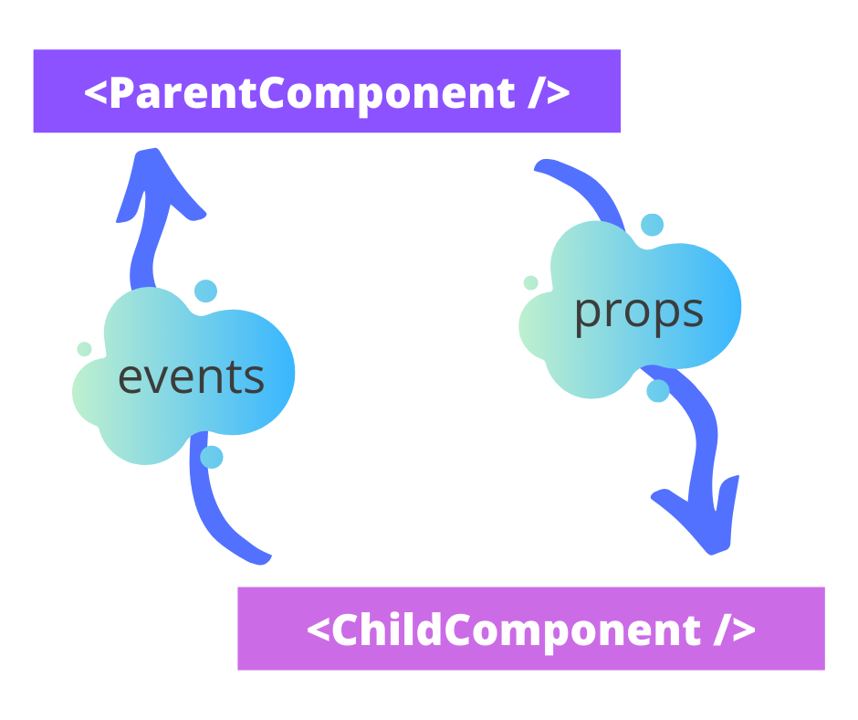
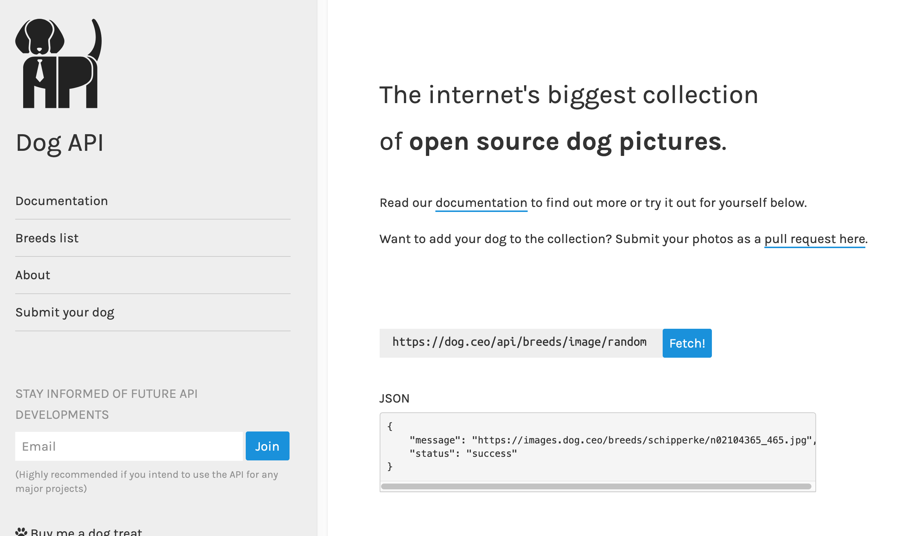

# Lesson 2: React Core Concepts

You've built and refactored a great React app. Now, it's time to talk about the fundamental principles of React components and core concepts.

In this lesson, we’re going to briefly introduce a core concept that lives at the heart of React and that’s how to pass data around between different components.

I meet a lot of students who are both new to coding or new to React and one of the common sticking points is how to deal with data; passing it to other components, and getting other data back into the original, parent component.

## Component Relationships

Due to the modular nature of React development, you will generally be focused on creating small, isolated parts of functionality within your apps. You then build larger features or areas within the app by combining these modules or components together.

Even if one component is not a logical ***parent** of another, that component may reference another to build some area of functionality. The component doing the referencing can be thought of as the **parent** component, and the component being referenced can be thought of as the **child** component.

As an example; a `header` is not naturally related to a shopping basket, but an e-commerce website might have a count of the current items in the shopping basket in the `header` somewhere. Therefore, you can say the `header` component would be the **parent** component, and the shopping basket would be the **child**.

Of course, **parents** can have **parents** themselves and **children** can have **children**. The important thing to remember is this initial relationship as it dictates how data flows within a React app.

## Data Flow within React

Without getting lost in complex topics such as `Redux` (which you will cover in a later lesson), data generally flows in two directions within React:

- Down via props
- Up via events and event handlers

Looki at this visually:



A **parent** component can pass data down to its **child** components via props.

Similarly, **child** components can feed data back up to **parents** via event handlers (functions passed down to them via props).

### Data Handling in Action

Look at a quick example to illustrate this in action:

**index.js**

```
import React, { useState } from 'react';

const ParentComponent = props => {
  const [items, setItems] = useState(['apple', 'pear', 'orange', 'bear']);

  const clearBasket = () => {
    setItems([]);
  };

  return <ChildComponent basket={items} clickHandler={clearBasket} />;
};

const ChildComponent = props => {
  return (
    <>
      <p>You have {props.basket.length} items in your basket</p>
      <button onClick={props.clickHandler}>Empty basket</button>
    </>
  );
};
```

In this simple example, you have two components, `ParentComponent` and `ChildComponent`.

In `ParentComponent`, you have an array of strings set into `state` using the `useState` Hook and assigned into the items variable. You then have a `clearBasket()` function that sets the value of our items array to an empty array.

`ParentComponent` returns an instance of the `ChildComponent` component passing both items and `clearBasket()` into it as props.

In `ChildComponent`, you return a paragraph that tells the user of how many items are in their shopping basket by checking the length of the items array it received via props from `ParentComponent` (although in `ChildComponent` this is received as `basket`).

Now, if you want to clear the basket, you can’t do this in `ChildComponent`. You need a way to tell `ParentComponent` you want to empty your `basket`.

The way we pass this request up to trigger the clearing of the `basket` is with a function passed to `ChildComponen`t via props. The function is `clearBasket()` and you pass it into `ChildComponent` via props under the name `clickHandler`.

In `ChildComponent`, attach the passed-in `clickHandler` function to the `onClick` event of your `button` element.

When the user clicks the `button`, the `onClick` event is triggered, which calls the `clickHandler` function from props. The `clickHandler` function (which is really `clearBasket())` is invoked in `ParentComponent` and the `basket` is cleared.

## Data Syncing

Fortunately, React takes care of the syncing of the dynamic data passed between components via props on our behal; re-rendering the UI as needed.

In your case, when a user clicks the `button` in `ChildComponent`, a function in `ParentComponent` is triggered which clears the items array. The new items array (which is empty) is then passed down into `ChildComponent` again, which re-renders the output, this time displaying the new message, ‘`You have 0 items in your basket`’.

React handles this automatically which is pretty handy and one of the powerful features of the React library.

## React Hooks

This section introduces you to React Hooks; what they are, how to use them, and why they're an important part of modern React development.

Hooks are not the newest addition to the React library. They were introduced in version 16.8 (the current version at the time of writing is 18). However, they have taken a while to be more widely adopted by the community as the standard practice when developing React components.

In React, Hooks allow developers to tap into some of the more powerful features of React, such as `state` and the **component lifecycle**, without writing some of the more cumbersome syntax required in more "traditional" class-based components.

### Why Hooks

Hooks offer several big advantages :

1. They allow us to write smaller, more manageable components.
2. They allow us to reuse stateful logic between components (we’ll discuss this next).
3. They reduce the complexity of dealing with the React component lifecycle.
4. They eliminate the difficulties learning and dealing with JavaScript classes can bring, especially around how this works and binding event handlers.

Let's cover these advantages with  examples.

### Reuse Stateful Logic

‘stateful logic’ referrs to a component’s `state`, the data stored by the component, and any associated logic to alter that `state`.

Before Hooks, `state` was quite rigidly bound to a particular component and common or repeated logic wasn’t easily removed into a separate space to be reused across other components.

Hooks solves this problem by allowing you to grab this stateful logic and create your own ‘hook’ to reuse wherever you wish, without changing your component hierarchy.

Let’s look at a quick example.

You want to know the status of a user compared with the amount of authorized roles they had within a system:

**UserStatus.jsx**

```
const UserStatus = props => {
  const [roles, setRoles] = useState([]);
  useEffect(() => {
    const handleRoleChange = user => {
      setRoles(user.roles);
    };
    UserService.fetchUserRoles(props.userId, handleRoleChange);
    return () => {
      UserService.destroy(handleRoleChange);
    };
  });

  return roles.length > 0 ? 'enabled' : 'disabled';
};
```


In another component, you want to see a list of that user’s roles, perhaps for an account page. That could look like this:

**RolesList.jsx**

```
const RolesList = props => {
  const [roles, setRoles] = useState([]);
  useEffect(() => {
    const handleRoleChange = user => {
      setRoles(user.roles);
    };
    UserService.fetchUserRoles(props.userId, handleRoleChange);
    return () => {
      UserService.destroy(handleRoleChange);
    };
  });

  return (
    <>
      {roles.map(role => {
        <li style={{ color: role.isAdmin ? 'red' : 'green' }} key={role.id}>
          {role.name}
        </li>;
      })}
    </>
  );
};
```

You have much shared logic here. You can use a custom Hook to abstract this into a shared `state` logic that deals with the `roles` list.

**useRolesForUser.jsx**

```
const useRolesForUser = userId => {
  const [roles, setRoles] = useState([]);
  useEffect(() => {
    const handleRoleChange = user => {
      setRoles(user.roles);
    };
    UserService.fetchUserRoles(props.userId, handleRoleChange);
    return () => {
      UserService.destroy(handleRoleChange);
    };
  });

  return roles;
};
```

You have your custom Hook. No you can update your examples above to use it!

**UserStatus.jsx**

```
const UserStatus = props => {
  const roles = useRolesForUser(props.userId);
  return roles.length > 0 ? 'enabled' : 'disabled';
};
```

**RolesList.jsx**

```
const RolesList = props => {
  const roles = useRolesForUser(props.userId);
  return (
    <>
      {roles.map(role => {
        <li style={{ color: role.isAdmin ? 'red' : 'green' }} key={role.id}>
          {role.name}
        </li>;
      })}
    </>
  );
};
```

### Reduce Complexity

Hooks can reduce the complexity of your components when compared to the previous class-based syntax you may have seen in the past.

**MyClassComponent.jsx**

```
import React from 'react';

// data handler
import DataHandler from './data-handler';

// components
import UserCard from './UserCard';

class MyClassComponent extends React.Component {
  constructor(props) {
    super(props);

    this.state = {
      users: []
    };
  }

  componentDidMount() {
    if (!DataHandler.initialised) {
      DataHandler.init(this.props.usersToLoad);
    }
    DataHandler.loadUsers().then(data => {
      this.setState({
        users: data
      });
    });
  }

  componentDidUpdate(prevProps) {
    if (prevProps.usersToLoad === this.props.usersToLoad) {
      return;
    }

    DataHandler.loadUsers().then(data => {
      this.setState({
        users: data
      });
    });
  }

  componentWillUnmount() {
    // clear any subscriptions and teardown data handler
    DataHandler.exit();
  }

  render() {
    return (
      <>
        <h2>Loading {this.props.usersToLoad} users</h2>
        {this.state.users.map(user => (
          <UserCard {...user} />
        ))}
      </>
    );
  }
}
export default MyClassComponent;
```

While not a very complex component in terms of what it does, it’s already becoming quite long and will prove more difficult to manage over time if it grows. You have data loading happening in several places across different parts of this `component`’s lifecycle, as well as having extra `state` management work in a constructor function, not to mention the liberal use of this to reference `state` and props values.

Refactor it to use Hooks (similar to how you did it in the previous module):

**MyClassComponent.jsx**

```
import React, { useState, useEffect } from 'react';

// data handler
import DataHandler from './data-handler';

// components
import UserCard from './UserCard';

const MyHooksComponent = ({ usersToLoad }) => {
  const [users, setUsers] = useState([]);

  useEffect(() => {
    if (!DataHandler.initialised) {
      DataHandler.init(usersToLoad);
    }

    DataHandler.loadUsers().then(data => setUsers(data));

    return () => {
      DataHandler.exit();
    };
  }, [usersToLoad]);

  return (
    <>
      <h2>Loading {usersToLoad} users</h2>
      {users.map(user => (
        <UserCard {...user} />
      ))}
    </>
  );
};
export default MyHooksComponent;
```

Look at how much smaller and more readable you made your component! You also reduced much of the complexity and overhead involved in managing several lifecycle methods.

#### Are Hooks Mandatory

That’s one of the positives of Hooks: they’re 100% completely opt-in.

You can also use them alongside class-based components. You might encounter a mixture of class-based components and Hooks-based ones in a real world project. This is because Hooks, much like React itself, offers a very adoptive experience. You can use them as much as you need, and gradually introduce them into your projects.

That said, I would recommend you get familiar with using them and employ them as your exclusive tool for building components in new projects. They are widely adopted by the React community today and there are countless articles and helpful advice out there on how to build your own Hooks and use Hooks in general.

You’ll be exclusively using Hooks to power your components throughout this course, so you’ll have plenty of experience with them as you make progress through the lessons.

For additional information, read this [documentation on Hooks(https://reactjs.org/docs/hooks-intro.html). 

## Common Hooks 

In this section you'll take a look at the most common Hooks you'll come across and learn how to use them in your apps.

## L02 Hands On Guided Learning: Common Hooks

Welcome to the Common Hooks hands-on practice assignment.

Arguably the most common Hooks you’ll encounter are:

- `useState` - used to interact with a component’s `state`.

- and `useEffect` -  best thought of as replacing the React lifecycle events such as `componentDidMount` and `componentDidUpdate`.

Before you move onto your big project in this lesson, take some time to familiarize yourself with the use of these two most common built-in Hooks.

## Requirements

1. Read all the guided learning text carefully for understanding.
2. Follow all instructions and coding step-by-step.
3. Create all files and folders for the Greeting App.
4. Complete all coding as demonstrated in all files.
5. Zip `L02ReactHandsOnPractice1` Folder
6. Attach the zipped folder below where indicated for submission.

## Project Setup

You will get an introduction to 'Create React App' in the next section as a great way to build new React projects. For now, keep things simple and familiar by using 'Parcel JS' to set up your project to bundle and run your React code for these examples.

### Configure Parcel JS

1. Create a new folder in your 
- `FEFReact`.

- `mkdir FEFReact/L02HandsOnPractice1`

 2. and open it in VS Code. Navigate to the terminal and let’s initialize our new project:

 - `cd L02HandsOnPractice1`

 - `npm init -y`

3. Install the packages you need:

 - `npm add react react-dom`

4. Finally, open your `package.json` file and add the following config so you can call `npm start` to run the project:

**package.json**

```
"scripts": {
    "start": "parcel index.html"
  },
```
### Create the Files

Your project is set up and ready to run. Add the necessary files to your project before you code them out.

- App.js
- index.js
- index.html
- styles.css
- UseEffectExample.jsx
- UseStateExample.jsx

`UseStateExample.jsx` and `UseEffectExample.jsx` are where you’ll do the main body of your work, so get your other files set up before you explore your example components.

This will be the entry point for Parcel to start loading your JavaScript from. Import your main `App` component here and call React DOM’s `render()` method to mount it into the `HTML` element in your `index.html` file.

**index.js**

```
import React from 'react';
import ReactDOM from 'react-dom';

import App from './App';

ReactDOM.render(<App />, document.querySelector('#root'));
```

### App.js

In your `App` component, the main starting point for your React app, you use a Hook, the `useState` Hook.

Look at the file in full:

**App.js**

```
import React, { useState } from 'react';

import './styles.css';

// components
import UseStateExample from './UseStateExample';
import UseEffectExample from './UseEffectExample';

export default props => {
  const [example, setExample] = useState('UseStateExample');

  return (
    <>
      <h1>Choose an example</h1>
      <button onClick={() => setExample('UseStateExample')}>
        useState Example
      </button>
      <button onClick={() => setExample('UseEffectExample')}>
        useEffect Example
      </button>
      <div className='container'>
        {example === 'UseStateExample' ? (
          <UseStateExample />
        ) : (
          <UseEffectExample />
        )}
      </div>
    </>
  );
};
```

You imported your two example components, `UseStateExample` and `UseEffectExample` and use the example value in `state` to determine which one to show.

If example is set to the string ‘`UseStateExample`' then you show the `UseStateExample.jsx `component, otherwise, show the `UseEffectExample.jsx` component.

You also have two buttons that both call the `setExample()` method to update the example `state` value, which will, in turn, change which child component is displayed.

### styles.css

Many of the styles here are the same basic styles from your first example built in Lesson 1, the Greeting App. You add a couple  extra layout selectors at the bottom to add some flex box support and additional styling to some form elements, such as a `select` and `label`.

**styles.css**

```
body {
  font-size: 16px;
  line-height: 1.4;
  font-family: 'Lucida Sans', 'Lucida Sans Regular', 'Lucida Grande',
    'Lucida Sans Unicode', Geneva, Verdana, sans-serif;
  margin: 5em;
}

p {
  margin-bottom: 1.6em;
}

input,
select {
  padding: 0.5em 1em;
  line-height: 1;
  font-size: 18px;
  border: 1px solid #ececec;
}

button {
  border: 1px solid #ececec;
  background: #ececec;
  padding: 0.5em 1em;
  cursor: pointer;
  font-size: 18px;
  margin-right: 15px;
}

button:hover {
  background: #c9c6c6;
}

label {
  display: block;
  margin-bottom: 0.5em;
}

label + input,
label + select {
  margin-bottom: 1em;
}

form button {
  display: block;
}

.container,
.dogs-container {
  padding: 0 2em 2em;
  border: 1px solid #ececec;
  border-radius: 4px;
  margin: 1em auto;
}

.form-message {
  background-color: #ececec;
  border-radius: 4px;
  margin: 1em auto;
  padding: 2em;
  font-size: 18px;
}

.dogs-container {
  display: flex;
  align-items: center;
  justify-content: space-around;
}

.dogs-container img {
  max-width: 250px;
  max-height: 200px;
}
```

### index.html

Your `index.html` file simply provides a basic entry point for Parcel to follow and find your JavaScript starting point.

It looks like this:

**index.html**

```
<html>
  <head>
    <title>Hooks example demo</title>
  </head>
  <body>
    <div id="root"></div>
    <script src="index.js"></script>
  </body>
</html>
```

With the basic files set up and ready, take a closer look at the `useState` and `useEffect` Hooks.

## The useState Hook

`useState` is a direct replacement for the class-based `state` you see used in this manner:

```
// updating state
this.setState({
  someProperty: 'some value'
});

// using state
<p>The value is {this.state.someProperty}</p>;
```

As you already saw in the previous lesson, the `useState` Hook has a very simple syntax for setting and retrieving values from.

```
// initial declaration
const [nameOfValue, setNameOfValue] = useState('initial value here');

// updating state
setNameOfValue('a new value');

// using state
<p>The value in state is {nameOfValue}</p>;
```

You’re not limited to what you can store inside this `state` Hook, just like you’re not limited with `state` used in a class component. Any valid JavaScript primitive value, array, object, and even function can be passed into and stored in `state`.

The convention is to have distinct declarations for multiple values, unless they’re logically able to be kept together, such as with form values.

```
// multiple values
const [itemCount, setItemCount] = useState(0);
const [data, setData] = useState([]);
const [balance, setBalance] = useState(null);

// grouped values
const [formValues, setFormValues] = useState({
  name: '',
  email: '',
  message: ''
});
```

In the first group, you see  singular values such as an integer, '0', an empty array, and a null value. These are all distinct pieces of `state` and declared in their own variable pairs, each using a separate call to `useState`. However, for the `formValues` variable, you're calling `useState` and passing in an object with multiple properties, one for `name`, `email`, and `message`, that each represents a form field value.

You could have separate these values out into their own `useState` call like this:

```
const [name, setName] = useState('');
const [email, setEmail] = useState('');
const [message, setMessage] = useState('');
```

This is fine and you'll see this approach quite frequently. As with many things in development, there are personal preferences and trade-offs on how you tackle a problem and implement a solution. For me, it makes sense to group closely related slices of data, such a collection of form field values, into a single place (i.e. the `formValues` variable above), but it does add a little more overhead in dealing with updates to any particular form field's value. Conversely, if you have a really large form with many field values, breaking each one into a separate call to `useState` could potentially create much more code for you to manage and a very large component.

With the explanation out of the way, let’s build a little example app to demonstrate how to use `useState` and the values it can be used with.

First: open the `UseStateExample.jsx` file, where you’ll import React and create the empty component’s skeleton:

**UseStateExample.jsx**

```
import React, { useState } from 'react';

const UseStateExample = () => {
  return <></>;
};

export default UseStateExample;
```

Look at how to effectively use the `useState` Hook. You’re going to build an `HTML` form that will update values in your component’s `state`, and display a message to your user once they’ve submitted the form.

To do that, you need a few things:

- An object in `state` to track `state` values

- A value in `state` to determine if you should show the message (i.e. has the form been submitted?)

- Methods to handle changes in the form elements and form submission

- An HTML form

Your component’s looking a little bare at the moment, so let’s code it out.

### Add in State

The first thing is add your `state` values and items, right at the top of the component.

**UseStateExample.jsx**

```
  const [showMessage, setShowMessage] = useState(false);
  const [formValues, setFormValues] = useState({
    name: '',
    age: '',
    fruit: ''
  });
  ```

  You really can store just about anything you want in `state`. Your first `state` variable, `showMessage` is going to hold a boolean value, while `formValues` holds an object with some default key-value pairs where you track the input from your user.

  #### Tip!

  You don’t have to add the keys in like done here, but it’s good practice. It let's you get an idea of what data your form will capture and what the expected type of that data will be, without having to run anything.

  ### Event Handling Methods

 Map out your `state` updating methods and event handlers: one for a change of any form field values, and one to handle the form submission.

 **UseStateExample.jsx**

 ```
   const handleChange = evt => {
    const updatedFormValues = {
      ...formValues,
      [evt.target.id]: evt.target.value
    };

    setFormValues(updatedFormValues);
  };

  const handleSubmit = evt => {
    evt.preventDefault();
    setShowMessage(true);
  };
  ```

  In the `handleChange` event, you’re still using the `evt.target.value` to retrieve the current value from the underlying `HTML` element (e.g. a text input field), but you’re creating a new `updatedFormValues` object first. You're using the spread syntax (the three dots you can see before `formValues`) which will essentially copy everything from the current `formValues` object in `state` into your `updatedFormValues` object.

  **UseStateExample.jsx**

  ```
    const handleChange = evt => {
    const updatedFormValues = {
      ...formValues,
      [evt.target.id]: evt.target.value
    };
	```

Immediately after this, you use the bracketed notation [evt.target.id] to reference a property dynamically on the `updatedFormValues` object, specifically referencing using the form field's `id`. If it exists on the object then the value we assign to it (e.g. `evt.target.value`) will be updated. If it doesn't exist, then a new property will be created and assigned the value of `evt.target.value`.	

Finally, you update your form field values object in `state` by calling `setFormValues()`.

Another thing to point out is your use of `evt.preventDefault()` in the `handleSubmit` method. The event React passes us is synthetic, the form submission caused by the button you add at the moment is very real. By calling the `preventDefault()` method when the form submits, you stop the form from triggering a complete page reload. If that happens, you lose your `state` values and your app will produce unintended results.

**UseStateExample.jsx**

Other than that, the `handleSubmit` method is quite simple. You change the value of `showMessage` in `state` to ‘`true`’ which will be used later in your returned JSX.

### HTML (JSX)

The final piece of the puzzle is to add your JSX in the return method so you can render something useful to the user.

First, a little message introducing the app to the user:

**UseStateExample.jsx**

```
  return (
    <>
      <p>Complete the form below and see a nice message about yourself!</p>
```

Next, add your `HTM`L form:

**UseStateExample.jsx**

```
      <form onSubmit={handleSubmit}>
        <label htmlFor='name'>What should we call you?</label>
        <input id='name' value={formValues['name']} onChange={handleChange} />

        <label htmlFor='age'>How old are you?</label>
        <input id='age' value={formValues['age']} onChange={handleChange} />

        <label htmlFor='fruit'>What's your favorite fruit?</label>
        <select id='fruit' value={formValues['fruit']} onChange={handleChange}>
          <option>Bananas</option>
          <option>Apples</option>
          <option>Oranges</option>
          <option>Strawberries</option>
          <option>Pears</option>
          <option>Dragon fruit</option>
        </select>

        <button>Submit</button>
      </form>
```

There are a couple of things to highlight:

- Notice on your labels you use `htmlFor=` instead of the HTML `for=`. This is because you’re still in JavaScript land and `for` is a protected keyword. You can use it, but React will complain, giving warnings in the browser and any tools like ESLint will also notify you of this. Stick to `htmlFor=` when using this attribute on labels in React.
- Each of your HTML elements (inputs and select) is setting the `value=` attribute using a named key from your `formValues` state object. They also each reference the same change event handler, `handleChange` you defined previously.
- Finally, there’s no event handler attached to the button within your form. This is because this button will trigger a form submission event by default when it’s clicked. So all you need to do is attach your `handleSubmit` event handler to the form itself.

Once you collect your user data and submit it, you need to display a message.

**UseStateExample.jsx**

```
      {showMessage && (
        <div className='form-message'>
          <p>
            Hi <strong>{formValues['name']}</strong>, what a lovely name. And I
            can't believe you're only <strong>{formValues['age']}</strong> years
            old, that's no age!
          </p>
          <p>
            Your favorite fruit can't be <strong>{formValues['fruit']}</strong>
            , mine too!
          </p>
        </div>
      )}
	  ```

You have a couple of simple paragraphs where you reference the values from `state`. You also wrap this entire block in a simplified logic expression:

```
{ showMessage && (...rest of expression)}
```

JavaScript evaluates the left side of the expression, `showMessage` and if that’s ‘`false`’, doesn’t look at the right side of the expression. However, once `showMessage` is ‘`true`’ it will evaluate the right-hand side, which will essentially render your JSX block.

### The Complete UseStateExample.jsx file

The finished file looks like this:

**UseStateExample.jsx**

```
import React, { useState } from 'react';

const UseStateExample = () => {
  const [showMessage, setShowMessage] = useState(false);
  const [formValues, setFormValues] = useState({
    name: '',
    age: '',
    fruit: ''
  });

  const handleChange = evt => {
    const updatedFormValues = {
      ...formValues,
      [evt.target.id]: evt.target.value
    };

    setFormValues(updatedFormValues);
  };

  const handleSubmit = evt => {
    evt.preventDefault();
    setShowMessage(true);
  };

  return (
    <>
      <p>Complete the form below and see a nice message about yourself!</p>
      <form onSubmit={handleSubmit}>
        <label htmlFor='name'>What should we call you?</label>
        <input id='name' value={formValues['name']} onChange={handleChange} />

        <label htmlFor='age'>How old are you?</label>
        <input id='age' value={formValues['age']} onChange={handleChange} />

        <label htmlFor='fruit'>What's your favorite fruit?</label>
        <select id='fruit' value={formValues['fruit']} onChange={handleChange}>
          <option>Bananas</option>
          <option>Apples</option>
          <option>Oranges</option>
          <option>Strawberries</option>
          <option>Pears</option>
          <option>Dragon fruit</option>
        </select>

        <button>Submit</button>
      </form>
      {showMessage && (
        <div className='form-message'>
          <p>
            Hi <strong>{formValues['name']}</strong>, what a lovely name. And I
            can't believe you're only <strong>{formValues['age']}</strong> years
            old, that's no age!
          </p>
          <p>
            Your favorite fruit can't be <strong>{formValues['fruit']}</strong>
            , mine too!
          </p>
        </div>
      )}
    </>
  );
};

export default UseStateExample;
```

## The useEffect Hook

The `useEffect` Hook is a bit more complex to understand than its `useState` cousin.

React has several lifecycle methods triggered during specific parts of a component's journey from being mounted, to when it updates, and finally, when it unmounts.

Before Hooks, developers would have to tie updates into these lifecycle methods; tasks such as fetching data, handling updates to props’ values, and cleaning up data handling or subscriptions to APIs. As you saw in lesson 1, this leads to messy and very complex components.

What `useEffect` gives you is a combined method that runs on each render of a component. It can be used multiple times to separate any distinct logic, and it can also be passed an array of dependencies React will monitor for changes. Should any of those dependencies change, only then would that particular `useEffect` call be executed.

Additionally, some work requires a clean up phase (e.g. subscriptions to external data sources). For these tasks, you return a function as part of your `useEffect` call that will carry out any clean up code you need. Think of this as replacing the `componentWillUnmount` lifecycle event.

Look at the syntax closer to get an idea of how it works:

**MyComponent.jsx**

```
const MyComponent = props => {
  // a simple useEffect declaration
  useEffect(() => {
    // log some data on each render
    cleverDataLoggingService.log('ooo what an exciting log entry');
  });

  // cleaning up on unmount
  useEffect(() => {
    // on mount and rerender
    // subscribe to an external API
    productAPI.subcribeToProductList(props.customer.id);

    return () => {
      // on render and unmount
      productAPI.unsubscribeFromProductList(props.customer.id);
    };
  });

  // using dependencies
  useEffect(() => {
    // this will only run when 'props.customer.id' changes
    console.log(`logged in customer is: ${props.customer.id}`);
  }, [props.customer.id]);
};
```

Now that you know a little more about the `useEffect` Hook, you can build your component.

Open up the file `UseEffectExample.jsx` and get the basic component scaffolding in as well as your React imports:

**UseEffectExample.jsx**

```
import React, { useState, useEffect } from 'react';

const UseEffectExample = () => {
  return <></>;
};

export default UseEffectExample;
```

In this example, you will build a simple gallery that loads everybody’s favorite: dog pictures! For this, you will using the excellent [Dog CEO API](https://dog.ceo/dog-api/).



For the component, you need to accomplish a few things:

- Set your API URL for loading in the pictures

- Add two variables in `state`, one for holding the image URLs of your dogs, and a loading flag you can use to show a ‘…loading’ message

- Create a function to actually go and load your dog pictures

- Two `useEffect` calls, one for an initial load and one for subsequent loads when the user presses a button

- A button for the user to trigger a new set of dog pictures

- The gallery itself

Now let's get building!

### Create the State Variables

The first task is define some variables, namely your fixed API URL and flexible state variables:

**UseEffectExampl.jsx**

```
const UseEffectExample = () => {
  const apiBaseUrl = 'https://dog.ceo/api/breeds/image/random/';
  const [dogImageUrls, setDogImageUrls] = useState([]);
  const [loadPictures, setLoadPictures] = useState(false);
  ```

  The Dog CEO API address will return a single image of a dog (that’s no good!), so append a random number onto this later on so we get a nice amount of dog images back.

  With state variables, `dogImageUrls` is set to an empty array to begin with but it will hold a list of picture URLs once the API has been called. With `loadPictures`, set it to ‘`false`’ for now, but you can use this to toggle whether the app is in the middle of loading data or not.

  ### Create the Image Fetching Function

You need to call the API to get the pictures in the first place. You define that next:

**UseEffectExample.jsx**

```
  const loadDogPictures = () => {
    const numToLoad = Math.random() * 10;
    fetch(`${apiBaseUrl}${numToLoad}`)
      .then(response => response.json())
      .then(data => setDogImageUrls(data.message));
  };
  ```

  Using the `Math.random()` function, you generate a random number between 1-10. Next, call the Dog CEO API, appending this random number on the end to return that number of doggo pics.

  Use the native browser `fetch()` method here, but in a realistic setting you may need to consider browser support and might need to look at using a polyfill or external utility like the Axios project.

  The process is straightforward: `fetch()` calls the API, you massage the raw response into `JSON`, then you consume that `JSON` as the object data, extracting a message object (as defined by the Dog CEO API docs), which just happens to be an array of image URLs. Set this array in `state` using `setDogImageUrls()` method returned from the `useState` Hook.


### Create the useEffect Calls

 Use the `useEffect` Hook in two separate calls here: one that will be used on the initial mount of the component, and the other will trigger a new load of pictures when the state value `loadPictures` changes.

 **UseEffectExample.jsx**

 ```
   useEffect(() => {
    loadDogPictures();
  }, []);
  ```

You use a bit of a React trick here. By passing this effect an empty dependency array, you effectively tell React to execute the effect, but only once, on the first mount.

You do that, because you want to have some dog pictures available when the component first mounts, but not every time anything happens, such as the component updates.

You do, however, want to trigger a new fetch when the user clicks the ‘`load more pictures!`’ button. When they do that, the value in `state` for `loadPictures` will change. You can have React watch this value and execute our second effect only when it changes. 

**UseEffectExample.jsx**

```
  useEffect(() => {
    if (loadPictures) {
      loadDogPictures();
      setLoadPictures(false);
    }
  }, [loadPictures]);
  ```

You can see that we supply loadPictures as a dependency on the useEffect Hook. When it changes, React will execute whatever we supply to the function. In this case, we check to make sure that it’s set to ‘true’, calling the API again before setting the value back to ‘false’, which will enable the button to work again.

You may be asking ‘won’t this just trigger this effect to be called again, even when `loadPictures` is set back to ‘`false`’?!’. The answer is ‘yes’, but by checking if it’s set to ‘`true`’ at the start of the function, you avoid some horrible infinite loop scenario.

### Add the Button and Gallery JSX

With all your logic in place, you can process the images and display a lovely gallery of sweet dogs to your users.
 
**UseEffectExample.jsx**

```
  return (
    <>
      <h2>Random dog pictures</h2>
      <button onClick={() => setLoadPictures(true)}>
        Load some more pictures!
      </button>
      <p>
        {dogImageUrls.length <= 0
          ? '...loading'
          : `We've got ${dogImageUrls.length} pictures for you:`}
      </p>
      <div className='dogs-container'>
        {dogImageUrls.map(imgUrl => (
          
        ))}
      </div>
    </>
  );
  ```

Starting with a title, you add a button that simply sets the `state` to ‘`true`’. As you discovered when you mapped out the `useEffect` calls, because React is watching this value as a dependency, it will automatically trigger a fetch of some new dog pictures.

Under this, we display a message to the user based on the value of `loadPictures`: ‘…loading’ if set to ’`true`’; or the number dog pictures the user can be expected to see if ‘`false`’.

Now the part you have been waiting for, the pictures themselves!

Using the `.map()` function built into JavaScript arrays  step through your array of dog pictures outputting an image tag.

#### Note!

You added an extra attribute you might not be familiar with right away. The `key=` attribute is another React-specific attribute needed when rendering lists of things. It helps React keep track of changes within the list, such as if any have been added, removed, etc. You should supply a unique identifier to each item in a list to give the elements a stable identity.

The nice thing about the `.map()` function is if we have an empty array (like when we initialize it to `[]` at the beginning of the component), nothing is output to the user.

The last thing to do is to fire up your app using `npm start` in the terminal, and enjoy some wholesome dog pictures: what the Internet was made for.

### The Complete UseEffectExample.jsx Component

Here's what the complete file will look like:

**UseEffectExample.jsx**

```
import React, { useState, useEffect } from 'react';

const UseEffectExample = () => {
  const apiBaseUrl = 'https://dog.ceo/api/breeds/image/random/';
  const [dogImageUrls, setDogImageUrls] = useState([]);
  const [loadPictures, setLoadPictures] = useState(false);

  const loadDogPictures = () => {
    const numToLoad = Math.random() * 10;
    fetch(`${apiBaseUrl}${numToLoad}`)
      .then(response => response.json())
      .then(data => setDogImageUrls(data.message));
  };

  useEffect(() => {
    if (loadPictures) {
      loadDogPictures();
      setLoadPictures(false);
    }
  }, [loadPictures]);

  useEffect(() => {
    loadDogPictures();
  }, []);

  return (
    <>
      <h2>Random dog pictures</h2>
      <button onClick={() => setLoadPictures(true)}>
        Load some more pictures!
      </button>
      <p>
        {dogImageUrls.length <= 0
          ? '...loading'
          : `We've got ${dogImageUrls.length} pictures for you:`}
      </p>
      <div className='dogs-container'>
        {dogImageUrls.map(imgUrl => (
          
        ))}
      </div>
    </>
  );
};

export default UseEffectExample;
```
