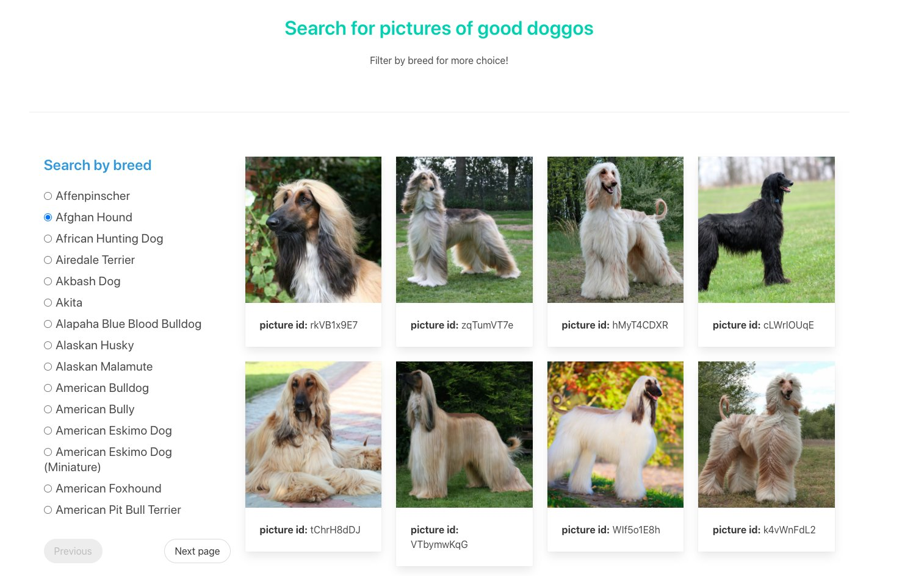
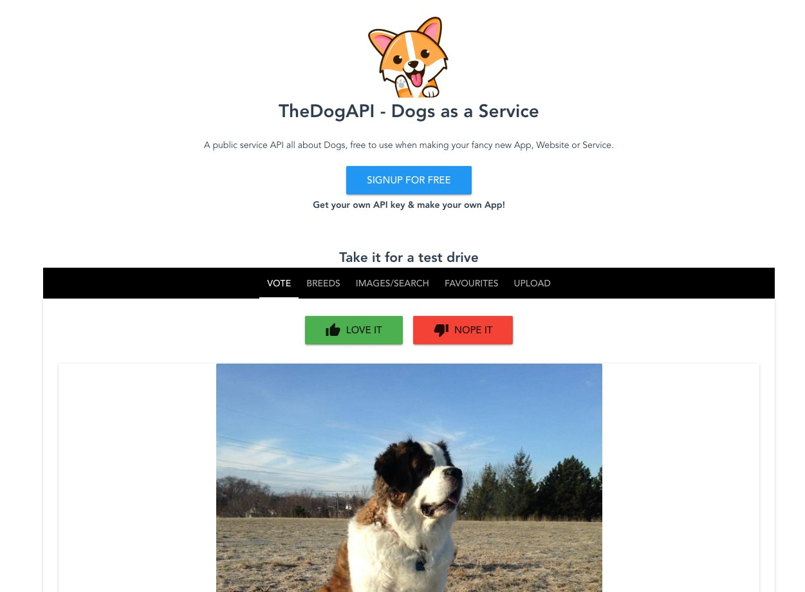
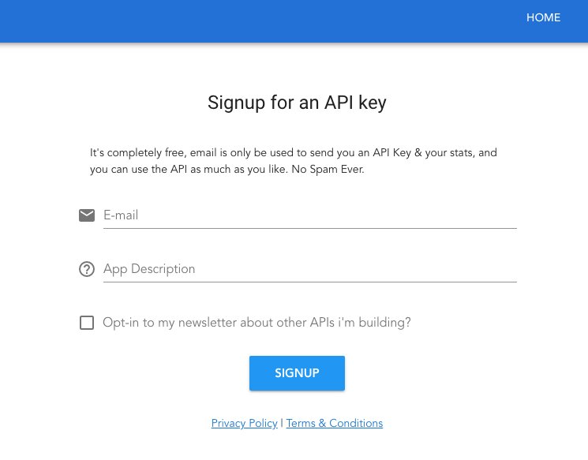
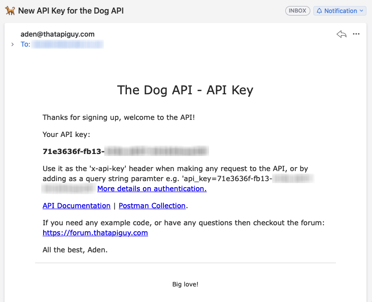
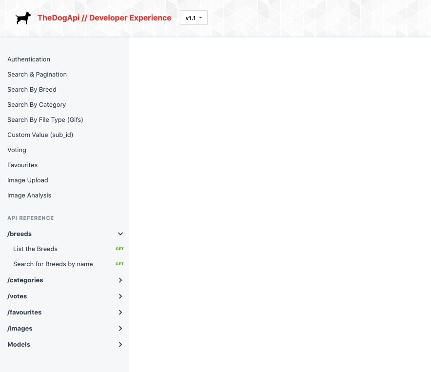
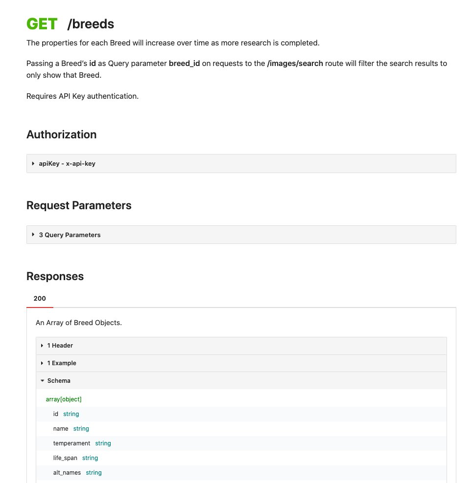
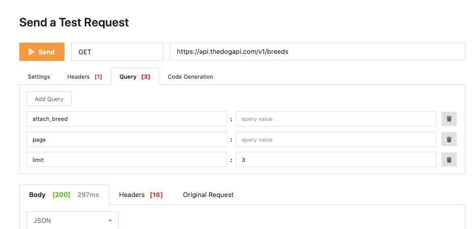

# Data with React

This lesson introduces concepts and approaches you can use to deal with fetching data within React, including the JavaScript Fetch API.

## Fetching Data

At some point, you will have to interact with data from an external source. In a frontend application where React is employed, this will most likely be via an `API`. 

You’ll be looking at different ways to retrieve data from an external `API` and handle the response using the [Axios HTTP client package](https://github.com/axios/axios). 

### React’s support for APIs

As previously discussed, React is unopinionated in its implementation. Outside of a few conventions, such as the JSX syntax and Hooks, it pretty much leaves things up to you to develop how you wish. 

However, as you’ve also seen, this unopinionated nature leaves us with some gaps. Unlike its fellow frontend framework Angular, for example, which boasts a suite of built-in tools for talking to external sources like APIs, React leaves us with plain old JavaScript. 

This isn’t a huge issue as connecting to an `API` isn’t particularly difficult, but it does mean you have to make some decisions on how to do this, how to handle errors and creating some sort of library or utility class to wrap this all up in. Or, you could use a third-party package, such as **Axios**, which will be discussed in a moment.

### Data Fetching Options in React

Since you’ll be faced with rolling your own solution to access APIs in React, you’ll likely encounter one of these three most common solutions:

1. Use an XMLHttpRequest to implement an AJAX call.

2. Use JavaScript’s native Fetch API.

3. Add a third-party library, such as Axios (which is arguably the most popular).

Let’s go over each of these three and discuss their merits and drawbacks.

### AJAX Calls with XMLHttpRequest

When it comes to asynchronous data loading network requests, **AJAX** is at the forefront. It stands for "Asynchronous JavaScript and XML", and is a combination of the built-in `XMLHttpRequest` object, which goes off to the server to retrieve the data, and JavaScript and the DOM to use the data.

At its core is the `XMLHttpRequest` object. This is how you would fetch the data. 

An example implementation might look like this:

```
const loadNewQuote = () => {
  const xhttp = new XMLHttpRequest();
  
  xhttp.onreadystatechange = function() {
    if (this.readyState === 4 && this.status === 200) {
      const response = JSON.parse(this.responseText);
     document.querySelector("#output").innerHTML = response.contents.quotes[0].quote;
    }
  };
  xhttp.open("GET", "https://quotes.rest/qod?language=en", true);
  xhttp.send();
};
```

Assuming you have an element on the page called ‘`output`’, this snippet prepares a new `XMLHttpRequest` and opens the connection to a free quote API service, https://quotes.rest/qod. When the state changes and is successful (i.e. a readyState of 4), we parse the `responseText` object which represents the response data as a string.

You won’t see as many direct implementations of the `XMLHttpRequest` object in many codebases today. While perfectly ‘legal’ and legitimate code, it’s considered a little outdated by modern replacements like the Fetch API. 

Although it has support for older browsers (especially Internet Explorer), the `XMLHttpRequest` is a more complicated way to handle async network requests. It doesn’t support `Promise` changing very well and requires several wrapper functions to get the best from it.

## Use the Fetch API

The more recent approach to handle resource fetching, especially to external APIs, is the built-in Fetch API. 

It offers a more straightforward implementation than the previous `XMLHttpRequest` option and boasts a more powerful and flexible feature set. Because it employs `Promises` quite heavily, subsequent action calls can be chained or swapped out for the `async/await` syntax. 

The downsides to the Fetch API are:

- Poor support for old browsers (with zero support for any version of Internet Explorer).

- Typical errors are not rejected, which can lead to false positives when expecting to catch errors like 500 or 404. 

- Timeouts and progress reports are not supported, meaning a request will continue as long as the browser chooses.

If you were to recreate the previous example using the Fetch API, the code would look like this:

```
const loadNewQuote = async () => {
  const response = await fetch("https://quotes.rest/qod?language=en");
  const json = await response.json();
  document.querySelector("#output").innerHTML = json.contents.quotes[0].quote;
};
```

As you can see, much more readable and clear and much easier to implement. 

### Leverage third-party Libraries or Packages

Much of modern JavaScript development makes use of the extensive `npm` library of third-party scripts, libraries, and utilities. There are always pros and cons to pulling in another package, and it’s up to you and your development team to weigh those and make the decision. 

However, there are times where employing a well maintained and supported package makes good sense. For situations with complex requirements, such as supporting different environments, browsers, error handling, using callbacks, and everything in between, sometimes it just makes sense to lean on an existing and robust solution. 

This is true when it comes to fetching data from APIs in commercial enterprise codebases. That’s why a package like `Axios` is so popular. `Axios` is a wrapper around the `XMLHttpRequest` object, providing much of the same familiar implementation of the `Fetch API` in the look and feel of how it’s used. 

Some of Axios’ main benefits over the previous two options include:

- Support for both browser and node development.

- Support for older browsers. 

- Interceptors for requests and responses.

- Automatic transformation of request and response data.

- Client-side protection against Cross-Site Request Forgery.

- Support for progress reports. 

As an `npm` package, you add it to your project in the same way as any other package:

`npm add axios`

Assuming you have installed `axios` and imported it into your code, you could achieve the same results as the previous two code examples as follows:

```
const loadNewQuote = async () => {
	const response = await axios.get('https://quotes.rest/qod?language=en');
  document.querySelector("#output").innerHTML = json.contents.quotes[0].quote;
};
```

You can read more on the comparisons between Axios and the Fetch API in this concise article from [Pluralsight](https://www.pluralsight.com/guides/axios-vs-fetch).

In the next section, you will implement Axios to build on your Furry Friends Gallery idea from the last module. 

## Furry Friends Gallery Mark II

Your code-along project for this lesson is to build a new Furry Friends Gallery. This time, you will ueg a new API and common UI patterns, such as a sidebar filter. Take a look at what you will build.

Your project will be based on the foundation of the Furry Friend’s Gallery you built in the last lesson. 

Here’s what you will build:



You replaced the original `input` box (allowed users to choose the number of pictures to display) with a sidebar containing a breeds filter. When the user selects a breed’s radio button, the dog pictures in the right-hand pane refresh using an API call. 

The list of breeds in the sidebar is also provided from the API. You’ll be able to page this list using previous and next buttons, each page being fetched directly from the API. 

This mechanism of filtering and listing data items, and paging those data items, all while interacting with an API endpoint, is a very common pattern in web development. Although it seems you’re just listing and filtering pictures of cute dogs, I’m sure you can already recognize this familiar layout pattern from just about every online shop or product category page.

You will use the `Create React App` starter project again to quickly scaffold your project, as well as the excellent `Axios` HTTP client package to handle API calls and data fetching. 

You’ll touch on the subject of a data handler to act as a middle man between your API and components. For this project, you’re going to use a slightly different API for your dog picture needs: [TheDogAPI - Dogs as a Service](https://thedogapi.com/). 

## Build Furry Friends Gallery Mark II

So here you are, ready to expand your API fetching and handling knowledge using the `Axios` package and grabbing data from TheDogAPI - Dogs as a Service.

You will move to this slightly different API provider for a few reasons:

1. It handles paging via the API.

2. It deals with API keys and sending them via request headers.

3. It offers more flexibility in the data that we can receive.

Overall, however, The Dog API will allow you to simulate a more realistic environment for requesting and receiving data in a realistic project.

Your first move will be to set up a new project using the Create React App helper, so let’s get started.

### Project Setup

Open a terminal window and navigate to the parent folder where you want to create the new project. Next, type the create react-app command as follows:

1. `cd desktop`

2. `cd FEFReact`

3. `mkdir lesson03-hands-on assignment`

4. `cd lesson03-hands-on-assignment`

5. `npx create react-app furry-friends-two`

The command line will finish installing the dependencies. Wait until you see the ‘success’ message and npm commands to start and build the app.

### Test the New Project

As you did in the last project, it’s always best to spin up the default, unchanged app you just made to make sure you’re starting from a solid, — and more importantly —  working base.

Enter the following command:

`npm start`

Once the project’s built and launched, you should be able to fire up http://localhost:3000 in a browser and see dark background and spinning React logo you’ll soon come to know and love. 

### Clean Up the Starter Project

Create React App does load a few bare-bones files and styles to give you a jumping-off point. You’ll make a few changes to get everything cleaned up and ready for your new gallery app.

First, open `index.js`, located in `/furry-friend-gallery/src/` and remove the following line:

`import ‘./index.css' ` 

It should be on line 3 of the `index.js` file. This will just remove a link to the default styles from the project we won’t need. 

After that, locate `/src/index.css` and delete the file.

Next, find the `/src/App.css` file and open it up. Highlight all the contents and delete the existing styles. Save and close the file.

Finally, open the main `App.js` file located at  `/src/App.js`. This currently contains starter JSX which you will replace, as well as a link to a logo file you will remove.

First, locate the following line (around line 2) that imports a `logo.svg` file, and remove it:

`import logo from ‘./logo.svg'`

Now, select everything in the return statement (everything between `return (` and `)` and replace it with the following so the new return statement looks like this:

```
return (
  <>
    <h1>welcome to furry friends gallery</h1>
  </>
);
```

Your project still contains default files, components, and assets loaded in by default, but don't worry about them for now as they’re not doing any harm just sitting there, and they’re not currently being loaded anyway.

## Add Project Dependencies

You’ll create and edit the files you need to get your project running, but first, add a couple of dependencies to your project. 

### Bring Axios Onboard

The first dependency to add is the `Axios npm package`. The benefits of Axios has been discussed already, but if you want to access those benefits and everything Axios offers, it’ll need to be part of your app.

Fortunately, it’s very straightforward to add. Back in a terminal window, make sure you’re in the root project location and enter the following command:

`npm add axios`

That’s it, quick and simple. Now,  import `Axios` and any of its helper methods using the import statement;

` import axios from ‘axios'`

### Adg Bulma

You could add Bulma as a dependency just like Axios, but for familiarity’s sake, add it in the same way you did in the last project. 

Open the file `/public/index.html` . If you remember, this is the template `HTML` file the project uses to render the initial output of the app. 

Next, add the following line somewhere between the opening and closing `<head></head>` tags:

```
<link
 rel="stylesheet"
 href="https://cdn.jsdelivr.net/npm/bulma@0.9.0/css/bulma.min.css"
/>
```
You can also edit the title of the page between the `<title></title>` tags too if you like.

## Creating Your App’s Files

Now that you’re will be implementing a data handler to act as a middle man between the API and your components, there are a couple more files you will use.:

1. `App.js` — the familiar project starting point where all the magic happens.

2. `DogCardInfo.jsx` — a slightly modified component from the previous project that displays a dog picture and id value.

3. `BreedList.jsx` — a self-contained data-fetching component to handle its own data needs and display a list of breeds to filter our main picture list on.

4. `App.css` — add a few additional styles to make the dog card components look a little nicer.

5. `.env` — a new type of file to hold key variables that might change between environments. Store your API key and other data here.

6. `api.js` — your data handler-like library responsible for interacting with the API and returning it to the calling component.

So start editing your files and putting all the pieces together.

### Obtain an API Key

There are manyfree APIs, but most usually offer their APIs from behind an authentication key. This helps to limit abuse and helps the API provider keep track of the volume of requests across a given range of accounts. 

[TheDogAPI - Dogs as a Service](https://thedogapi.com/) is no different. Fortunately, it’s really simple to request an API key from them. 

First, head over to https://thedogapi.com and click on the large blue button saying ‘SIGNUP FOR FREE’. 



You’ll be taken to the following page where you enter your email address and a brief description of what you’ll be doing with your app.



After clicking ‘SIGNUP’, you’ll see a thank you screen and a message to check your inbox for the key. Head to your email and you should receive an email containing your shiny new API key like this:



With your API, it’s time to take a quick look at the documentation, which is another important aspect of your role as a frontend developer, especially when working with APIs. 

### Experiment with The Dog API Documentation

In a real-life frontend role, you’ll very likely come across a situation where you have to connect to APIs to fetch important data for your UI. When facing this, you’ll hopefully have access to quality API documentation that outlines what endpoints are available, as well as information that explains how to call the endpoint — what parameters to supply, what the format of the data returned is, and so on.

With that in mind, take a quick peek at [The Dog API documentation](https://docs.thedogapi.com/). Fire up the URL in your browser of choice and you’ll see a screen similar to this. 



The top links in the left-hand sidebar all refer to features and functionality of the API, along with details on how to authenticate to the API to use it.

Under the ‘API Reference’ heading, however, is where you find information about specific endpoints the API exposes. Click on ‘breeds’ and then ‘List the Breeds’ to view that page. 



The page contains information about authorization, which parameters you can supply to the /breeds endpoint (in this case there are three), as well as the response data you’ll receive following a successful call. 

The most useful part of this page is the ‘Send a Test Request’ section. If you hit the orange ‘Send’ button, the API will generate a sample call with real data. 



The API URL, https://api.thedogapi.com/v1, you will use this in a moment.

The response from the test API call looks like this:

```
[
  {
    "bred_for": "Small rodent hunting, lapdog",
    "breed_group": "Toy",
    "height": {
      "imperial": "9 - 11.5",
      "metric": "23 - 29"
    },
    "id": 1,
    "life_span": "10 - 12 years",
    "name": "Affenpinscher",
    "origin": "Germany, France",
    "temperament": "Stubborn, Curious, Playful, Adventurous, Active, Fun-loving",
    "weight": {
      "imperial": "6 - 13",
      "metric": "3 - 6"
    }
  },
  ...other entries
]
```

This is key as it helps shape the JSX in your components now you know what data is available and the shape of that data. 

## Create .env File

A file without a name but with some variation of `.env` as the extension is an environment file. It contains environment variables, which are pieces of information specific to particular development environments. 

For example, you might have a staging file and a production one, each containing the same variable names but with different values, each specific to their respective environments. 

There are no hard and fast rules to what you can keep in such a file, but generally, you’ll store relatively insensitive information that changes between different environments, such as URLs, names of things, or version numbers.

For  your project, however, you’ll store the API URL and your API key in a `.env` file of your very own. 

At the root of your project, create a new file and don’t give it a name. Instead, just type the file extension directly, so it should read `.env`. 

`touch /src/.env`

Open the file and add the following information:

```
REACT_APP_DOG_API_URL=https://api.thedogapi.com/v1/
REACT_APP_DOG_API_KEY=[YOUR API KEY]
```

Notice the API  noted before, https://api.thedogapi.com/v1/ . This is the base URL to call the dog API; you will append with specific routes like `/breeds` later on. 

The important point to remember is to replace `[YOUR API KEY]` with the API key The Dog API sent to you via email!

Generally, with `.env` files, you can put whatever variable and value combination you like in there. However, when it comes to Create React App, if you want to use any of the variables in here, you’ll need to prefix them with `REACT_APP_` or they won’t be read. For example, if you want to use a variable called `DINOSAUR`, you must name it `REACT_APP_DINOSAUR`.

Create React App does this to avoid exposing anything it shouldn’t that shares the same name. 

You can read more about [environment variables and Create React App](https://create-react-app.dev/docs/adding-custom-environment-variables/) in the official docs.
