# Deploy React App

Deploying your React apps is a vital step and this lesson will help you learn how to do that. You cover some hosting history as well as your options for deployment in modern hosting ecosystems.

Once your app is finished and ready, you want to deploy it to the world. In a large commercial organization, there will likely be multiple steps for this involving different environments, teams, and complex cloud hosting platforms, such as Amazon’s AWS or Microsoft's Azure.

These commercial environments can be both expensive to use and complex to set up and manage. In fact, it’s more than likely that if you end up working in a place using these environments, you’ll have entire teams dedicated to setting up hosting, running integration and deployment pipelines, and managing things from build through to deployment. They’re usually referred to as dev ops teams.

However, for single developers or small teams, static sites, or simple apps, you may just want to deploy your app to the world on your own hosting provider or deployment platform.

That’s what you’re going to do in this lesson. Take our Furry Friends Gallery II, you will build an optimized set of deployable code files and have them deployed to a public URL on the excellent Netlify cloud hosting platform.

First, explore some of the different terms, practices, and conventions you’ll come across when exploring deploying your apps to the world.

## Traditional Hosting Environments

In the early days of the web, there were a limited number of ways to host a website. More often than not, it involved one or a handful of linked servers in a physical location serving requests from browsers.

For example, in the early days of Google’s founding (approx. 1997), its first search services were provided by a set of servers slotted into a rack physically based in their company office.

Things moved considerably over the years but websites remained largely split into either simple, frontend sites consisting of `HTML` and `CSS` (maybe with a little JavaScript for basic interactivity) with CGI scripts to process payments or form submissions, to more complex backend sites involving PHP and server-side rendering.

A lot of hosting models were still based on physical hardware server space being sold with some redundancy built-in. They were relatively expensive, challenging to set up and maintain, and had a higher risk of failure.

### Cloud-based Hosting Providers

As new languages emerged to power a new breed of complex websites, hosting evolved into a more complex beast with a variety of options we see today. Depending on your needs, you can opt for virtual servers/machines (AKA VMs), managed hosting environments, shared hosting spaces, containerized deployments (e.g. Kubernetes or Docker) scalable instances, and even serverless hosting for things like Lambdas or serverless functions.

Cloud-based hosting providers offer access to huge computing power that can start as small as you need and seamlessly scale up and down if you have an app that suddenly has an influx of active users.

Still based on physical servers, this computing hardware is housed in massive datacentres located across multiple sites across the globe. Code and apps and websites are rarely ever kept in one physical place, but rather replicated across slices of physical hardware across multiple datacentres using complex management software and techniques.

This offers several benefits:

- Redundancy of your data; if any link in the chain suffers a fault, a duplicate/replicated link will take its place.

- Zero management hassle; all the ins and outs of the complex hosting infrastructure are taken off your hands and the management of the environments is taken care of so you can focus on deploying more features.

- Pay for what you need; depending on the host, you often only pay for what resources you use.

- Instant scaling; app going viral? Not to worry, your hosting can instantly spin up more resources to handle the incoming spike in traffic.

Some of the larger players in this cloud-based hosting space include Amazon AWS, Microsoft Azure, and Google Cloud. You can host just about anything you want on these providers.

The big three above offer a range of flexible, scalable hosting options and services within their platforms, but they can be overkill and work out fairly expensive if you’re trying to deploy a small website or simple app.

You have many more choices for hosting your apps and websites today, and you explore some of those options in a moment.

### Single Page Applications (SPAs)

React and similar frameworks deal in the business of Single Page Applications or SPAs. SPAs are what the name implies: a single page that runs an entire application.

In a traditional website, you have separate HTML pages for each route. So, `index.html` is a separate page, as is `about.html`. In server-side driven websites, such as WordPress, there is still a separate page generated and rendered for each route.

With SPAs, like the apps or sites you created with Create React App, you might remember you only have a single `index.html` page in the `/public directory`. That’s because you start from this entry point and the framework processes a ton of JavaScript behind the scenes to build  sections of HTML, injecting it into the starting page and managing any UI updates and changes as needed (this is what React does).

Typically, you won’t navigate away from this initial starting page, even though the UI may swap and change and replace whole portions of the screen.

Even when you inject some form of routing into an SPA (you’ll be doing this later in the course with React Router), so you can visit what looks like a different page (e.g. visit the `/about` route or `/customers`) you’re still not physically visiting a different web page. There’s no call out to a server that responds to your request by building a page, gathering data and generating an HTML file to return to the browser.

What’s actually happening is React (or a similar framework) is updating the required UI changes and managing the browser history in the background.

### The Jamstack (or JAMStack)

The [Jamstack](https://jamstack.org/what-is-jamstack/) (you may see it written as JAMStack) is a phrase coined by Netlify themselves, who are arguably the original champions of this way of building modern interactive websites.

Jamstack stands for JavaScript APIs and Markup. It’s a particular way of building a website that deals with complex user interfaces and aggregating data from databases, server sources, APIs, or even template files (e.g. markdown or .md files) and squashing all these things together at build time to produce more simple, static sites that hark back to the early days of the web.

The advantage of these statically-generated sites is they can be hosted without any special requirements, are super performant, and can enjoy more security and benefit from heavy caching.

The sites and apps you’re building using Create React App are a form of Jamstack site in that they’re built into a set of `CSS`, `JS`, and `HTML` files.

When talking about the Jamstack in the context of React, you’re more likely to come across specific static site frameworks such as Next.js or Gatsby.

## Hosting Provider Options

In the next section, you cover what happens when you want to build and deploy a statically generated site or SPA. You need to look for a host that can incorporate both the building and the deploying parts as one seamless process.

Any of these hosts offer a great blend of developer experience, ease of use and setup, fair pricing (usually free for small sites or apps), and modern deployment and hosting tooling.

### Netlify

You’re going to look at [Netlify](https://www.netlify.com/) but Netlify is a great choice and I’d recommend it. Although I’m not personally affiliated with them, I host several personal sites and projects on the Netlify platform and it’s always a great developer experience.

You can deploy from a command line or the simple, user-friendly GUI they offer. You can get started for free with a generous number of limits on various features, and all you need to do is plug your GitHub repository into the system and tell Netlify which build commands to run.

They also have some cool features such as automatic form recognition within your site, build-time plugins, web hooks, and more.

You can use custom domains and they even secure your site for you with a free SSL certificate!

### Vercel

[Vercel](https://vercel.com/) are the creators of React-based framework `Next.js`. They offer a very comparable set of services to Netlify and also offer a completely free level of hosting for smaller projects.

While they don’t quite have the same breadth of features as Netlify, where Vercel shines is in its handling of any `Next.js` project. Unsurprisingly, since they created `Next.js`, their hosting is geared a little more toward supporting `Next.js` projects and this is really where they perform best.

However, it is an excellent choice for any SPA or site you wish to host. It has custom integrations such as Google Lighthouse, which triggers a performance and optimization report on each build.

The process works in much the same way as Netlify: you hook Vercel into your GitHub repository and the platform will then monitor the code for changes or commits and rebuild and redeploy the site or app as needed.

### Heroku

[Heroku](https://www.heroku.com/) is another popular choice for modern web apps and data-driven sites. Starting at free, Heroku offers a range of services to support modern app development.

The Heroku platform is more complex than the previous hosting options, but it does support containerized app deployment and additional services such as data storage providers (Postgres and Redis) and support for a range of backend languages such as Ruby, Node, PHP, and more.

It also has a free option with very minimal pricing to add extra services and features such as extended container hours and SSL certificates.

## Build an app to Deploy

React apps need to be built and packaged for deployment before you can think about sending them off to a hosting platform. This assignment covers how to build your React apps, ready for deployment.

### How to build your Projects

The process of building your applications and websites involves running a separate set of scripts, tools and, processes on your code before you send it to a hosting service.

If you look back at your most recent project from Lesson 3, and open the `package.json` file, you see the following section:

```
"scripts": {
    "start": "react-scripts start",
    "build": "react-scripts build",
    "test": "react-scripts test",
    "eject": "react-scripts eject"
  },
```

You’ve been using `npm start` for running your apps locally on some address like http://localhost:3000. But when it's time to build your code ready to deploy, it’s `npm build` you’ll need to run.

Give it a try! Open the terminal and type `npm build`  and hit enter.

You see some brief messages in the console and then….nothing?

Take another look at your project directory. You should see a new folder, `/build`. Look in there and you see a few new files and folders, especially in the `/js` folder where there are a number of `.js` files — this is your app!

This `/build` folder is the one you want to deploy in the coming lessons as it holds the minified, optimized code that our hosting provider will be able to serve to your visitors.

## Continuous Deployment and Continuous Integration

Continuous deployment and integration is often shortened to CI/CD. Continuous deployment is a broad term that encapsulates the processes that happen when new code is committed to a codebase.

Broadly speaking, it describes an often automated environment that flows like this:

1. Code is checked into one or more versioned branches being watched by the CI/CD environment for changes.

2. The change is noticed by the CI/CD environment.

3. Automated tests are usually run next (unit tests or integration tests).

4. On a successful test run, a new build is started.

5. Whatever build commands you have are run.

6. On a successful build, the built, processed, packaged code is collected and deployed to one or more hosting environments.

In the next section, you set up a simple CI/CD environment on Netlify to host your Furry Friends Gallery. In reality, CI/CD environments can be very complex beasts and are often managed by dedicated teams broadly grouped under the name DevOps.

It’s not imperative that you have a detailed knowledge of how to build and deploy your apps and sites at this level, but even having a basic grasp of the concepts and some experience with the processes involved will make it easier for you to communicate with dev ops teams in your workplace.

Now that you have an idea of the concepts involved in building and deploying your apps and websites, start deploying your very own project.

## Set Up Deployment on Netlify

You'll walk through the deployment process to host your Furry Friends Gallery Mark II app on the Netlify hosting platform.

From the previous lessons you discovered you need a suitable hosting platform to serve your built and processed apps, websites, and SPAs.

Because the code you’re likely to produce with React is dependent on some kind of build process to get from development code to production-ready output, it’s useful to choose a hosting provider that can handle this building process for you. You could, of course, just run build commands manually and then deal with the output yourself, but this is a tedious, unnecessary, and very error prone-process.

In modern development environments, it’s much more common to deal with some sort of predictable build and deployment pipeline where tests are run, code is built, bundled and packaged for deployment, and physically deployed somewhere for public consumption.

You were briefly introduced to Netlify as an option for hosting your React apps and sites, but you’ll look in more depth here. 

1. Sign up for a new account, 
2. attach Netlify to your GitHub repositories, 
3. set up a build and deployment project for the Furry Friends Gallery Mark II, and finally, 
4. deploy your app to the world.

## L04HandsOnFurryFriends2

### Project Setup

1. Go to Starter Code,

  - https://codesandbox.io/s/l04-hands0n-furry-friends2-653l9v?file=/src/App.js

   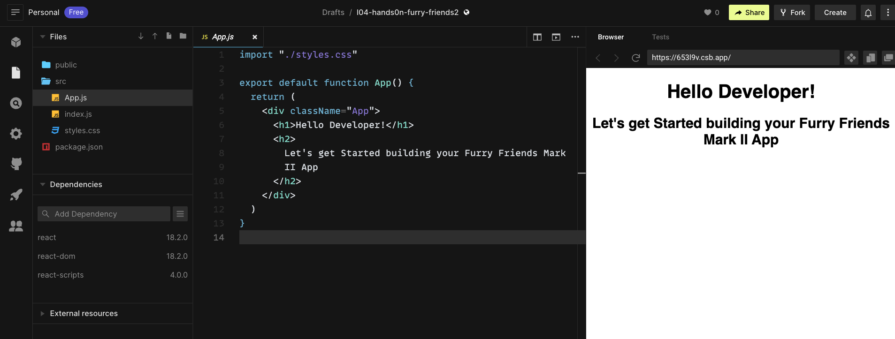

2. Fork the Starter Code

  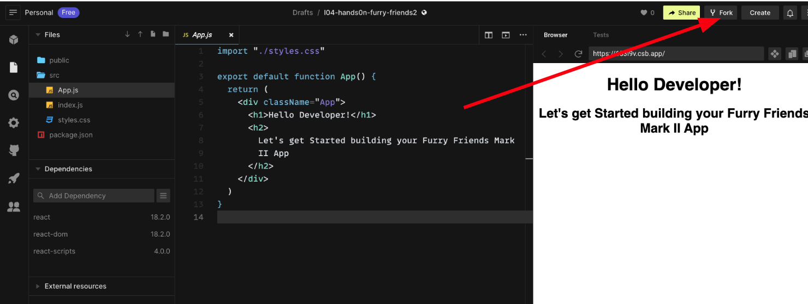

3. Sign in If you aren't already.

  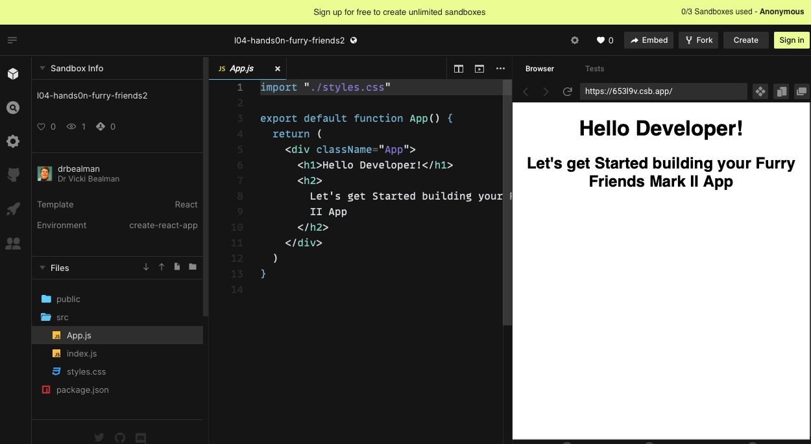

4. Save project

  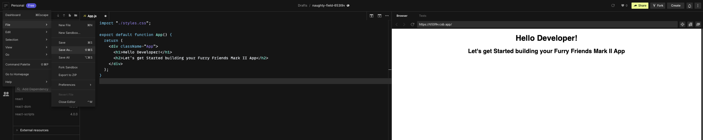

5. Export to GitHub

  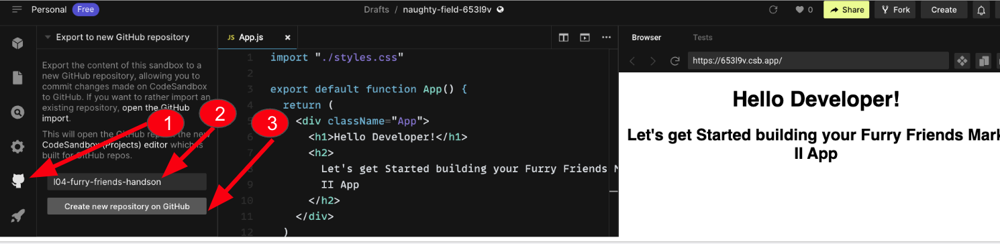

### Step One - Create a New Account on Netlify

This is the easy part. Head to [Netlify](https://www.netlify.com/) and you’ll be greeted with the company’s landing page. Look for the ‘Sign up ->’ button on the top right-hand side of the screen and click it.

You’ll be taken to the signup screen, which will look like this:

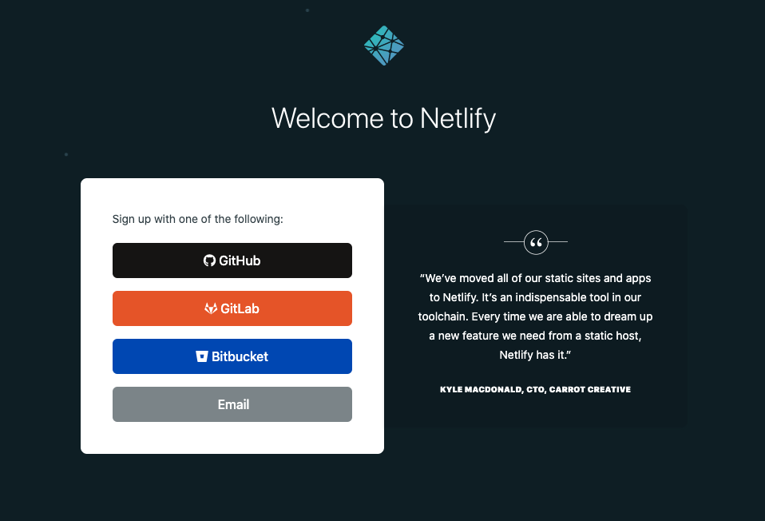


Netlify offers a range of options, including a simple email/password combination.

 - Sign up with your GitHub account.

You need to be logged in with GitHub, as it is arguably the most common. However, even if you choose another provider, the meat and potatoes of the lesson here will work in the same way. The main differences will be around signin, choosing your repository and any special GitHub commands.

### Step Two - Create a New Project for Furry Friends Gallery

When you sign up using GitHub you’ll be whisked off to their specific signin screen to authenticate and then authorize Netlify to read your repository information.

Once authorized, you’ll be taken to the Netlify dashboard. Here’s mine:

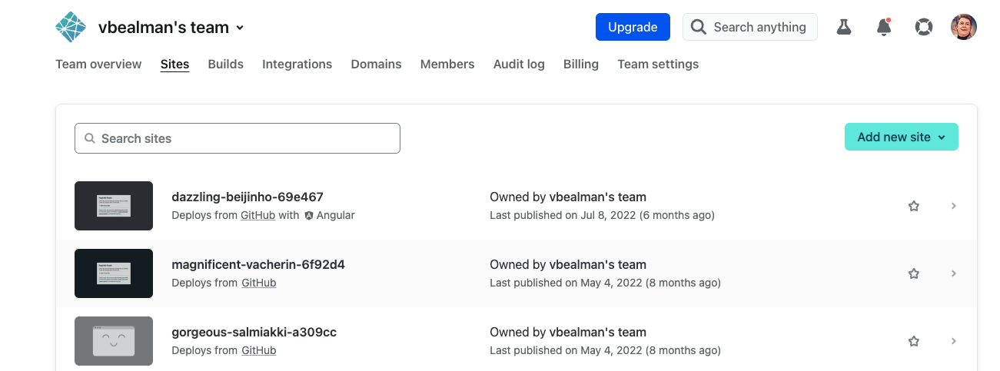

On the dashboard, you have easy access to high-level account settings, such as domains, builds, billing, and any team members you have.

You see on my dashboard a list of my Netlify-hosted projects.

If I were to click on one of these, I’ll be taken to a sub-dashboard with specific information related to this site, such as deploys, previews, and settings. You look at this screen in more depth shortly, but for now, add a new project!

Hit the green ‘Add New Site’ button at the top right of the dashboard and you’ll be taken through the new site wizard.

### Connect to Git Provider

The first step in the wizard is to choose the source for the  app.

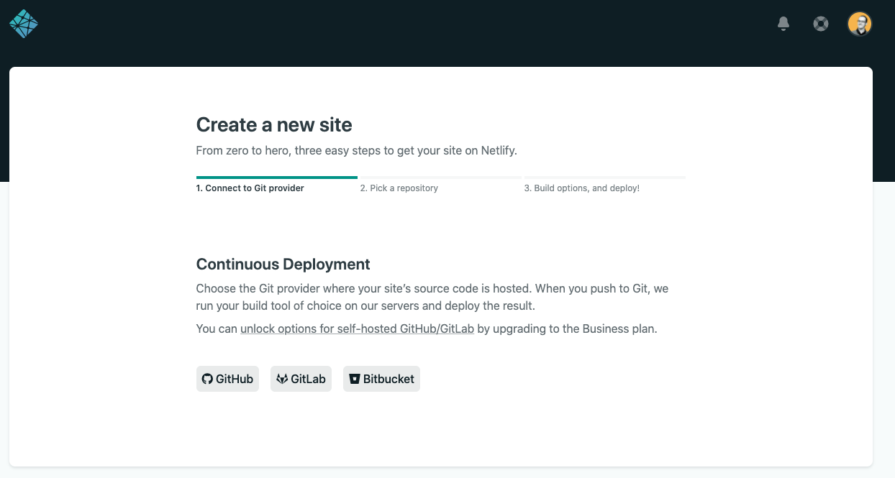

In your case, choose GitHub. Click the GitHub button and you may see a popup asking to authenticate to your GitHub account. Once you’ve done that, you’ll be returned to the new site wizard and will be moved onto the next step, picking a repository.

### Pick a repository

In this step of the wizard, choose the repository where your deployable code is located. You can see mine is called real-world-react-module-4-demo in the screenshot, but yours might be called something different.

Search through your repositories and find the one where your Furry Friend Gallery is located. Click on it to choose it and you’ll be moved onto the final part in the wizard, build options and deploy.

### Build Options and Deploy

So far so good (and simple). There’s a little bit more to this final step, but first, check out the screen to see what’s going on here.

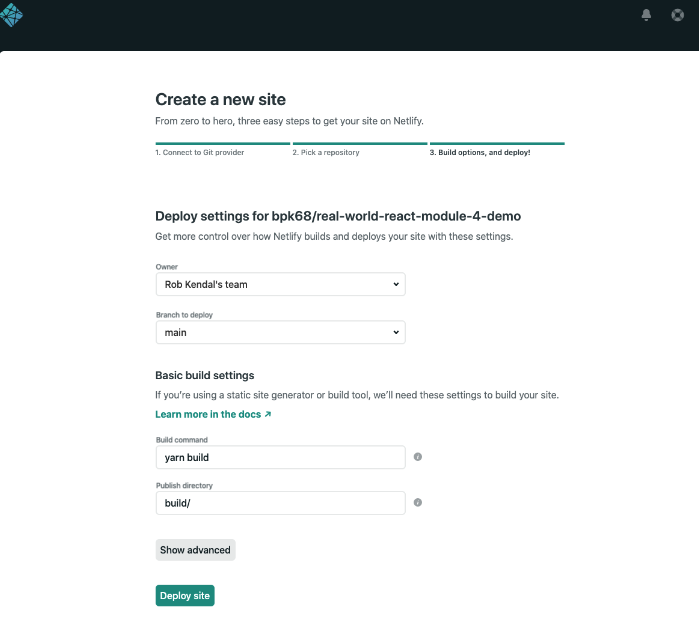

You see in the first section the chance to assign an owner and a deployment branch. The owner's information is only relevant if you have multiple members in your team or multiple teams. The branch to deploy, however, might differ depending on your Git versioning approach.

It’s quite common to have a main or master branch in your project. This will be the primary source of truth for the project and where all releases are made from. Leave this selection as main or master or whatever the default branch is unless you have a specific need to deploy your code from a different branch.

In the basic build settings section, define your build command and directory where Netlify will look to find all the files it needs to deploy.

Netlify does a pretty good job of working out what these values should be based on the type of project you’re deploying.

**IMPORTANT!**

For clarity, you need to know what command to give to Netlify to trigger the build process, as well as the final folder that is output as part of that build process.

In your case, open the project, Furry Friends Gallery Mark II, and look in the `package.json` file under the scripts section. Since this is a Create React App, you see the command `build`. If you were to build this project yourself manually, in a terminal window you type `npm build`, so that’s what you’ll pass to Netlify in the ‘build command’ input.

```
"scripts": {
  "start": "react-scripts start",
  "build": "react-scripts build",
  "test": "react-scripts test",
  "eject": "react-scripts eject"
},
```

Similarly, if you ran the npm build command and let it finish, you’d see a new folder in your project called `/build`. This is the location of the built and processed project files ready to be deployed. So, pass `build` as a folder to the ‘`publish directory`’ input here.

### Advanced Build Options

Usually, this is where you’d leave things and just click the ‘Deploy site’ button. However, you need an extra step because your Furry Friends Gallery is using environment variables.

At the bottom of this page, look at the ‘Advanced build settings’ section, where it talks about environment variables.

In the previous section, we introduced the concept of environment variables and how they’re stored in `.env` files. The drawback to `.env` files is they are usually stored on each developer’s local machine and not checked into code versioning systems and are therefore not available to build systems, such as Netlify.

When you built the Furry Friends Gallery Mark II in the very last lesson, you used two environment variables to access your Dog API, namely `REACT_APP_DOG_API_URL` and `REACT_APP_DOG_API_KEY`.

So how do you make these variables available at build time for an app in Netlify? Fortunately, like all good build pipelines, Netlify provides us with the option to add environment variables to be used at build time.

If you take a look toward the bottom of the build settings screen you see an ‘Advanced build settings’ section.

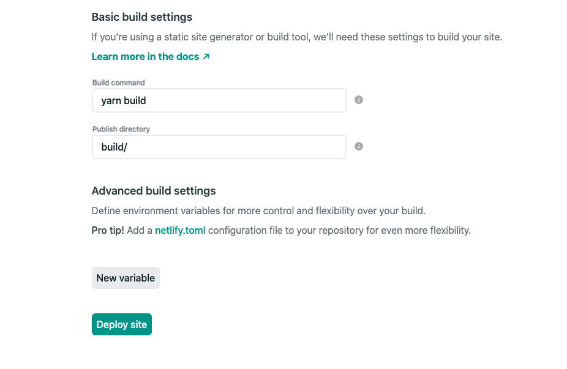

This is where you add your variables to enable the site to connect with your Dog API.

Click the ‘New variable’ button twice and you’ll see two sets of two inputs appear that hold `key` and `value` values respectively.

Enter your environment variables for the API URL and access key into these new inputs like this:

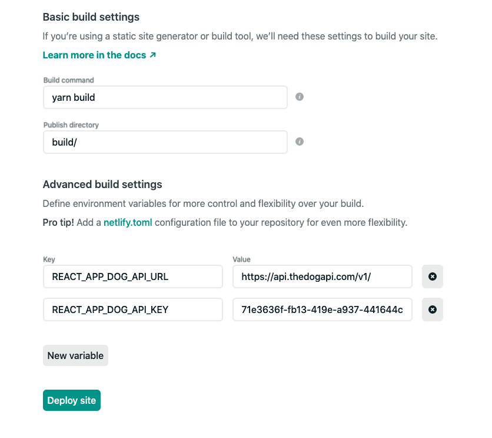

With that covered, it’s time to deploy our hard work!

Hit the green ‘Deploy site’ button and you’ll be taken to the project’s dashboard to check on the build progress.

## Step three - Inspect the Build via the Project Dashboard

So here you are, the project dashboard for your project. It should look something like this:

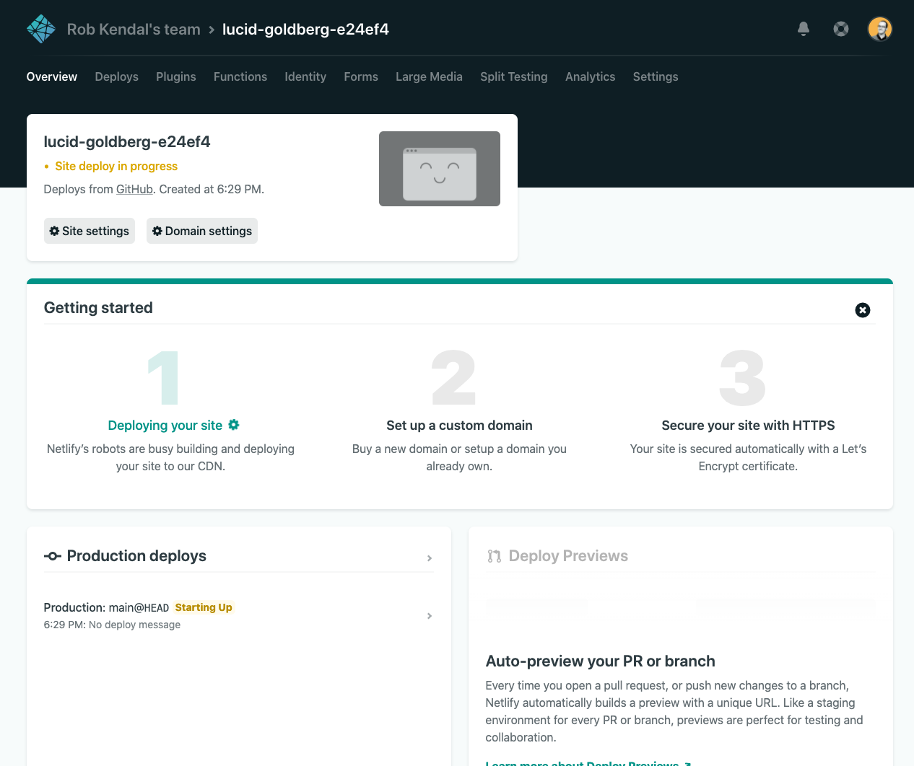

Up at the top of the dashboard, you see a funny looking name. Unless you use a custom domain for the project, Netlify will assign a random three-part name you can use to identify the project in lists and access publicly (once it’s deployed), at an address that looks like https://[your-unique-name].netlify.app. Note, yours will look different from the one I have here.

This topmost area also holds a preview of the deployed site (once it’s finished) as well as the status of the current build and deploy. Notice that yours is currently set as yellow with a ‘site deploy in progress’ message.

The other main points of interest here are the ‘Getting started’ section and the ‘Production deploys’ area. ‘Getting started’ is a one-time panel that shows for all new projects you add to Netlify. Once your site has deployed successfully, you’ll be given the option to bring in and use a custom domain, and finally, to add a free SSL certificate. Leave the custom domain and SSL for now as they’re outside the scope of this course, but Netlify has fantastic documentation on custom domains and how to use them in your projects.

With ‘Production deploys’ you find a list of the most recent deploys for your project and whether they succeeded or failed. You can inspect each separate build run to see a log of exactly what happened during the build.

### Handling Build Errors

After a while, you should see your project has finished building and then you can view your hard work in all its glory on the public URL.

But oh no, what’s this?! Red text, a warning and a message about ‘site deploy failed’!

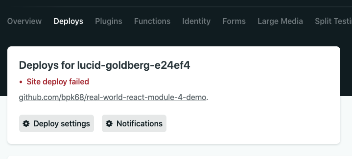

Something’s gone wrong with your build and the build has failed. Fortunately, you can step into the specific build run and see what exactly went wrong.

Looking under the ‘Production deploys’ area of the project dashboard, you see you have at least one build run with a Failed tag in red, next to it.

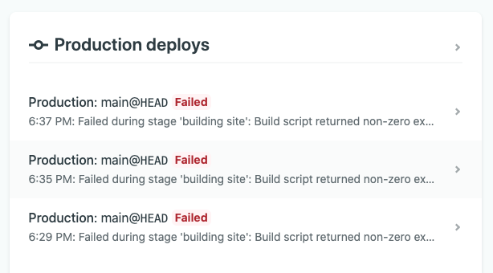

Click on the most recently failed build to view the build log. Under this wall of white on black terminal style text you can scroll down to see the specific point in the build where things went wrong and look for a possible solution.

The error here is a rather specific build environment error unique to Netlify. From the middle of 2020, Netlify started adding a CI=true environment variable to all builds on its platform. All build environments such as Netlify will have a list of standard, internal environment variables they make available to projects during builds, but this one causes an easy-to-fix issue with Create React App in particular.

The main problem here is this automatically injected environment variable `CI=true` causes the build of your project to interpret some rather innocuous warnings as real problems, shutting down the build.

You can read all about this specific issue on the [Netlify community blog](https://community.netlify.com/t/new-ci-true-build-configuration-treating-warnings-as-errors-because-process-env-ci-true/14434) where they have an entire thread dedicated to this problem and how to solve it.

Fortunately, it’s a really easy fix that you apply now.

## Step Four - Exploring the Build Settings

Fixing your build error is quite straightforward and only takes a simple change to the build settings, but it also gives a good opportunity to review your build settings and see what else is in there.

From the project dashboard, click the ‘Site settings’ menu item in the top navigation. Once in the site settings, click the ‘Build & deploy’ link from the left-hand navigation menu.

This section is where you can discover and edit all the settings related to your site or app's build and deployment. You can change the deployment branch, environment variables, apply post-processing tricks like injecting Google Analytics into your site, and control who gets what notifications.

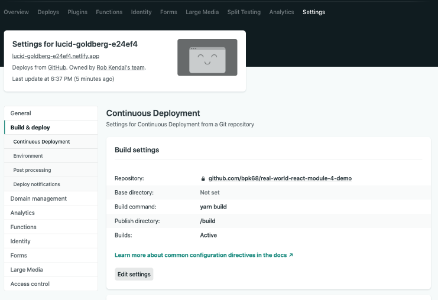

For now, however, you’re concerned with the very top box ‘Build settings’. Click the ‘Edit settings’ button and change the ‘Build command:’ input box from yarn build to CI= yarn build.

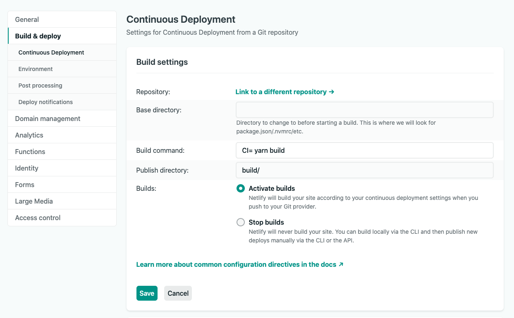

Hit the ‘Save’ button and that’s it: such a simple fix, but now, Netlify will not interfere with our Create React App build and you’ll find things go much more smoothly from now on.

### Triggering a New Deployment

The last thing is to trigger a new build and deploy run. To do that, head over to the ‘Deploys’ section from the top navigation. This area lists the most recent deployments as well as access to deployment settings, notifications, and stopping automatic publishing.

For your needs, you’re mainly concerned with the ‘Trigger deploy’ select element in the top right of your deployment list. Click ’Trigger deploy’ and then select ‘Deploy site’ to kick off a new site deployment.

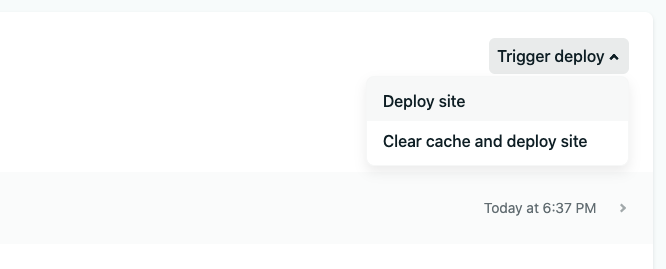

This will add a new deployment item to the existing list and mark it as ‘in progress’. If you click into this new build you can follow along in real-time as Netlify builds the project.


Hopefully, if everything goes according to plan, you reach a nice blue box surrounding the message ‘Netlify Build Complete’. If you reach this point, everything’s built and you’ll be able to go view your deployed project at your very own unique URL.

## Step Five - Viewing the Deployed App

Back at the top of the screen, click the ‘`< Deploys`’ link to get back to the Deploys dashboard, and then take a look at the nice green URL under your project name.

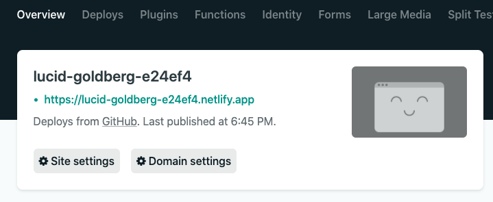

Mine will look different from yours, but the point here is you can click this link to open a new screen which will have your lovely Furry Friends Gallery Mark II running.

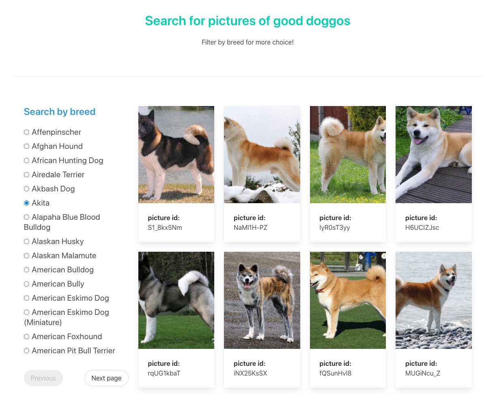

Take a look at your public app and take it for a spin: select some breeds from the left, page through them, view the dog pictures.

Although you haven’t built anything new in this lesson, you covered an awful lot of ground in understanding how building and deploying your apps in a realistic setting works. You should give yourself a huge pat on the back and go grab a well-earned rest before we tackle the next lesson. 