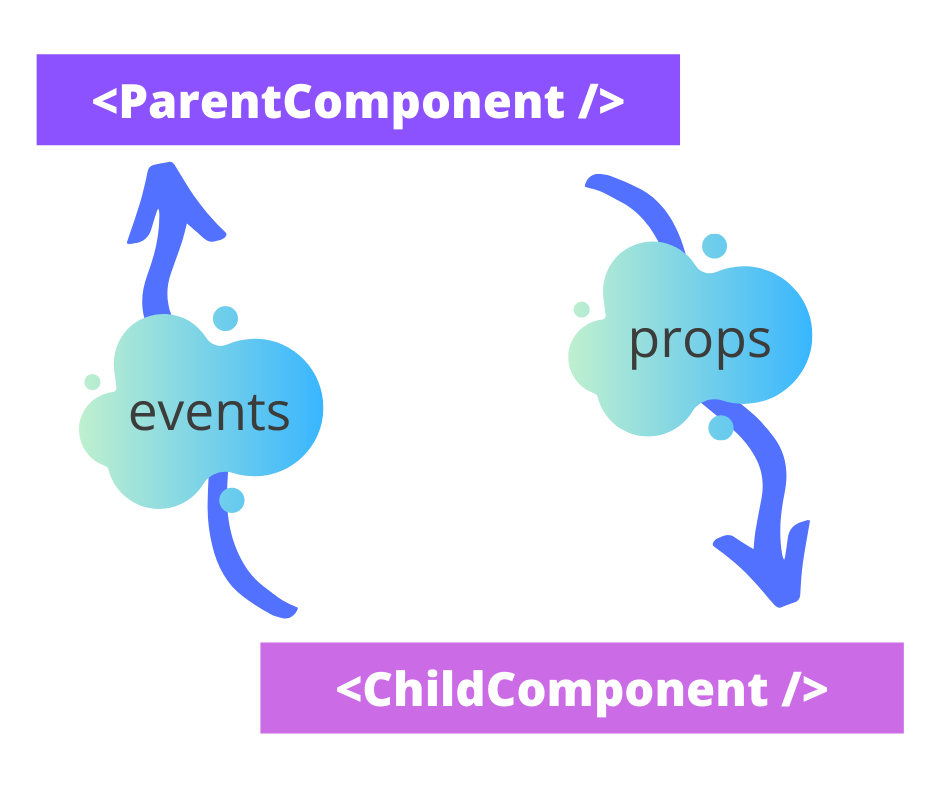
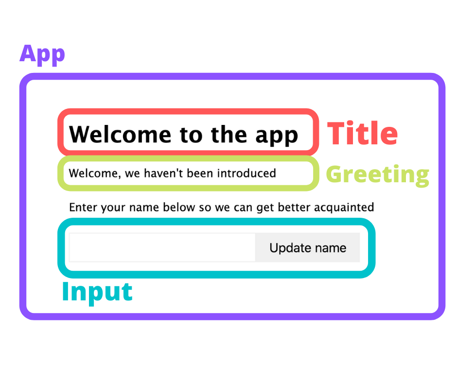
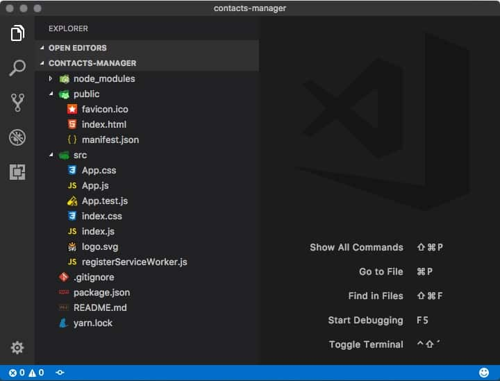
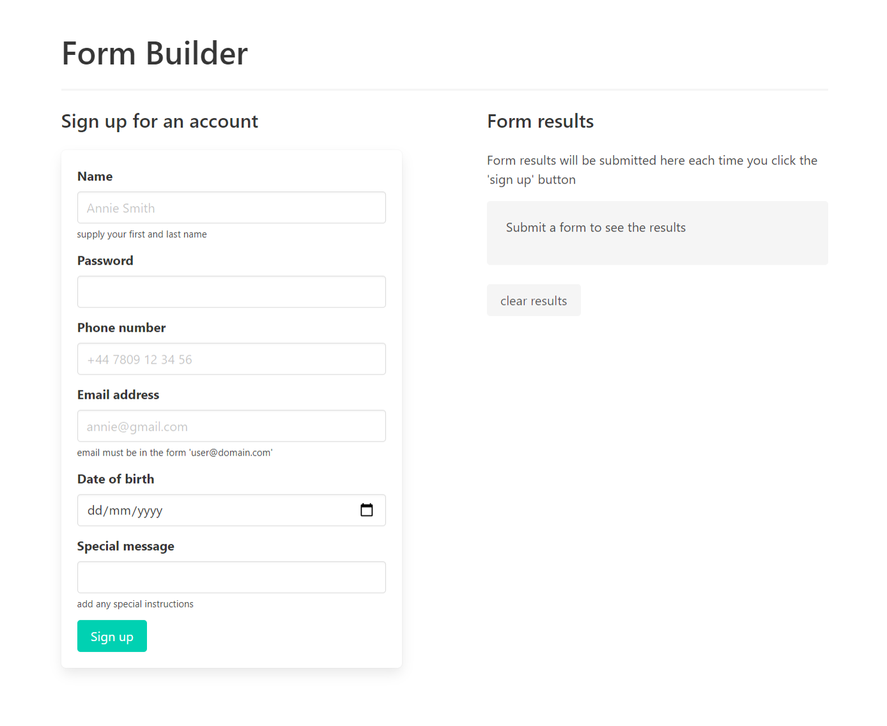

# Think in React

Successful React development involves being able to 'think in React'. Look at breaking down UI's into components and their relationships.

In the early lessons you looked at the relationship between components in React. No matter what the size, structure, and complexity of the React project you’ deal with, when it comes to components there are broadly two roles a component will have: they will either be a **parent** or a **child**.

## Parent and Child Component Relationships

Most components are either a **parent** or a **child** and this isn’t a one to one relationship. Just like real life, parents can have parents, and children can themselves have children. The important thing to remember about this relationship is how you move information between them. It’s a core part of the React approach but one many beginners struggle with.

Here’s your earlier lesson’s diagram that highlights this information flow.



You see a parent component passes data or information down to a child via props, while a child component sends data and information back up to a parent via some sort of event. 

For example, a parent component which deals with calling an API to retrieve a list of users might pass a loading flag, `isLoading`, a value for the total number of users found, `totalUserCount`, and a function `nextPage()` to a child component which deals with displaying some paging elements in a nicely formatted way. The child component has a styled set of page elements and a button for the user to click to move onto the next page.

The child component, in this case, is purely presentational. It contains minimal (or zero) logic or state and is more concerned with accepting a range of prop values and displaying them in some formatted way. 

In this scenario, the parent component passes the data, our `totalUserCount`, `nextPage()` and `isLoading`  down into the child component via the props object. In the child component, you access them via a call to props like this, `props.totalUserCount` or `props.isLoading`. 

That’s fine, but what happens when the child component wants to change to the next page of results? 

The logic involved in fetching new results and organizing the returned data is handled by the parent component not the child component because the child component is purely presentational. 

At this point you might be thinking, ‘well couldn’t we just move the button that triggers the next page into the parent component?’. This is an option, but the button makes more sense in the context of the whole paging component. The parent component in this example is possibly doing several other things and contains several other related presentational components such as a data table and a search bar. 

So what’s the solution? Well, leave the button where it is, in the presentational child component, but attach the `props.nextPage()` function you passed down from the parent to the button’s `onClick` event. 

What happens now is when the user clicks the next page button, the button’s `onClick` event is triggered, this calls whatever function is attached to this event, which in our case is the passed in `nextPage()` function. The `nextPage()` function will be called and since it lives in the parent component, it’ll be handled there. The parent component will likely fetch more results from the API and then pass these new results down to the child competent, which will re-render and complete React’s component lifecycle once more.

This is a fairly simple, yet common, example of data flow around your app and between components. Things can get complicated and a little ugly if you have many layers of children and you need to get data from a parent component higher in the chain to a much lower child component. This practice is called prop drilling and involves each child component in the chain having to grab a prop from its parent and pass it down to the next child. 

In a later lesson, you will look at more complex data and state management using the `useReducer` Hook and the Redux state management pattern. These concepts can avoid scenarios like prop drilling and reduce the dependency of unrelated components on each other for the sake of passing props down the line. 

### Component Types in the Wild

Just about anything you come across in a React project that returns some JSX can be thought of as a component. However, not all components are created equal. There are several different component types you may come across when building projects as part of your job, contributing to open source projects or reading about in blog articles. 

Look through some of the more common ones to see what they are used for, what they look like, and how you can identify them. 

Keep in mind that because React is both very unopinionated and is based on JavaScript, which is itself a very loosely typed language, there can be a lot of overlap between styles of components. For example, a class-based component can also be a presentational component. The naming convention of a style or type of component can be a mixture of its role, its output or how it’s constructed. Nothing’s set in stone, but it can help to order your project and the building blocks that components represent.

### Class-based Components

A class-based component is really any component based on an ES6 class. They typically look like this, extending React’s Component class:

```
class MyClassComponent extends React.Component {
	state = {
		name: '',
		age: 0,
	};

	constructor(props) {
		super(props);
		
		// handle incoming props
		this.state.name = `${props.firstName} ${props.lastName}`;
	}

	render() {
		return(
			<p>Hi, {this.state.name}, you are {this.state.age} years old!</p>
		);
	}
}
```
s
You might remember the look of this style of component construction from our earlier lessons where you built out some class-based components and refactored them.

This component will accept some props such as `firstName` and `lastName`, does some string manipulation to turn it into a single name property in state and renders a paragraph element pulling in the name and age values from state. 

Class-based components will often have a file name that ends in `.js` rather than `.jsx`.

### Function-based Components

Function-based components are more simple in their implementation over class-based ones. They look more like a standard JavaScript function and often just return a block of JSX. They also can often be found with a `.jsx` filename. 

As mentioned above, since the introduction of **Hooks**, function components can now perform the same state interactions and lifecycle logic their class-based counterparts could previously. 

If you were to rewrite the previous class-based example, it would look like this:

```
function MyFunctionalComponent(props) {
	const [name, setName] = useState('');
	const [age, setAge] = useState(0);	

	useEffect(() => {
		setName(`${props.firstName} ${props.lastName}`);
	}, [props.firstName, props.lastName]);

	return(
		<p>Hi, {name}, you are {age} years old!</p>
	);
}
```

It’s important to note that both this example and the previous class-based one are functionally equivalent. They’re both pure functions, that is, given the same input, they will return the same output. It’s one of React’s only hard and fast rules.

### Presentational Components

Presentational components are components that deal almost exclusively in formatting and presentation of information with zero (or bare minimal) logic or stateful processing. 

They represent the base building blocks that your UI is composed of. 

Consider the very first example in this lesson of a paging component which accepts some data from a parent component and just deals with displaying it. This Paging component might look like this:

```
function Paging({ isLoading, totalItemCount, nextPage }) {
	const pageSize = 10;	 
	const pages = [];
  
  for(let i= 0; i <= parseInt(Math.ceil(totalItemCount / pageSize), 10); i++) 	{
    pages.push(<a className="page-item">{i+1}</a>);
  }
  
	return (
		<nav className="paging">
			{ pages }
      	<button onClick={nextPage}>next page</button>
		</nav>
	);
}
```

While containing some logic, it is minimal and purely used to work out how many pages to display. The component is still primarily presentational as it isn’t concerned with external data fetching, complex logic, state updates or lifecycle handling.

Another simple example might be a title component which displays a formatted header and subtitle like this:

```
const TitleDisplay = ({title, subtitle}) => (
	<>
		<h1 className="title is-size-1 has-text-primary">{title}</h1>
		<p className="subtitle is-size-2 has-title">{subtitle}</p>
	</>
);
```

As well as using the alternative construction of the component by using a `const` and an anonymous arrow function, you see this component is much more of a simple beast. It accepts a `title` value, a `subtitle` value, and returns a block of JSX that will format the input values consistently for our imaginary project.

### Container Components

Container components (sometimes known as management or manager components) are almost the opposite of presentational components. They usually contain very little presentational JSX markup, passing that responsibility to child presentational components (or other child management components). 

Instead, they’re concerned with app-wide state updates, fetching data to power child UI blocks, more complex logic and data synchronization tasks. 

This convention of breaking responsibilities into how things look with presentational components and how things work with container components is a great starting point if you’re new to structuring your React projects and want to know how to split out your components and their responsibilities.

### Higher-order Components (HOCs)

HOCs are a more complex offering, but you will come across them in real life projects and it’s worth identifying them and seeing how they tick.

All higher-order components are, like all components, still just JavaScript functions and JavaScript already has this idea of a higher-order function. This is a function that accepts functions as arguments and returns another function. They allow for a greater abstraction over actions not just values. A good example of a JavaScript higher-order function would be the built-in Array functions, `.forEach()` or `.map()`. 

Back to HOCs in React; these are an advanced React technique of creating a function that takes a component and returns a new component.

You will use a number of HOCs in later lessons without even thinking about this concept, such as React Redux for managing a global state. Redux’s `connect()` function is a HOC, but you discover this in an upcoming lesson.

There is a really good example of a higher-order component on the official [React docs](https://reactjs.org/docs/higher-order-components.html) that goes into a lot deeper of an example for a use case. 

However, for the base concept, you’ll discuss a simple example from the [CSS Tricks website](https://css-tricks.com/what-are-higher-order-components-in-react/) to illustrate the point.

```
const withUpperCase = (WrappedComponent) => (props) => {
  return (
	  <WrappedComponent {...props}>
  	{props.children.toUpperCase()}
    </WrappedComponent>
  )
}
```

This `withUpperCase` component receives a wrapped component as an argument, it then returns a new component where you convert the children to an uppercase string using `toUpperCase()`. 

To use this, you could create a component that receives some props and renders its children elements. 

`const Title = props => <h1>{props.children}</h1>`

Next, wrap this `Title` component in the higher-order component you created and save it in a variable. 

`const UpperCaseTitle = withUpperCase(Title);`

Then, render this in another part of your app like so:

```
function MyAwesomeComponent = props => (
	<div>
		<UpperCaseTitle>This is a page title here</UpperCaseTitle>
	</div>
);
```

The `UpperCaseTitle`  component renders the result of the HOC `withUpperCase` that was passed our `Title` component, transforming the string ‘This is a page title here’ to its upper case variation. 


## Component Relationships

React components are modular, isolated slices of functionality that connect together to build user interfaces. This lesson discusses the relationships between components.

### React Component Relationships

Many beginners to React get hung up on how to structure their components, asking questions like:

- When should they be split into new components?

- What should they do?

- How should they interact?

- How can I pass data between related components?

Hopefully, in this lesson, you can answer some of these questions and get some guidance on good places to start when thinking about your components. 

## Split up Components

There are two ways of getting started when building your projects or thinking about building new components and areas of functionality within your app:

1. Plan everything out to the nth degree.

2. Get started and refine as you go. 

In an ideal world, there would be a mid-point between the two extremes, but I generally lean towards the second approach and refine as I go. If you’re new to React or find it more helpful to plan more rigorously then you might find the first approach fits your needs better. 

My approach tends to involve getting something rough and ready working, and then looking to refactor it as I go. 

The point here is you want to have a good idea of the data and information you want to consume and present to the user, and manage their interaction with it. Then, you want to break these areas of responsibility into smaller, more manageable chunks reusable across different parts of the app, keeping your components as DRY (don’t repeat yourself) as you can. 

You can, of course, do this with fewer, larger components that are like a Swiss Army knife doing multiple jobs at once. The drawback to this approach is you end up with large components that become hard to manage and maintain, new eyes on the components will struggle to assimilate the information and figure out what does what, and they’re harder to debug and test. 

A good place to start with splitting your larger components down is to look at your component as a whole and to ask yourself a few questions:

- What does this larger component do? 

- What parts of the UI is it responsible for?

- Are there any areas of distinct UI that could be used elsewhere or abstracted so that this is possible?

### Visualize the Component Split

We touched on some of this visualization right at the beginning of the course when you built your Welcome app.

Take another look at the diagram we made back in that earlier module:



You looked at this entire component, the `WelcomeMessage` component and thought about how you could break this down into smaller, reusable elements. 

Although we decided it’s a little overkill for this specific component, this practice is very useful to do when you have larger blocks of code that could stand to be isolated, or a lot of repeated sections of near-identical code that could be abstracted into reusable parts. 

This way of drawing out the slices of a whole UI section will help you visualize the possible components you could break the complete UI down into, as well as seeing at-a-glance their relationships to one another. 

### Component Splitting Example

Take a look at a typical piece of UI you might find on a blog post, a comment:

```
const PostComment = ({ author, commentText, commentDate}) => (
	<div className="post-comment">
		<div className="user-info">
			
			<p className="avatar">{author.name}</p>
		</div>
		<p>on {commentDate}, they had this to say...<p>
		<div className="post-comment-body">
			{commentText}
		</div>
	</div>
)
```

Now admittedly this isn’t a huge component, but you see you have a very familiar pattern in your user-info div. This slice of UI that renders a user’s avatar image with their name might be used across your site in several places: a blog comment; a user profile section; my account area; in a list of popular commenters; or in a recent visitors section. 

So straight away, you can pull out the user info section that houses their profile picture and their name into its own, reusable slice of UI like this:

```
const UserAvatar = ({imgUrl, name}) => (
	<div className="user-info">
		
		<p className="avatar">{name}</p>
	</div>
)
```

Now, back in your original `PostComment` component, replace this section with your new component:

```
const PostComment = ({ author, commentText, commentDate}) => (
	<div className="post-comment">
		<UserAvatar imgUrl={author.img.url} name={author.name} />
		<p>on {commentDate}, they had this to say...<p>
		<div className="post-comment-body">
			{commentText}
		</div>
	</div>
)
```

You could quite easily create components for the parts that display the comment date and comment body content, but this would only serve to create unnecessary complexity and extra components. You don’t add anything helpful by doing this, because these sections in particular are just a simple `<p>` tag and an ordinary `div` element with a CSS class attached to it.

## Balance Reuse with Project Complexity

This is good talking point about exactly how much splitting down of UI into separate components is needed or a good idea?

If you ask Facebook themselves, they’ll admit they have tens of thousands of components. However, Facebook is a huge site, much bigger than you’re ever likely to work on, with thousands of distinct areas of UI that have a common overlap in some parts — a bit like our avatar image example above. 

For average projects, sites and apps, even really large ones, it’s important to strike a balance between reducing reuse by abstracting common functionality and UI, and adding to project complexity.

The user, which is ultimately whom you’re building your UI for doesn’t care or know (or really need to know or care) about how your project is pinned together. There’s also very little argument for any performance gains over having several large components over a ton of small ones, beyond the glaring one that is more reuse equals less code on the frontend bundles. 

Really, the great gains for splitting down your components are several fold:

- You reduce code waste and repeated blocks of code or UI.

- You reduce large component complexity and responsibility.

- You shift responsibility into smaller, isolated blocks, the individual components themselves.

- Your UI becomes more composable because you’ll have a number of distinct building blocks.

- Unit testing becomes easier.

- Troubleshooting and debugging becomes more forgiving as narrowing down the trouble spots is now easier.

So then, since you’re largely doing it for yoursef as developer and the maintenance of the project, you could agree it’s key to be able to reduce redundant and overused blocks of code. 

Keep in mind that every single thing doesn’t need to be a separate component. In our example above, it made sense to abstract the `UserAvatar` component. Sure, it’s a small slice of the UI (merely an image element and a paragraph), but this combination, coupled with some styling information, can be repeated across the site or app many times in many areas. 

If you need to change the look and feel or functionality of the user’s avatar, you now have a single, easily-tested component that just needs changing in one place.

It makes sense to abstract related pieces of UI information into distinct components, even if they are small. But try not to go so far as to make every single thing into a component as you’ll end up with a bloated project full of components that becomes hard to navigate.

## React Project Structure

There is a ‘good not perfect’ axiom key when thinking about your project structure. Again, it’s a weirdly overly-thought-about subject, but you’d be surprised at how difficult it can be to be presented with a completely blank canvas and asked to start adding files and folders to it. 

Take a look at some common approaches to structuring your React projects.

### React’s own Base Project Structure

You created several projects using the Create React App tool so far, so start by looking at a brand new Create React App project structure and go from there:



It’s quite flat by design. There’s no complex nested structure and indeed the React team advises against nesting more than three levels deep. React, being so unopinionated understandably provides a really unopinionated project structure with its Create React App projects. 

However, rather than looking at it from a ‘we don’t want to push any ways of doing it on you’ angle, think about it as a great starting point that gives you just enough structure for you to get going, without adding in complexity or pushing you down a set route from the start.

### Common Structure

Start with this clean approach that’s quite flat and then have a number of different top-level folders to suit different areas of responsibility:

- `/component`s - houses all the smaller components or presentational ones. Add additional folders that group some related components together, such as form fields.

- `/containers` - because I like the split between presentation and logic, I put my management components that look after logic and data handling in the containers folder.

- `/lib` - anything that’s functional but not directly React related, such as data handlers, API fetchers, or utility files get held in here.

- `/reducers` - if using Redux, keep reducers and action creators in this folder.

- `/layout` - although still holding components, for more complex layouts within apps, I find it helpful to have a dedicated layouts folder for these structural UI components.

- `/data` - this usually holds any static data such as initial state or json files.

- `/assets` - this folder houses CSS files, SCSS files, images or other similar files.

Some of these might not be relevant depending on the type of app or site you're building.

There are other popular options to look at too, so let’s talk about those.

## Group by Features or Roles

One popular way of structuring your React projects is to group your components and files by their features or routes. 

Consider the following mock structure:

```
common/
  Avatar.js
  Avatar.css
  APIUtils.js
  APIUtils.test.js
feed/
  index.js
  Feed.js
  Feed.css
  FeedStory.js
  FeedStory.test.js
  FeedAPI.js
profile/
  index.js
  Profile.js
  ProfileHeader.js
  ProfileHeader.css
  ProfileAPI.js
```

So here, you have a `/common` folder that houses several common or global files that will be shared across the app. Then, you have a `/feed` folder that houses everything related to the feed feature. Similarly, you have a `/profile` folder that deals with everything to do with a user’s profile.

This is quite a neat approach and makes for easy maintenance and finding of files. You notice a mixture of file types in there, including CSS files, `.js` functions, an API caller and the main `index.js` entry points for that route or feature.

This approach will be most helpful on larger, more complex projects but possibly overkill for smaller apps and sites.

### Group by File Type

The grouping by type approach is a little more like the one I prefer that I mentioned at the beginning. 

In practice, it might look like this:

```
api/
  APIUtils.js
  APIUtils.test.js
  ProfileAPI.js
  UserAPI.js
components/
  Avatar.js
  Avatar.css
  Feed.js
  Feed.css
  FeedStory.js
  FeedStory.test.js
  Profile.js
  ProfileHeader.js
  ProfileHeader.css
```

You have a dedicated `/api` folder that holds everything API-related. Then a `/components` that holds both the component itself and an associated CSS file.

This is a much flatter structure that lends itself well to the type of files in your project. It could grow a little unwieldy if your project grows quite large or more complex. 

### A Final Thought on Project Structuring

Many people like to overthink these things. During my career I’ve even had meetings where I’ve spent over a hour in a meeting discussing folder structure on a project. One or two hours in a meeting with ten other engineers is close to two full days of lost development time!

And guess what, even if you agree on a structure ahead of time, code projects and software are like living organisms. They change over time, adapt to changes in user needs, available technologies, and preferences or best practices.

So my advice is the same as the official React advice from their documentation website: ‘don’t overthink it’. Don’t spend more than five minutes deciding on a folder structure

You can always change things as you go and refactor it as you need!

## L04HandsOn Project-Form Builder

### Requirements

1. Read the entire lesson, and code along with the guided learning to create the Form Builder App
2. Save your work frequently.

For your project in this lesson, you create a Form Builder app. The Form Builder will allow you to dynamically create a number of form fields using a JSON file. 

The final form will be assembled dynamically based on the JSON information and each form field's value will be captured in state.

You essentially build a really simplified version of the popular React form generators such as [Formik](https://formik.org/). 



You can change the JSON file, adding and removing fields as you wish, and the form is automatically updated on the front end. 

All the information from each field is captured and mock sent to your site owner via an email — this is what you’d like to do in real life, but for now, we’re just displaying the submitted form field values back to the user in a display box.

Start making your Form Builder.

### Build the Form Builder

The Form Builder app is the most complex you've built so far. It builds on concepts from earlier lessons and reenforces the idea of building modular, component-driven UIs. You'll walk through the app step-by-step to create a dynamic form powered from a set of JSON objects.

Time to build something fun, the Form Builder app!

In this app, you will take a simple HTML form powered by React and allow it to load in a range of form fields dynamically from a JSON file. 

It’s going to look like this when you’re done:

.png)

## Visualize the Components

Before you start building anything in code, however, it’s a great place to practice some of our ‘thinking in React’ skills. 

As you get more experienced, you can code up what you need to and look at refactoring this as you go. In fact, it can be really helpful to rapidly and roughly build something out and just get it working and then concern yourself with refining it once it does. 

But at this stage, it’s a super useful exercise to do a bit of planning beforehand to get a mental model and layout of what components you’ll need to build, and how they’ll interact. 

### Opportunities for breaking down components

Sticking with the finished demo you just looked at above, if you were to code this all up in one big component, it would look like this:

**LonFormExample.js**

```
function MyLongForm (props) {
  const [formValues, setFormValues] = useState({});

  const handleOnChange = e => {
    setFormValues({
      ...formValues,
      [e.target.name]: e.target.value
    });
  };

  const handleOnSubmit = () => {
    // do something when the form submits
  };

  return(
      <form onSubmit={handleOnSubmit}>
        <div className="field">
          <label className ="label">Name</label>
          <div className ="control">
            <input
                className ="input"
                type="text"
                placeholder="Annie Smith"
                onChange={handleOnChange}
                name="name"
                value={formValues['name']}
            />
          </div>
          <p className ="help">
            supply your first and last name
          </p>
        </div>
        <div className="field">
          <label className ="label">Password</label>
          <div className ="control">
            <input
                className ="input"
                type="password"
                onChange={handleOnChange}
                name="password"
                value={formValues['password']}
            />
          </div>
        </div>
        <div className="field">
          <label className ="label">Phone number</label>
          <div className ="control">
            <input
                className ="input"
                type="text"
                placeholder="+44 7809 12 34 56"
                onChange={handleOnChange}
                name="phone"
                value={formValues['phone']}
            />
          </div>
        </div>
        <div className="field">
          <label className ="label">Email</label>
          <div className ="control">
            <input
                className ="input"
                type="email"
                placeholder="annie@gmail.com"
                onChange={handleOnChange}
                name="email"
                value={formValues['email']}
            />
          </div>
          <p className ="help">
            email must be in the form 'user@domain.com'
          </p>
        </div>
        <div className="field">
          <label className ="label">Date of birth</label>
          <div className ="control">
            <input
                className ="input"
                type="date"
                onChange={handleOnChange}
                name="dob"
                value={formValues['dob']}
            />
          </div>
        </div>
        <div className="field">
          <label className ="label">Special message</label>
          <div className ="control">
            <input
                className ="input"
                type="text"
                onChange={handleOnChange}
                name="message"
                value={formValues['message']}
            />
          </div>
          <p className ="help">add any special instructions</p>
        </div>

        <button className="button is-primary">Sign up</button>
      </form>
  );
}
```

Ok, so this is already a really long component with much repetition, or very very close to having identical blocks of code — e.g. the label and input element combinations.

Granted, some of this additional markup is due to the styling imposed by Bulma, but even without that, you would still have many repeated blocks of code. This has a few disadvantages:

- Readability becomes more difficult as the file or component grows in size or complexity.

- Any universal changes (i.e. if you needed to change the styling or structure or logic) need to be made to each and every separate block rather than in one place.

- More repetition usually introduces more places for errors to occur.

- You also essentially ‘lock in’ this form and make it concrete. For example, we can’t reuse it anywhere, despite the fact that the mechanism of how it works (e.g. collecting data from the user and doing something with it) is going to be largely identical from form to form. 

### Create a Visual Map of Components

An improvement on this would be to look at the component you have and refactor it, thinking how you can maximize reuse and minimize errors and lines of code.

Thinking about the previous example and the previous demo of the app, you can create a visual mapping of how you might break down the single components into smaller parts.


Looking at this visual mapping, you can see you have three main components and an additional file, `formfields.json`.

- `App.js` — The usual project entry point that defines the starting place for your app to begin.

- `Form.jsx` — This will be a container component that pulls in your JSON data from the `formfields.json` file and uses it to populate a dynamic list of `FormFieldInput` components.

- `FormFieldInput.jsx` — A semi-presentational component that renders an HTML input with a label, wrapped in a little bit of Bulma markup. It manages its own state for the input’s value.

- `formfields.json` — A simple JSON file that contains an array of objects, each representing a form field with some information like a name, label text, and input type.

## Project Setup

This part of the build should be starting to look familiar by now as you create a new project with Create React App, remove some default files you don’t need, and add Bulma’s CSS framework to the project.

Open a terminal window and navigate to the parent folder you want to create the new project in. Next, type the `create-react-app` command as follows:

`npm create react-app form-builder`

Let the command line finish installing the dependencies. Wait until you see the ‘success’ message and `npm`` commands to start and build the app.

### Test the New Project

Give everything a quick check to see if it’s working before you take the coding hatchet out.

```
cd form-builder
npm start
```

Once it’s built and ready, navigate to http://localhost:3000 in a browser check out the project running as expected.

### Initial Clean Up

Open `index.js`, located in `/form-builder/src/` and remove the default styles:

`import ‘./index.css' ` 

It should be on line 3 of the `index.js file`. This will just remove a link to the default styles from the project you won’t need. 

After that, locate `/src/index.css` and delete the file.

Find the `/src/App.css` file and open it. Highlight all the contents and delete the existing styles. Save and close the file.

Open the main `App.js` file located at  `/src/App.js`.  Locate the following line (around line 2) that imports a `logo.svg` file, and remove it:

`import logo from ‘./logo.svg'`

Now, select everything in the return statement (everything between return `()` and replace it with the following so the new return statement looks like this:

```
return (
  <>
    <h1>Form Builder is ready to go</h1>
  </>
);
```

### Add Bulma

The final stage in the setup is to, once more, bring Bulma onboard to help style your app. 

Open up the file `/public/index.html` . If you remember, this is the template HTML file the project uses to render the initial output of the app. 

Next, add the following line somewhere between the opening and closing `<head></head>` tags:

```
<link
 rel="stylesheet"
 href="https://cdn.jsdelivr.net/npm/bulma@0.9.0/css/bulma.min.css"
/>
```

You can also edit the title of the page between the `<title></title>` tags too if you like.

### Project Structure

You’ve given some thought to the files you want and how you’re going to break the components down, but where are you going to house everything? 

Start by creating two folders directly underneath your `/src` folder: one that will hold your components and one for your JSON data. Create a new folder, `/components` and another one called `/data`.

When you start dealing with more complex projects and components that depend on each other, it can be helpful to start with the child furthest down the tree and build up from there. That’s how you’re going to build your components out for the Form Builder. Starting with your JSON data, then you’ll look at the `FormFieldInput` component and build up (or backward, depending on how you look at it) from there.

This is helpful because it allows you to decide what information a child component will need ahead of time and then make sure you pass that down from the parent component when you’re building the parent out.

### Create formfields.json

You want your HTML input elements to be rendered dynamically. This means they won’t know what to render ahead of time and will work this out at runtime, deciding which parts of the HTML to render, what type of field, etc. 

This is good because it makes the component more flexible: want to render a simple text box? No problem. Want to use the exact same component to render a date picker instead that has some helper text? Fine and dandy.

However, at some point, you do have to let uour form field component know what you expect of it. A good way to do that is with some good, old fashioned structured JSON data. 

Inside of the `/data` folder, create a new file called `formfields.json` and populate it with the following basic data:

**formfields.json**

```
{
  "fields": [
    {
      "label": "Name",
      "type": "input",
      "fieldName": "name",
      "placeholder": "Dr. Vicki",
      "helpText": "supply your first and last name",
      "required": true
    }
  ]
}
```

Thinking about the sort of properties your HTML input elements can have and the other sort of information you would like to have displayed by your form field input structure, you arrive at this structure.

- `label`; the text you want displayed in the `<label>` element.

- `type`; the value for the `type=“”` attribute on the input — this could be text, date, password, email, etc.

- `fieldName`; the name or id value for the field — this will be used in the `name=""` attribute.

- `placeholde`r; any text you want to have displayed initially in the input box.

- `helpText`; a convenience for your users which will display a little help message underneath the input.

- `required`; a boolean value that forces the user to enter some input.

You can make some of these optional, such as the help text and required values. 

#### The Complete formfields.json File

Add a couple more fields to get a feel for how the rendered form fields will look in the end:

**formfields.json**

```
{
  "fields": [
    {
      "label": "Name",
      "type": "text",
      "fieldName": "name",
      "placeholder": "Dr. Vicki",
      "helpText": "supply your first and last name",
      "required": true
    },
    {
      "label": "Password",
      "type": "password",
      "fieldName": "password",
      "required": true
    },
    {
      "label": "Phone number",
      "type": "text",
      "fieldName": "phone",
      "placeholder": "+44 7809 12 34 56"
    }
  ]
}
```

You see already you left a couple of properties out of the password and phone number objects and you’ll discover how this affects the rendered output later on.

## Create the FormFieldInput Component

The first link in the chain is the `FormFieldInput` component. Create a new file, `FormFieldInput.jsx` in the `/components` folder. 

Fill it with a basic structure before you build it out from there:

```
import React, { useState } from 'react';

const FormFieldInput = () => {
  return (
      <div className="field">
      </div>
  );
};

export default FormFieldInput;
```

### Incoming Props

Next up, define some props the `FormFieldInput` component will receive. These will be pretty much the same as those in the JSON file you just defined. Add them into the component using the JavaScript destructuring syntax we used previously:

**src/components/FormFieldInput.jsx**

```
const FormFieldInput = ({
  label,
  type,
  fieldName,
  placeholder,
  helpText,
  required,
  handleFieldChange
}) => {
```

You see they share the same name as the properties in the JSON file. This is useful as it means you can pass these directly from the JSON file into the component as you’ll see a little bit later on.

The only additional prop you need is the `handleFieldChange`. You use this as part of your input `onChang`e` event to inform the parent component your field’s value has changed.

### Handle Input Changes

With your incoming props mapped out, set up your state and handle any changes on the input element.

**src/components/FormFieldInput.jsx**

```
  const [value, setValue] = useState('');

  const handleOnInputChange = e => {
    setValue(e.target.value);

    if(handleFieldChange) {
      handleFieldChange(e.target.name, e.target.value);
    }
  };
```

You use the `useState` Hook you imported at the top of the component to keep track of your input element’s value. 

With the `handleOnInputChange` function, you capture the synthetic event, `e`, that React kindly provides. Use the value property like this, `e.target.value`, to update your state value using the `setValue` function returned from your Hook. 

The next part is the interesting one. However many of these components you add onto the page, they each only track their own state and values. But when you’re thinking about form data, you’re thinking in terms of the overall form, not individual values. So how do you capture all the data from the form if you have multiple inputs but they’re just tracking single values?

One way is to have the parent component (the one that renders all the individual input components) keep all the input values together in one place in its own state.

The way you’re going to handle this is have your child `FormFieldInput` component tell your parent component, `Form`, that a value has changed using an event that Form passes down to us. 

The prop `handleFieldChange` will be a function that accepts a field name and a field value. So here, you check that the function exists (you don’t want to call a function that hasn’t been passed in!) and if it does, call it passing in the synthetic event’s `e.target.name` and `e.target.value` values.

Don't worry about the mechanics of that function for now because ultimately, as a child component, you don’t care too much about what happens in your parent.


### Define the JSX

The final part of the puzzle is to outline the HTML (or JSX) that will be rendered. Define that now and then walk through it:

**src/components/FormFieldInput.jsx**

```
  return (
      <div className="field">
        <label className="label">{label}</label>
        <div className="control">
          <input
            className="input"
            type={type}
            placeholder={placeholder}
            name={fieldName}
            value={value}
            onChange={handleOnInputChange}
            required={required || false}
          />
        </div>
        {
          helpText &&
          <p className="help">{helpText}</p>
        }
      </div>
  );
```

There’s nothing fancy in the HTML here, but it does have a few extra bits and pieces of structure to make the styling work. You can read more about the generic controls and inputs layout and styling directly in the Bulma CSS form [documentation](https://bulma.io/documentation/form/general/). 

The key points here are to look at where you’re using your props. You’re defining a standard HTML input element and assigning props to the various input element’s attributes, such as name or type. 

The input’s value attribute is using the value from state. This makes the input a controlled component from React’s point of view as it is managing the ‘state’ of the input’s value.

With `placeholder`, if that’s empty or null, then the input just won’t display anything, so that’s fine. 

With `required`, you cater to a null value. If you pass `true` or `false`, that’s fine, because `required` will exist and have some boolean value. However, if it’s `null` or `empty` or `undefined` (or some other ‘falsey’ value) then this could cause issues. To cater to this, add a simple logical `OR` short circuit, the `required || false`. You’ll become familiar with this as you look through React projects. It’s a common expression to find that essentially says ‘evaluate the first part of the expression and if it’s false, evaluate and return the second. 

So, if required is null or undefined, set the attribute to ‘false’. 

You do a similar thing for the help text. Check to see if `helpText` is available. If it is, then check the section part of the expression after the `&&` and return it. This happens to be a JSX expression, which is also JavaScript, but it will get rendered out as a paragraph element containing your help text. 

This is a really handy and neat looking way to dictate if a portion of JSX is shown or not without complex `IF` statements or other complex mechanisms.

#### The Complete FormFieldInput Component

Here’s what the complete component should look like:

**src/components/FormFieldInput.jsx**

```
import React, { useState } from 'react';

const FormFieldInput = ({
  label,
  type,
  fieldName,
  placeholder,
  helpText,
  required,
  handleFieldChange
}) => {
  const [value, setValue] = useState('');

  const handleOnInputChange = e => {
    setValue(e.target.value);

    if(handleFieldChange) {
      handleFieldChange(e.target.name, e.target.value);
    }
  };

  return (
      <div className="field">
        <label className="label">{label}</label>
        <div className="control">
          <input
            className="input"
            type={type}
            placeholder={placeholder}
            name={fieldName}
            value={value}
            onChange={handleOnInputChange}
            required={required || false}
          />
        </div>
        {
          helpText &&
          <p className="help">{helpText}</p>
        }
      </div>
  );
};

export default FormFieldInput;
```

## Create the Form Component

The parent for your form fields is your `Form` component. Create that now by making a new file, `Form.jsx` in the `/component` folder.

In terms of complexity, the `Form` component acts as a middle man of sorts. It collects and collates input changes from child input components, and then handles form submissions. Of course, it also renders the necessary HTML form elements including a default submit button.

Scaffold out the basic component first:

**Form.jsx**

```
import React, {useState} from 'react';

// components
import FormFieldInput from './FormFieldInput';

const Form = () => {
  return (
    <form onSubmit={onFormSubmit}>
		// Form fields here
      <div className="control">
        <button className="button is-primary">Sign up</button>
      </div>
    </form>
  );
};

export default Form;
```

Nice and simple to start with. Import `React` and `useState` from React. Then bring in your `FormFieldInput` component and define a `Form` component.

As part of the initial JSX returned, you use a standard HTML form element with a React event `onSubmit` handled by the `onFormSubmit` function you’ll define in a moment.

Add a default button element with some Bulma wrapping and classes for styling purposes. The button doesn’t wire up to any event handling, but by default, when a button element exists within a form element, when it is clicked it triggers the form’s `onSubmit` event. 

### Incoming Props

You have two props to outline here; `handleFormSubmit` and `formFields`. The former is a function called when you handle your form’s `onSubmit` event. Similar to the way the `FormFieldInput` handles its input value changes and then calls an event passed in by the parent, your `Form` component is going to do the same with `handleFormSubmit`. 

The latter, `formFields` will be an array of form field data objects you’ll loop through and use to render a separate `FormFieldInput` component. 

**src/components/Form.jsx**

```
const Form = ({
  handleFormSubmit,
  formFields,
}) => {
```

### Handle form Submissions and input Changes

You have your props defined. Outline some variables and event handlers:

**src/components/Form.jsx**

```
  const [formValues, setFormValues] = useState({});

  const handleFormValuesChange = (name, value) => {
    setFormValues({
      ...formValues,
      [name]: value
    });
  };

  const onFormSubmit = e => {
    e.preventDefault();
    if(handleFormSubmit) {
      handleFormSubmit(formValues);
    }
  }
```

The `formValues` variable uses the familiar `useState` Hook and you use it to add or update any new form field values as they change.

The `handleFormValuesChange` function is what you pass down to any and all child `FormFieldInput` components. It’ll be fired on each input change in the child component and its sole job is to take the updated value and add or amend it in your local `formValues` state object.

Similarly, the `onFormSubmit` function does a simple, singular task. After preventing the form from causing a full page refresh using `e.preventDefault()`, it checks to see if the props function `handleFormSubmit` is available. If so, it calls it, passing up the current state of `formValues`. 

In your case, the parent component here will be `App` and you look at what you do with the `formValues` it receives shortly when you build that component out.

## Define the JSX

All that’s left to do now is add a number of `FormFieldInput` components into the body of your `Form` component. 

Leaving the majority of the current JSX you defined intact, replace the commented section, `//` Form fields here with the following code:

**src/components/Form.jsx**

```
      {
        formFields.map(fieldDetails =>
            <FormFieldInput
              key={fieldDetails.fieldName}
              handleFieldChange={handleFormValuesChange}
              {...fieldDetails}
            />
        )
      }
```

Your `formFields` prop is an array of objects, each containing a set of form field properties. You’re using the `.map()` function on the array to loop through and return a new array full of JSX markup; in this case, each item in the `formFields` array will return a new `FormFieldInput` component.

You add a key attribute, which is vital when producing output in a loop. This is what React uses to keep track of changes in repeated sections of JSX. Then add in the `handleFormValuesChange` function to the attribute `handleFieldChange` so that it’s passed into the child component. 

### Destructure prop Attributes

The next bit might look a little strange. Take a look at the `{…fieldDetails}` line. You might recognize the `...` syntax as the object destructuring syntax built into newer versions of JavaScript.

However, you use it here as shorthand instead of typing out each individual property on the `FormFieldInput` component.

You’ll remember from when we defined the component that it expects the following props:

- `label`

- `type`

- `fieldName`

- `placeholder`

- `helpText`

- `required`

- `handleFieldChange`

With the exception of `handleFieldChange` all the other props are named identically to the object properties on `one of our form field JSON objects. 

What this means is that by saying `{…fieldDetails}` on the component, you’re really saying, ‘please copy all the properties and values from the `fieldDetails` object (which represents a single item in the `formFields` array) onto our `FormFieldInput` component.

Let’s quickly highlight this with a code example:

**Just an Example-Don't Use**

```
// in the loop
{
	formFields.map(fieldDetails =>
		// this VVV  	
		<FormFieldInput
         {...fieldDetails}
        />

		// is exactly the same as doing this
		<FormFieldInput
          label={fieldDetails.label}
          type={fieldDetails.type}
          fieldName={fieldDetails.fieldName}
          placeholder={fieldDetails.placeholder}
          helpText={fieldDetails.helpText}
          required={fieldDetails.required}
        />
   )
}
```
Although the second version is more explicit in that you know exactly what’s being passed from into the `FormFieldInput`, the first version is much neater and serves the same purpose. It would be much more fitting if it were part of a larger, more complex component that we could refactor to make more readable.

#### The Complete Form Component

Here’s what the complete component should look like:

**src/components/Form.jsx**

```
import React, {useState} from 'react';

// components
import FormFieldInput from './FormFieldInput';

const Form = ({
  handleFormSubmit,
  formFields,
}) => {
  const [formValues, setFormValues] = useState({});

  const handleFormValuesChange = (name, value) => {
    setFormValues({
      ...formValues,
      [name]: value
    });
  };

  const onFormSubmit = e => {
    e.preventDefault();
    if(handleFormSubmit) {
      handleFormSubmit(formValues);
    }
  }

  return (
    <form onSubmit={onFormSubmit}>
      {
        formFields.map(fieldDetails =>
            <FormFieldInput
              key={fieldDetails.fieldName}
              handleFieldChange={handleFormValuesChange}
              {...fieldDetails}
            />
        )
      }
      <div className="control">
        <button className="button is-primary">Sign up</button>
      </div>
    </form>
  );
};

export default Form;
```

## Edit App.js

With all the building blocks in place, the last thing to do is wire everything up into your starting point, the `App` component. 

Open the `App.js` component in the project root. Add some imports first:

**src/App.js**

```
import React, { useState } from 'react';

// components
import Form from './components/Form';

// data
import data from './data/formfields.json';
```

You bring in both the `Form` component and the `JSON` data from the `formfields.json` file. 

Next, inside of the `App` functional component, use `useState` to set up a place to house the collected form values when the HTML form is submitted. 

**src/App.js**

```
function App() {
  const [submittedFormValues, setSubmittedFormValues] = useState([]);
```

And finally add in the JSX. First, add in the structural elements infused with the Bulma styles. 

**src/App.js**

```
return (
    <div className="section">
      <div className="container">
        <h1 className="title is-size-2">Form Builder</h1>
        <hr />
        <div className="columns">
          <div className="column">
            <h2 className="title is-size-4">Sign up for an account</h2>
            <div className="box">

					// We'll add our form here

            </div>
          </div>
          <div className="column is-offset-1">
            <div className="content">
              <h2 className="title is-size-4">Form results</h2>
              <p>Form results will be submitted here each time you click the 'sign up' button</p>
              <div className="notification">

					// We'll output the collected form values here

              </div>
              <button 
					className="button is-light" 
					onClick={() => setSubmittedFormValues({})}
				  >
                clear results
              </button>
            </div>
          </div>
        </div>
     </div>
    </div>
);
```

Everything so far should look pretty straightforward. Bulma, like most CSS frameworks, dictates a lot of additional styles and some additional markup to layout and style everything according to its own approach. Here, you add a `section`, `container`, `title` and some columns which Bulma bases on the flexbox CSS model. The box class will give your form a nice surrounding border and box-shadow. 

Meanwhile, on the other side, the `notification` class will highlight your eventually outputted form values with a background and some spacing. 

The only other thing for now is you have a ‘clear results’ button that calls the `setSubmittedValues()` method to reset the value in state, effectively clearing out the results you'’ll display in a moment.

Output some of the form values you can expect to receive when the form is submitted:

**src/App.js**

```
              <div className="notification">
                {
                  Object.values(submittedFormValues).length <= 0 &&
                      <p>Submit a form to see the results</p>
                }
                <ul>
                {
                  Object.entries(submittedFormValues).map(([key, value]) => (
                      <li key={key}>{value}</li>
                  ))
                }
                </ul>
              </div>
```

The first code block uses the logical `AND` shortcut to check if the `submittedFormValues` object in state has any values. Use JavaScript’s `Object.values()` for this job. You can read the [MDN developer documentation](https://developer.mozilla.org/en-US/docs/Web/JavaScript/Reference/Global_objects/Object/values) on this for more information. If the object in state doesn’t have any values, it’s an empty object, so check the other side of the expression. The right hand side happens to be a paragraph tag informing the user they need to submit the form to see some results. 

Next, define a standard unordered list and do a similar statement as you’ve just done. This time you look through each `key:value` pair in the `submittedFormValues` object using JavaScript’s `Object.entries()`. Again, here’s some great documentation on the [MDN developer site](https://developer.mozilla.org/en-US/docs/Web/JavaScript/Reference/Global_Objects/Object/entries). 

Each item in the loop gives both a key and a value for each property in the object in state. For each `key:pair` value, you return (and render) an HTML list item element that contains this pair’s value. For example, if the current object property was `name: ‘Rob Kendal'` then you’re just be grabbing ’`Rob Kendal`’.

Finally, add the `Form` component. 

**src/App.js**

```
              <Form
                handleFormSubmit={values => setSubmittedFormValues(values)}
                formFields={data.fields}
              />
```

Simple, right? you already completed all the hard work by defining and building out components. Now you have the relaxing job of just adding in the component. The only remaining thing is to wire up the `Form` component’s props, namely the `handleFormSubmit` event and the `formFields`. You passed along the fields array from your JSON file into the `formFields` prop. 

With the `handleFormSubmit` prop, you run an inline arrow function that receives a values object containing the form field names and their values, and immediately call the `setSubmittedFormValues` to update these names in state. 

As soon as the value of `submittedFormValues` in state changes, the component will render again, and your notification area will be populated (assuming of course that submittedFormValues contains any values!).

#### The Complete App Component

Here’s what the complete component should look like:

**src/App.js**

```
import React, { useState } from 'react';

// components
import Form from './components/Form';

// data
import data from './data/formfields.json';


function App() {
  const [submittedFormValues, setSubmittedFormValues] = useState([]);

  return (
    <div className="section">
      <div className="container">
        <h1 className="title is-size-2">Form Builder</h1>
        <hr />
        <div className="columns">
          <div className="column">
            <h2 className="title is-size-4">Sign up for an account</h2>
            <div className="box">
              <Form
                handleFormSubmit={values => setSubmittedFormValues(values)}
                formFields={data.fields}
              />
            </div>
          </div>
          <div className="column is-offset-1">
            <div className="content">
              <h2 className="title is-size-4">Form results</h2>
              <p>Form results will be submitted here each time you click the 'sign up' button</p>
              <div className="notification">
                {
                  Object.values(submittedFormValues).length <= 0 &&
                      <p>Submit a form to see the results</p>
                }
                <ul>
                {
                  Object.entries(submittedFormValues).map(([key, value]) => (
                      <li key={key}>{value}</li>
                  ))
                }
                </ul>
              </div>
              <button className="button is-light" onClick={() => setSubmittedFormValues({})}>
                clear results
              </button>
            </div>
          </div>
        </div>
      </div>
    </div>
  );
}

export default App;
```

## Run the Project

So, all that’s left to do is run the project and marvel at your handiwork. This might look like a fairly simple project on the surface, but it is deceptively deep when you get into it. 

- You abstracted much repeated code into reusable, independent components that each manage their own state. 
- You employed some structured JSON data to dynamically dictate what types of form fields to render. 
- You started to think in React to achieve all this, passing values and information down through props, and back up via events and handler functions.

If you’re not already running your project to check everything out, then open the terminal, locate the code folder and run the starting command, `npm start`. 

Enter some data into the form, check out the built in HTML validation in play on the required fields, and try submitting the form. Notice how the notification display updates with whatever you enter in the form? Pretty cool, right?

### Change the JSON Data

Now for the real magic. The power of your dynamically generated form really shines through if you change any of JSON data in the `formfields.json` file. Do that now and check out the results. 

Add a new field and change some details on the others. As soon as you hit save on the file, watch the form in the local site update to reflect those changes. If you submit the form again, notice how the correct data is being pulled together and displayed in the notification area. 

Now that’s really cool and so powerful for two components and not that many lines of code!

**Optional Challenge**

You built something very useful here that offers a lot of flexibility and power in such a small package. There are many ways to extend it which offer some challenges and you can take and experiment with.

For example, you could:

1. Look at adding in dynamic validation to the form field components.

2. Add different types of HTML form elements, such as selects, text areas, or sliders.

3. Add some moving parts to the Form component such as notifications on submission, call back functions, and introductory messaging. 

#### Submission

1. Zip project folder
2. Upload folder