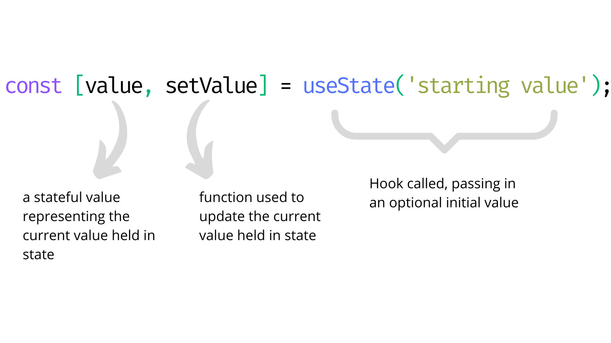

# React Hooks Deep Dive

You covered Hooks fairly lightly up to this point and mainly focused on the two most used, namely `useState` and `useEffect`. 

As you previously discovered, Hooks were introduced to the React core library in version 16.8 (the current version at the time of writing this very module has just passed 18.0).  Their concept is quite simple: they allow us to ‘hook’ into various React features without using JavaScript classes.

In this lesson, you take a deeper dive into the available Hooks React provides out of the box.

There are a few things to note about Hooks from the [official documentation](https://reactjs.org/docs/hooks-intro.html):

- **They’re 100% opt-in**. Even though Hooks’ use is quite widespread, you don’t have to use them. In fact, depending on the types of projects you end up tackling with React, you might come across class-based components which can’t use Hooks. 

- **They’re 100% backwards-compatible**. Hooks offer a separate layer to React to hook into React’s core functionality, but they don’t introduce any breaking changes. Again, depending on the projects you find yourself involved in, you may well see a mixture of class-based components and function-based components using Hooks as they are gradually adopted.

- **Classes aren’t in danger of lack of support**. Facebook themselves have tens of thousands of components written using classes. They’re not likely to drop support for class-based components, so you don’t have to scramble to rewrite all your existing components.

- **Hooks don’t change React’s core concepts**. Hooks allow us to use parts of React’s core features, such as state and the rendering lifecycle, outside of classes, but they don’t alter the concepts behind them. For example, whether you use the useState Hook or this.state.xyz from a class, the fundamental principles and concepts of using state remain the same.

## Rules of Hooks

Just like the film Gremlins, there are rules to caring for and using Hooks. Fortunately, they’re not as complicated as looking after Gizmo and there are only two rules you have to be aware of:

1. **Only call Hooks at the top level**.

2. **Only call Hooks from React Functions**.

The first rule means you can’t call Hooks from within loop blocks, conditional statements, or nested functions. 

As a quick example to hammer home the point, take a look at the following code:

```
const GoodExample = (props) => {
	const [myValue, setMyValue] = useState(123);

	if(props.someCondition) {
		setMyValue(456);
	}
}

const BadExample = (props) => {
	if(props.anotherCondition) {
		const [bigNumber, setBigNumber] = useState(98765432211);
	}
}
```

Notice how in `GoodExample` the `useState` Hook is called at the top level, so is an immediate descendant of the `GoodExample` function. (Note that they don’t have to be physically at the top of the component, but this is good idea from a readability point of view). We call `setMyValue` within a conditional `if` statement, but this isn’t calling the Hook, merely a value or variable returned from the `useState` Hook.

However, in `BadExample`, you declare a variable and call the `useState` Hook inside of the conditional statement `if`(props.anotherCondition), which violates Rule 1 of Hooks.

The second rule is short and simple: you can only use Hooks from React Functions, either function-based components or your own custom Hooks (which we’ll talk about in a moment).

## Available Hooks

React comes with quite a few Hooks built-in and these are the ones you  explore throughout this lesson. 

Here they are at a glance:

- `useState`

- `useEffect`

- `useContext`

- `useReducer`

- `useCallback`

- `useMemo`

- `useRef`

You won't cover `useState` or `useEffect` as you already looked a little deeper at those in earlier lessons. Similarly you’re not going to cover `useReducer` here, because it will have a dedicated lesson. You need to cover the Redux topic before you can understand how to effectively use `useReduce`r. 

There are a couple of Hooks not mentioned here, namely `useImperativeHandle`, `useLayoutEffect`, and `useDebugValue` that you leave alone this time around as you won't come across them very often.

### useState Hook

You’ve been using the `useState` Hook in lessons up to this point. It’s quite simple in its implementation, which looks like this:



You can access the value in state by referencing the first variable returned from the `useState` array. In this case, you'd reference the `value` variable. To update the `value` in state, you use the second variable returned from `useState`, the updating method, like this:


In a realistic code example for a paging component, its use would look like this:

```
const Paging = ({initialPage}) => {
  const [page, setPage] = useState(initialPage);
  return (
    <>
        Current Page: {page}
        <button onClick={() => setPage(initialPage)}>
            Reset
        </button>
        <button onClick={() => setPage(prevPage => prevPage - 1)}>
			prev
		</button>
        <button onClick={() => setPage(prevPage => prevPage + 1)}>
		    next
		</button>
    </>
  );
}
```

### useEffect Hook

Straight out of the gates here I’m going to once again recommend Amelia Wattenberger’s superb article on [Thinking In Hooks](https://wattenberger.com/blog/react-hooks). It does a really great job of explaining the mind shift you need to take to approach the `useEffect` Hook. 

The `useEffect` Hook can be thought of as an initial replacement for the other React lifecycle events you’d see in a class-based component: events such as `componentDidMount` or `componentWillUnmount`. However, a better way to think of it, as per Amelia’s article, is a way to keep various bits of data in sync. 


React components are concerned primarily with shuffling all the pieces into place to render some slice of the UI to the user. Anything that depends on mutations, subscriptions, timers, logging, or similar code you refer to as a ‘side-effect’ needs to live inside of the `useEffect` Hook. 

By default, `useEffect` runs on each and every render of the component. You can prevent this, however, by passing an optional argument: an array of dependencies.  This will mean the `useEffect` contents will only be run when any of the items in the dependency array change. 

Another optional aspect is a return function. You don’t have to include a return function, but there are some times where you want to perform some sort of clean up between `useEffect` firings. It might be you need to remove an event listener, or a subscription to a data handler, or API. If you left these things in place, you could end up with memory leaks in your app. Fortunately, you can return a function from `useEffect` that is called each time the component unmounts or is removed from the UI. 

### useReducer Hook

The `useReducer` Hook is a different approach to managing state. It’s similar to the `useState` Hook, but intended for more complex state management situations. For example, where you need to manage multiple sub-values, or deal with state updates that depend on previous values. 

The `useReducer` Hook is heavily tied to the Redux state management pattern, which can be tricky to get your head around at first, so we’ll be leaving that until a later lesson.  Once you start covering Redux, you’ll look at the `useReducer` Hook in lots of depth.

## L06HandsOn Project

### Requirements

1. Follow guided learning
2. Create code for each hook

**Project Setup**

You will create several demos; one for each new Hook you learn. 

However, rather than making a brand-new project for each of the new Hooks you cover, you make a single project that contains several components you can swap in and out to demonstrate a specific Hook you want to see in action.

Go all the way back to Lesson 2 for this one and quickly build up a skeleton project using Parcel JS.

### Add Parcel bundler

If you haven’t already got Parcel installed on your machine from Lesson 2, go ahead and add it globally using the commands as follows:

`npm i -g parcel-bundler`

or

`yarn -global add parcel-bundler`

Once you’re ready to go with Parcel, create a new project folder on your machine and open it up in VS Code.

`cd fefreact`
`cd lesson 5`
`mkdir l06handson`
`cd l06handson`

### Add React to the Project

You have your new, empty folder opened in VS Code. 

Parcel will wire up all the moving parts, but you need to do a few things first:

1. Initialise your project,

2. Install React and React DOM packages

3. Add a shortcut script to build and run your code

#### Initialise the Project

The first step is initialise your project with a `package.json` file. To do that you’re going to run the command:

`npm init -y`

#### Add React Dependencies

Next add React to the project. Still in the terminal, type the following command to add both packages to the project:

`npm add react react-dom`

#### Add Scripts for Building and Running the Code

Open the `package.json` file, add a new property ‘`scripts`’, with a new command property under this called ‘`start`’. Next, add the command:

`parcel index.html --open`

When you’re done, it should look like this:

```
"scripts": {
  "start": "parcel index.html -—open"
}
```

## Code the Project Files

With the initial setup almost done, the last pieces of the puzzle are to add a few files to your skeleton project.

You need:

- `styles.css`: basic styles to make your app look slightly more interesting than the out-of-the-box HTML. 

- `index.html`: Your Parcel starting point.

- `index.js`: The starting point for your JavaScript. 

- `App.js`: Your main entry point for the React side of things. 

- `UseMemoExample.jsx`: Example component for the `useMemo` Hook

- `UseRefExample.jsx`: Example component for the `useRef` Hook.

- `UseContextExample.jsx`: Example component for the `useContext` Hook.

- `UseCallbackExample.jsx: Example component for the `useCallback` Hook.

Once you have the files created, it’s time to fill them in, starting with your `styles.css` file.

### styles.css

It’s nice to have a few basic styles available to improve the built-in look and feel browsers give by default. Copy and paste in some really simple styles that just affect the body, font size, and line height. You’ve also got a couple of basic styles for form elements.  

You need some additional styles as you move through the Hooks examples, but you add those as you need them so you can discuss them at the right time.

At this stage, the `styles.css` file should look like this:

**styles.css**

```
body {
    font-size: 16px;
    line-height: 1.4;
    font-family: 'Lucida Sans', 'Lucida Sans Regular', 'Lucida Grande',
        'Lucida Sans Unicode', Geneva, Verdana, sans-serif;
    margin: 5em;
}

p {
    margin-bottom: 1.6em;
}

label {
    display: block;
}

input,
textarea {
    padding: 0.5em 1em;
    margin-bottom: 1rem;
    line-height: 1;
    font-size: 18px;
    border: 1px solid hsl(0, 0%, 93%);
}

button {
    border: 1px solid hsl(0, 0%, 93%);
    background: hsl(0, 0%, 93%);
    padding: 0.5em 1em;
    cursor: pointer;
    font-size: 18px;
    margin: 0.5rem 0.5rem 0.5rem 0;
}

button:hover {
    background: #c9c6c6;
}

.button-primary {
    background-color: rgb(36, 170, 87);
    color: white;
}
.button-primary:hover {
    background-color: rgb(10, 128, 55);
}
```

### index.html

The next thing is add some HTML into your `index.html` file.  

Within the `body` tag, there are two things:

- Some kind of element to render your React output into

- A `script` tag that references your JavaScript entry point `index.js`

With that done, save the file and move on to the main JavaScript entry point, the `index.js` file.

**index.html**

```
<html>
  <head>
    <title>React Hooks Deep Dive</title>
  </head>
  <body>
    <main id="root"></main>
    <script src="index.js"></script>
  </body>
</html>
```

### index.js

Your `index.js` file is the first place you really set up your React app to load and inject it into your HTML page.  You need to do a few things inside this file:

- Import React

- Import your main `App` component, the starting point for your React app

- Use React DOM to render your app to the browser

Save the file. On to your `App` component!

**index.js** 

```
import React from 'react';
import ReactDOM from 'react-dom';

import App from './App';

ReactDOM.render(<App />, document.querySelector('#root'));
```

### App.js

The last thing to do is build your `App` component which will render a particular Hook example component.

Open the `App.js` component and the first thing you do is set your imports. You can see you’ve got React in scope, quickly followed by each of your Hooks example components.

**App.js**

```
import React from 'react';

// components
import UseMemoExample from './UseMemoExample';
import UseContextExample from './UseContextExample';
import UseCallbackExample from './UseCallbackExample';
import UseRefExample from './UseRefExample';

// styles
import './styles.css';
```

Next, outline a really simple body for App. 

```
const App = () => (
    <>
        <UseContextExample />
        {/* <UseRefExample /> */}
        {/* <UseMemoExample /> */}        
        {/* <UseCallbackExample /> */}
    </>
);

export default App;
```

There’s nothing much going on here. You use the fragment shorthand React provides to contain your Hooks examples, but notice we commented out all but the `UseContextExample.jsx` component, as that’s the one we’ll be working on.

As you progress through each new Hook, you simply comment the previous one out and uncomment the current one so you can work on that.

You’ve not covered comments in React so far, but they’re exactly the same as regular JavaScript comments. The only difference is that if you’re commenting inside of a JSX block, you should wrap the comment block in curly braces, i.e. `{/* this is a comment */}`.

## Hook: useContext

The first Hook you explore in this section is `useContext`. Context in React is defined very clearly in the [official React documentation](https://reactjs.org/docs/context.html):

By making various items of data available in a ‘global’ sense, context solves a familiar problem you saw in the previous lesson, prop drilling. Prop drilling is the process of passing data down through multiple layers of child components. 

It often looks like this:

```
<App user={user} />
// App then renders...
<Header user={user} />
// Header then renders...
<Navigation user={user} />
// Navigation then renders...
<Avatar user={user} />
// Avatar then renders...
<LoggedInStatus loggedIn={user.loggedIn} />
```

The main `App` component receives a user object and then passes it down to the `Header` component, which passes it down again to `Navigation`, which in turn passes it on to `Avatar`, and so on down the tree. `

In this really contrived and over-simplified example you already see how things could get messy if you had a number of different items of data to pass through multiple child components. This practice also creates redundancy. In essence, many of these parent components become middle men for the user object; they themselves don’t do anything with `user`, they merely pass it on down the component tree. 

With context, you create a context provider to wrap your `App` component in. This provider would then carry your user data across the components until wyou hit the `Avatar` component. At this point, grab the context using a consumer wrapper. 

This non-Hook version of React’s context looks like this:

```
// Create a context object with a default value of 'null'
const UserContext = React.createContext(null);

function App() {
	// grab some user details from somewhere
	const userDetails = fetchUserDetails();

	// wrap the main child(ren) component(s) in a Context.Provider
	return (
		<UserContext.Provider value={userDetails}>
			<Header />
		</UserContext.Provider>
	)
}

// Header and other components omitted...

function Avatar() {
	return (
		<UserContext.Consumer>
			{value => <p>{value.name}</p>}
		</UserContext.Consumer>
	);
}
```

Straightforward enough, but it looks a little clunky. Things only get worse when you start to use multiple slices of context; you have to wrap providers inside providers and do the same with the consumer end.

## Use the useContext Hook

The `useContext` Hook offers a much more efficient experience when detailing with context. Much of the way you define a context object will be the same - this holds true for the provider wrapper too. The main difference is how you consume the context; that’s where `useContext` comes in.

Walk through the steps needed to create and consume context in React.

### Define a context Object

The first step is to define your context object:

```
// i.e. MyContext.js
export const MyContext = React.createContext('default value here');
```

The default value for your context can be anything you like: a primitive value, function, object, you name it. 

### Wrap the top-level Component in a Context Provider

Next, wrap whatever your topmost component happens to be, in a context provider. The topmost component might be your app’s entry point, or it might be a specific area within your app that contains a specific group of components, such as an account management area.

```
// i.e. MyTopLevelComponent.jsx
import { MyContext } from './MyContext.js';

function MyTopLevelComponent() {
	return (
		<MyContext.Provider value={'specific value here'}>
			<ChildComponent1 />
			<ChildComponent2 />
			<ChildComponent3 />
		</MyContext.Provider>
	);
}
```

### Consume the Context with useContext

To grab the context and use whatever value it contains, implement the `useContext` Hook like this:

```
// i.e. ChildComponent1.jsx
import React, { useContext } from 'react';
import { MyContext } from './MyContext.js';

function ChildComponent1() {
	const myContextValue = useContext(MyContext);

	return (
		<p>{myContextValue}</p>		
	);
}
```

### Use Multiple Contexts

If for whatever reason you need to access multiple contexts within a component, the `useContext` Hook makes it really easy. You simply call `useContext` as many times as you need, one for each context object you want to consume:

```
function MySuperComponent() {
	const user = useContext(UserContext);
	const theme = useContext(ThemeContext);
	const messages = useContext(MessageContext);

	return (
		<div style={{background: theme.background}}>
			<h1>Welcome {user.name}</h1>
			<p>{messages.greetingMessage}</p>
		</div>
	);
}
```

Looks nice and clear and clean, doesn’t it? No more wrapping consumers within consumers to access multiple context objects.

### When to use Context

Context is a great fit for some use cases, theming being one of them. Its primary purpose is to provide a means to share data between many components within a nesting structure. However, its use can be abused and you may be tempted to use context when some component refactoring (or component composition changes) could achieve the same result.

Using context can also make components less reusable as they’re more inherently tied to their context-providing parents, higher up the component chain.

The official React documentation on [context](https://reactjs.org/docs/context.html) has a great example on using component composition (i.e. how you create your components) over using context, and I’d recommend checking those out.

Context also offers a simple alternative to something like Redux. You’re going to study Redux in detail in an upcoming lesson, but for now just know that, while more complex in its implementation, Redux essentially offers the same end result of providing access to a broader idea of state.

It’s also important to note at this point that context is not particularly suitable for two-way communication between components. You can facilitate data back upstream by passing event handlers and functions down via context (you can see an example of this very thing in the official context docs), but its primary purpose is to provide access to global state data across portions of your app without the need for prop drilling. This is generally a one-way street.

## Build the useContext Example

Now that you have a better understanding of React’s context and how to use the `useContext` Hook, build a simple example that uses context to change themes.

Open the project you set up in the previous section and open the styles file `styles.css`. So far, it only has some basic, general styles. You’re going to add a few more for the `UseContextExample` component, just to illustrate the theming idea.

Add these styles to the bottom of the file:

```
/* UseContextExample styles ---------------------------- */
.layout-container {
    position: relative;
    display: flex;
    padding: 2rem;
    border: 1px solid hsl(0, 11%, 80%);
    border-radius: 3px;
}
.sidebar {
    background-color:hsla(210, 28%, 85%, 0.45);
    border-radius: 2px;
    width: 25%;
    padding: 0 1rem;
    margin: 0 0.5rem;
}
.sidebar a {
    display: block;
    margin: 1rem 0;
    color: inherit;
}
.layout-container article {
    padding: 0 1rem;
}
```

You’re going to create a layout container that houses a sidebar with some navigation, and a main article element that holds some dummy content. The styles here add a bit of background color to the sidebar to distinguish it, as well as adding a little bit of padding and spacing, and set the display type as ‘flex’ on the container. You’ll see why this is important in a moment.

This is a familiar layout trope you see on just about every website you visit. The difference here is you’re going to control both the position of the sidebar and the type of theme that’s applied to the content (i.e. light or dark), all with your friend and mine, `useContext`.

With the styles taken care of, open the example component, `UseContextExample.jsx`.

Start with your imports section, importing `React`, `useContext`, and `createContext`. 

**UseContextExample.jsx**

`import React, { useContext, createContext } from 'react';`

Next, define a couple of plain JavaScript objects, one for some styles, and another for some layout information: 

**UseContextExample.jsx**

```
const styles = {
    light: {
        background: '#fff',
        color: '#333'
    },
    dark: {
        background: '#0d1117',
        color: '#c8cfd7'
    }
};
const layout = {
    left: 'row',
    right: 'row-reverse'
};
```

You can see the styles object has light and dark properties filled with a couple of familiar CSS key:value pairs (light having a light background with dark text, and dark vice versa). 

The layout object offers a couple more CSS values which will translate to flex direction values when we inject them into our layout container JSX in a little while.

Next, define your initial context object and default values:

**UseContextExample.jsx**

```
const ThemeContext = createContext({...styles.light, direction: layout.left});
```
Really easy this one: name your variable `ThemeContext` as is the convention for context objects (i.e. <NameOfContext>Context). Then call React’s `createContext` function, pass in some defaults. In your case, pass an object with the light styles and left direction for the layout.

### The Layout Component

Now for the star of the show, the main component that will consume your context. Worry about providing the context in the default exported component later on. For now, define a skeleton component called `Layout`. 

```
const Layout = () => {
	
	return (
		// todo: complete JSX	
	);
}
```

The first thing is consume the context using the `useContext` Hook. That looks like this:

**UseContextExample.jsx**

```
const Layout = () => {
    const theme = useContext(ThemeContext);
```

Call the `useContext` Hook, just like in the mini examples from earlier in this lesson, and pass it the `ThemeContext` object created earlier. 

The theme variable will now have access to whatever was passed into the context provider or, if that isn’t available, whatever was passed to the context object as a default. 

In your case you haven’t defined the context provider yet, but have passed in the default values. So, uour theme variable will look like this:

```
{
	background: '#fff',
    color: '#333'
	direction: 'row'
}
```

Next, it’s time for some JSX: 

**UseContextExample.jsx**

```
        <section 
            className="layout-container"
            style={{            
                backgroundColor: theme.background,
                color: theme.color,
                flexDirection: theme.direction
            }}
        >
            <div className="sidebar">
                <nav>
                    <a href="#">Home</a>
                    <a href="#">About</a>
                    <a href="#">Contact us</a>
                    <a href="#">Blog posts</a>
                </nav>
            </div>
            <article>
                <h1>Welcome to my fantastic blog post</h1>
                <p>
                    Lorem ipsum dolor sit amet, consectetur adipiscing elit. Cras sed quam sed ex semper semper et accumsan erat. 
                    Fusce facilisis augue mauris, id pretium dui iaculis eu. Pellentesque varius a nisl nec accumsan. Integer ipsum est, 
                    lacinia vitae lorem at, blandit suscipit dui. Donec bibendum lorem mi, vel vehicula felis efficitur a.
                </p>
                <p>
                    Suspendisse et luctus massa. Ut tincidunt ex at tincidunt varius. Fusce sed ipsum lectus. Nulla varius erat sed dolor 
                    feugiat, et scelerisque nunc luctus. Nulla et nulla leo. In a arcu in leo mollis finibus in nec dui. 
                    Pellentesque lorem metus, pharetra quis mattis quis, fermentum id felis.
                </p>
                <p>
                    In blandit ligula at hendrerit maximus. Aliquam erat volutpat. Fusce malesuada elit sagittis, accumsan enim nec, ultrices 
                    risus. Aliquam eleifend scelerisque dolor ut blandit. Nullam posuere eros eu lectus molestie, ac posuere elit mattis. 
                    Fusce ligula tortor, sagittis vel sapien at, efficitur posuere leo. In hac habitasse platea dictumst.
                </p>
                <p>
                    Duis non ipsum lacinia, malesuada tortor nec, efficitur nisi. Ut molestie ut quam at pellentesque. Nam convallis sodales 
                    commodo. Suspendisse potenti. Donec in ipsum eros. Nunc venenatis lorem dolor, vitae tempor nulla mollis sit amet. Curabitur 
                    sed lacus commodo, viverra massa sit amet, luctus erat. In molestie tempus metus auctor suscipit.
                </p>
            </article>
        </section>
```

Everything within the section element, which is your layout container, is pretty standard HTML. You have a sidebar with a `nav` element and some dummy links. Inside the `article` element, you have a title and some good old fashioned lorem ipsum placeholder text.

The `section` element, however, is where you consume your context data. Using React’s inline style attribute (the one that looks like style={{}}), set `backgroundColor`, `color`,  and `flexDirection` CSS properties. The values for those properties are being provided from the theme context pulled in using the `useContext` Hook. Pretty neat, and very little effort. 

### The Context Provider and default export

OK, you defined some context and consumed it in the Layout component, but the `useState` Hook won’t do a thing unless you first provide the context to components looking to consume it.

For your default export, create a super-simple inline function that returns your provider wrapper and the Layout component as a child.

**UseContextExample.jsx**

```
export default () => (
    <ThemeContext.Provider value={{...styles.light, direction: layout.left}}>
        <Layout />
    </ThemeContext.Provider>
);
```

To provide context to child components, wrap them in a provider component which takes the form of `<ContextObject>.Provider`. Since your context object was created as `ThemeContext`, your provider wrapper component looks like `<ThemeContext.Provider>`. 

The `value={}` attribute is where you pass whatever values you want into the context object to be consumed later. In your case, you pass the value attribute an object, but it could be a primitive value, such as an integer or a string. 

Finally, inside your provider, add the `Layout` component. Just as with any other component you could add more child components here if you wanted, and each would have access to the context values using the `useContext` Hook.

## Runn the Example

With the heavy lifting done, head over to the `App.js` file and make sure all the other components you imported are commented out except for the `UseContextExample` component. 

Ideally, at this point, your App component should look like this:

**App.js**

```
import React from 'react';

// components
import UseMemoExample from './UseMemoExample';
import UseContextExample from './UseContextExample';
import UseCallbackExample from './UseCallbackExample';
import UseRefExample from './UseRefExample';

// styles
import './styles.css';

const App = () => (
    <>
        <UseContextExample />
        {/* <UseRefExample /> */}
        {/* <UseMemoExample /> */}        
        {/* <UseCallbackExample />*/}
    </>
);

export default App;
```

Update and save the file if needed and open your terminal window. Type the good old `npm start` command and view the result in the browser.


You should see a dark text on white background theme with the sidebar on the left. Change things up and alter the theme details that the default component uses. 

Back in `UseContextExample`, right at the bottom of the file where you export a default component, change the contents of the value attribute passed to the `ThemeContext.Provider` wrapper to the `styles.dark` value for the color scheme, and `layout.right` for the direction. 

Back in the browser, refresh the page if it hasn’t hot-reloaded for you already and take a look. Well, look at that! You have a light text on dark background and the sidebar is now on the right-hand side. And all you've done is update two values!

That’s all there is to the `useContext` Hook, and indeed React’s context in general. It’s a fairly simple, yet elegant, beast. I encourage you to have a play with this example and see what else you can pass around using the context mechanism, or try providing and consuming multiple contexts. 

Next up, you will look at the useRef Hook.

## Hook: useRef

The `useRe`f Hook provides a way to store and retrieve a mutable (that is, subject to change) reference object. It has a `.current` property that can be initialized to a starting value. The object that’s returned from `useRef` will be persisted for the lifetime of the component, which is quite handy. 

From the {official React docs](https://reactjs.org/docs/hooks-reference.html#useref) on `useRef`:

"Essentially, `useRef` is like a “box” that can hold a mutable value in its .current property."

If you’ve come across the `React.createRef` function or seen those funny `ref={}` style attributes, especially in class components, then the `useRef` Hook functions in a very similar way. 

### Use cases for useRef

One of the most common use cases for the `useRef` Hook is to attach a reference to the underlying DOM element a ref is assigned to. For your demo, build a simple modal popup that, when closed, returns focus to the corresponding input element in a form. 

Use the `useRef` Hook to provide a way to access the input element in the React-generated DOM. With a reference to this element, you can access native properties and functions, such as the `focus()` function. 

However, the `useRef()`  Hook isn’t just for DOM refs. A `ref` object is a generic container with a mutable current property. This property can hold any value and is comparable to an instance property on a class.

### Use the useRef Hook

Using the `useRef` Hook couldn’t be simpler:

```
import { useRef } from 'react';

const MyComponent = props => {
	const inputRef = useRef(null);

	const handleSomething = () => {
		inputRef.current.focus();
	};	

	return (
		<input type="text" ref={inputRef}/>
	);
};
```

Call the `useRef` Hook, passing in a value of ‘`null`’ as an initial value (though this could be anything you want). In the return function, define a standard HTML input element and assign your `inputRef` variable to the `ref={}` attribute. This essentially wires the underlying DOM input element into the `useRef`’s ‘`current`’ property, so that later on, in the `handleSomething` function, you can grab a reference to the input element. 

We have gone with the common example of calling the `focus(`) function to bring the browser focus into the input element.

Of course, if you want to change the value of the ref’s ‘`current`’ property, you can do so as you would with any JavaScript assignment — e.g. `inputRef.current = ‘my value here’`.

## Build the useRef Example

With your fundamental knowledge of the Hook in place, build something to showcase it in action! For this demo, you will create a form with a modal popup. Once the user clears the modal, return focus to the correct area of the form, a specific input element. 

Back in your project in VS Code, open the `styles.css` file and add the following additional styles at the bottom: 

```
/* UseRefExample styles ---------------------------- */
.modal-container {
    background-color: hsla(0, 0%, 0%, 0.43);
    z-index: 2;
    position: absolute;
    top: 0;
    left: 0;
    width: 100%;
    height: 100%;
    display: none;
    justify-content: center;
    align-items: center;
}
.modal-container.is-active {
    display: flex;
}
.modal {
    background-color: white;
    padding: 3rem;
    min-width: 30%;
    border-radius: 4px;
    box-shadow: 1px 1px 2px aliceblue;
}
```

Youalready have some default styles for form elements, such as inputs. These styles are concerned with the modal’s onscreen positioning and toggling its visibility. CSS’s flex property gives a super clean and simple way to position an element in the center of the screen, such as our modal friend here.

With your helper styles in place, open the `UseRefExample.jsx` file. Unsurprisingly you import the `useRef` Hook from React’s library first:

**UseRefExample.jsx**

```
import React, { useState, useRef } from 'react';
```

### The ModalBox Component

Next, define a `ModalBox` component that will house some dummy content to be displayed when we eventually click on a button to trigger the modal into view:

**UseRefExample.jsx**

```
const ModalBox = ({ isOpen, handleModalClick }) => (
    <div className={`modal-container ${isOpen ? 'is-active' : ''}`}>
        <div className="modal">
            <label>
                <input type="checkbox" /> this is option one
            </label>
            <label>
                <input type="checkbox" /> this is option two
            </label>
            <label>
                <input type="checkbox" /> this is option three
            </label>

            <hr />
            <button className="button-default" onClick={handleModalClick}>cancel</button>
            <button className="button-primary" onClick={handleModalClick}>save</button>
        </div>
    </div>
);
```

It’s a purely presentational component and receives two props, `isOpen` and `handleModalClick`. The `isOpen` prop is used in a ternary if statement to apply an is-active CSS class that will show or hide the modal. The `handleModalClick` prop will be a function just assigned to the modal’s buttons. 

Ultimately, your default parent component will handle the toggling of the `isOpen` prop value via the `handleModalClick` click event, but for now, your presentational `ModalBox` component doesn’t need to know, or care, about this. When a user clicks either cancel or save, the component simply fires the `handleModalClick`.

### The default Export

Of course, the `ModalBox` component on its own isn’t enough to do anything, so your default parent component is going to handle a few things:

- It will hold a modal visibility toggle, a boolean value.

- It will create a `ref` object that will be tied to a form input element.

- And it will handle toggling of the modal’s visibility via a click handling event that will be passed into the `ModalBox` component.

Underneath uour `ModalBox` component, outline an empty scaffolded default export:

```
export default () => {
    return (
        <section>
        </section>
    );
};
```

First things first. Define a couple of variables:

**UseRefExample.jsx**

```
export default () => {
    const [modalIsOpen, setModalIsOpen] = useState(false);
    const groupsInputRef = useRef(null);
```

Notice the familiar use of the `useState` Hook to define a `modalIsOpen` boolean value. Use this to keep track of the visibility status of the modal. By default you want it to be closed, so initialize it to ‘`false`’. 

Under here, create a `groupsInputRef` variable that uses the `useRef` Hook, passing in ‘`null`’ as you call it. Assign this returned `ref` to the corresponding input element in a moment. For now, just define the `ref` and call the Hook to kick things off.

Next, you need a way to allow the` ModalBox` component to effectively close itself, or rather notify us that it needs to be closed. dDo this by passing it a function, which we’ll define now.

**UseRefExample.jsx**

```
    const onModalClick = () => {
        setModalIsOpen(false);
        groupsInputRef.current.focus();
    };
```

The `onModalClick` function, when called, will accomplish two things: 

1. First, it sets the `modalIsOpen` value back to false (this will then be passed back into the `ModalBox` component which will re-render with the correct CSS class applied)

2. Next, it will call the `focus()` function from the `groupsInputRef` variable’s current property. 

Remember, the ref’s current property will be pointing to the underlying input element in the DOM, thus giving access to its properties and values, `focus()` being one of them.

Next, fill out the JSX inside the section element: 

**UseRefExample.jsx**

```
    return (
        <section>
            <form className="fancy-form">
                <label>Name</label>
                <input type="text" />
                <label>Current role</label>
                <input type="text" />
                <label>Groups</label>
                <input type="text" ref={groupsInputRef} />
                <button type="button" onClick={() => setModalIsOpen(true)}>select groups</button>
                <label>Message</label>
                <textarea></textarea>
                <hr />            
                <button className="button-primary">submit form</button>
            </form>
```

You have a plain old form element with some equally plain labels and inputs. For a real form, add a little more markup here such as state syncing on change events, styling classes, and maybe some accessibility attributes. You'd also want to handle the form’s submission. If you click the submit button now, the form will submit to nowhere and the page will refresh.

For now, the main thing to draw your attention to is the ‘`select groups`’ button which is wired up to an `onClick` event. It’s an inline anonymous arrow function that simply calls the `setModalIsOpen` state Hook, passing in a value of ‘`true`’. 

Underneath your form element, add the ModalBox component:

**UseRefExample.jsx**

```
            </form>
            <ModalBox isOpen={modalIsOpen} handleModalClick={onModalClick}/>
        </section>
```

You pass the `modalIsOpen` value and `onModalClick` function into the props `isOpen` and `handleModalClick`, as you looked at when we defined the `ModalBox` component.

And that’s you done with the code!

### Runn the Example

Ahh the best part, running the code! As with your previous example, make sure to open up the `App.j`s file and comment out all the components apart from `UseRefExample`. 

Your App component should look like this:

**App.js**

```
import React from 'react';

// components
import UseMemoExample from './UseMemoExample';
import UseContextExample from './UseContextExample';
import UseCallbackExample from './UseCallbackExample';
import UseRefExample from './UseRefExample';

// styles
import './styles.css';

const App = () => (
    <>
        {/* <UseContextExample /> */}
        <UseRefExample />
        {/* <UseMemoExample /> */}        
        {/* <UseCallbackExample />*/}
    </>
);

export default App;
```

Update and save the file. Open the terminal and run the trusty `npm start` command, viewing the result in the browser:

.png)

You have a simple form with a few fields. None of them are hooked up to anything so don’t worry about what you put in there. The interesting part is the ‘`select groups`’ button. Click on that and you’ll see your modal window appear in all its dimmed-out glory.

Again, select whatever you want in the modal (nothing’s hooked up here either), then either save or cancel from the modal’s footer. When it closes, notice how the input element under the ‘`Groups`’ label is highlighted and given focus? 

You might see this pattern a lot in enterprise applications or admin consoles where you open a new window, select multiple items, and then get returned to a main form of some kind to continue editing. That’s what you achieved here. Once you’re finished with the modal, the focus is automatically sent back to the correct place in the form. 

All this is achieved with the `useRef` Hook!

Coming up next, you explore the `useMemo` Hook. I’ll see you over there.

## Hook: useMemo

Now to one of the slightly more complex Hooks.  The `useMemo` Hook accepts a function and a list of dependencies, much like the `useEffect` Hook. It returns a memoized value (yes, that is a weird word!)  

What’s special about this memoized value is it is only recomputed when there is a change in one of the values in the dependency array. 

The dependency array you pass is important. If you don’t pass in a dependency array to the `useMemo` Hook, its contents will be regenerated on each render, thus undermining its use.

The use of the `useMemo` Hook is quite simple. The function `expensiveComputedFunction` will only be called when either `depOne` or `depTwo` changes. 

```
const someMemoizedValue = useMemo(() => { 
	// ...do your expressions here...
	// return a value here
	return expensiveComputedFunction(depOne, depTwo);
	// passed in dependencies
}, [depOne, depTwo]);
```

### Suitable Applications for useMemo

Much like its sibling (of sorts) the `useCallback` Hook (which you learn about in the next lesson), the `useMemo` Hook is usually found when it comes time to profile your application for performance optimization. 

The best employment of this particular Hook is to prevent multiple frequent calls to functions computationally expensive, especially when their expected value hasn’t changed or is not expected to have changed. These extra calls can create optimization bottlenecks and are largely unnecessary.

You often find `useMemo` dealing with big data items such as graphs, charts, plotting data, and large mathematical equations. 

### Optimization cCveats

It’s worth a quick mention here that there is a temptation to over-optimize your code, either too liberally or too early. For me, optimization should be kept in mind, but it should be based on as much empirical data as possible. 

Try to resist the temptation to pepper your code with `useMemo` and `useCallback` at every opportunity as the complexity you add and the readability you lose are often not worth the trade-off for slight gains in perceived performance.

### Build the useMemo Example

Before going on, take a quick look at the excellent Hooks reference site, [useHooks.com](https://usehooks.com/) by Gabe Ragland. You be using a modified version of Gabe’s `useMemo` example in your demo here.

For this demo you don’t have any extra styles to add, so fire up the `UseMemoExample.jsx` file and start by defining some imports and helper functions. You'll be using a few Hooks here, so import them upfront. 

```
import React, { useState, useMemo, useEffect } from 'react';
```

Next, your helper functions:

**UseMemoExample.jsx**

```
const getTimeDifference = (startTime, endTime) => {
    const res = Math.abs(endTime - startTime) / 1000;
    return res % 60;
};

const countLettersInWord = (word) => {
    let i = 0;
    while (i < 3000000000) i++;

    return word.length
};
```

With `getTimeDifference`, you want to work out the time that has elapsed between a passed in start and end time. The passed in times here will be standard JavaScript date time values. You work out the difference, using the modulus operator to divide the result by 60 to arrive at a value in seconds.

For `countLettersInWord` you employ a bit of a cheat here, or at least, a forced ‘expensive’ computation. In the real world you'd be looking at a big data calculation or math equation processing function, but here, we have a simple `while` expression that increases a counter, `i`, around three billion times. Once that’s finished, the function just returns the length of the string word that we pass in as an argument. 

You'll be memoizing the `countLettersInWord` function later on.

### Define the dDfault Component Export

Now for the main event, defining the default component export. Start by scaffolding out the component before filling it in:

```
export default () => {
    return (
        <section>
            <h1>Expensive counting functions</h1>
        </section>
    );
};
```

### Add the vVriables

First up, you need variables. For starters, add some non-Hooks variables:

**UseMemoExample.jsx**

```
export default () => {
    const wordList = ['Typewriter', 'Megaphone', 'Hamburger', 'Batman', 'Milkshake'];
    const timeStart = new Date();
```

`wordList` is an array of random strings you're going to count later on in the component. Meanwhile, `timeStart` is set to a brand new `Date()` result that will represent the date-timestamp of when the component first renders. 

Next, you need some state values using `useState`:

**UseMemoExample.jsx**

```
    const [count, setCount] = useState(0);
    const [computedTime, setComputedTime] = useState(0);
    const [currentWord, setCurrentWord] = useState(wordList[0]);
```

The variable `count` will be increased each time you click a specific button, which you define in the upcoming JSX. With `computedTime` keep track of the time it takes to count the letters in each of your words when the next word count is triggered. And finally, `currentWord` will hold onto the current word you're counting the length of.

### Define the Functions

Now to define some functions, and most importantly, use your new Hook:

**UseMemoExample.jsx**

```
    const handleLoadNextWord = () => {
        const wordIndex = wordList.indexOf(currentWord);
        setCurrentWord(wordList[wordIndex + 1 === wordList.length ? 0 : wordIndex + 1]);
    };

    const letterCount = useMemo(() => countLettersInWord(currentWord), [currentWord]);

    //const letterCount = countLettersInWord(currentWord);
```

You can ignore the commented-out line for now. You'll come back to that when you run the final app. It’s going to help illustrate an important point, but for now skip over it.

The first function, `handleLoadNextWord` is going to be called from a button click that you’ll add in shortly, when you build out the JSX. It looks at the array of words, `wordList` and works out the index of the currently selected word. From here, it calls the `setCurrentWord` function to update the current word held in state — it does this by grabbing the next word in the `wordList` array, incrementing the `wordIndex` by one, or setting it back to the start if it’s going to overshoot.

The next function is where things get spicy. You finally call the `useMemo` Hook, passing it an arrow function that returns the value from the `countLettersInWord` function defined earlier. This function is supplied the `currentWord` held in state. You’re also using `currentWord` in the dependency array, so that when this changes, you’ll run this memoized function again to get the new word count.

The last bit of logic is to use the `useEffect` Hook to work out how long it took to render the component:

**UseMemoExample.jsx**

```
    useEffect(() => {
        setComputedTime(getTimeDifference(timeStart, new Date()));
    }, [currentWord]);
```
Again, you use `currentWord` as a dependency value, so that when it changes you work out the time difference using your `getTimeDifference` helper, passing in the start time when the component began rendering, and the time now, when we call this function. 

This doesn’t have anything to with the workings of `useMemo`, but it will allow you to visually see how long each word’s letter count computation took to complete.

### Define the JSX

Your final task is to add in the JSX so you actually see something when you load this puppy up. 

Underneath the `h1` element in your skeleton JSX, add the following:

**UseMemoExample.jsx**

```
    return (
        <section>
            <h1>Expensive counting functions</h1>           
            <p>Example word is: <strong>{currentWord}</strong></p>
            <p>
                <button onClick={handleLoadNextWord}>
                    load next word
                </button>
                <button onClick={() => setCount(count + 1)}>
                    notch up the count
                </button>
            </p>
            <hr />
            
            <p>"{currentWord}" has {letterCount} letters. This took <strong>{computedTime} seconds</strong> to process.</p>
            
            <p>Current word is still "{currentWord}", but we've {count === 0 ? 'not increased the count yet' : `increased the count ${count} times`}</p>
        </section>
    );
```

- The first paragraph gives a nice reference to the current word held in state so you can see what’s being calculated.

- Next you have two buttons: the first will load the next word in the array, calling the `handleLoadNextWord` function from the last section; while the second button calls an inline arrow function that updates the count value in state.

The final two paragraphs are further visual niceties to highlight what’s going on in the app. The first line shows the currently selected word and how many letters it has once this has been calculated. It also outputs the estimated time it took to count the letters in the word.

The second paragraph lets you view the count value in state, checking first if it is zero and displaying a slightly different message if the count hasn’t been touched yet.

### Run the Example

Now for the fun part, seeing your hard work in action. Just as before, make sure to open the `App.js` file and comment out all the components except `UseMemoExample`. 

Your App component should look like this:

**App.js**

```
import React from 'react';

// components
import UseMemoExample from './UseMemoExample';
import UseContextExample from './UseContextExample';
import UseCallbackExample from './UseCallbackExample';
import UseRefExample from './UseRefExample';

// styles
import './styles.css';

const App = () => (
    <>
        {/* <UseContextExample /> */}
        {/* <UseRefExample /> */}
        <UseMemoExample />        
        {/* <UseCallbackExample />*/}
    </>
);

export default App;
```

Update and save the file. Then open up the terminal and run the age old `npm start` command, and open your browser to view the result:


Sure, it’s not much to look at, but it does a really great job of illustrating the benefits of `useMemo`. You can see that on initial page load, and every time you hit the ‘load next word’ button, your mocked expensive function is called and the time difference is calculated, then output to the screen. 

## Hook: useCallback

In a similar fashion to the `useMemo` Hook, `useCallback` gives a means to optimize your applications somewhat. It also provides a form of memoization. 

However, the big difference between the two Hooks is that `useMemo` provides a way to memoize a value, while `useCallback` memoizes a function. It looks and feels almost identical to the implementation of `useMemo`, too. You define and use the `useCallback` Hook like this:

```
const someMemoizedCallback = useCallback(() => { 
	// run a function here
	myEpicFunction(depOne, depTwo);
	// passed in dependencies
}, [depOne, depTwo]);
```

### Memoize fFnctions

"Great", you’re thinking, "but why would anyone want to memoize a callback function?"

Well, the complicated answer is "it depends".

Start with a little 101 on React components. Each time a component re-renders, React will create new versions of items like function objects.  Take the following code snippet as an example:

```
function MyEpicComponent() {
	const handleButtonClick = () => {
		// ...do something in here
	};

	// ...rest of component
}
```

Each time `MyEpicComponent` re-renders, `handleButtonClick` is recreated as a brand-new function object. For most components this isn’t a problem and is usually nothing you need to concern yourself with; this re-creating of functions is inexpensive and not going to cause you any problems, performance-based or otherwise.

However, there are some situations you might face where you don’t want this behavior. One such example might be when the function is a dependency of other Hooks. In this situation, you’d want to have access to the same function object across different renderings, not some brand-new instance (or we’d be back in infinite looping territory again).

## Build the useCallback Example

The `useCallback` Hook is one of those tools you may not use or come across a great deal, but when you do need to use it, the benefits are huge. Because of the rather infrequent need to use this Hook, our example is going to be a little more contrived, in order to highlight those benefits.

You'll be building a message generator and some buttons that increment counters within the component. You will keep track of the functions your component recreates across each render so you can see how `useCallback` comes into play.

Start by opening the `UseCallbackExample.jsx` file and building it out.

### Imports and External Variables

First things first, import `React`, `useState`, and of course, the `useCallback `Hook.

**UseCallbackExample.jsx**

```
import React, { useState, useCallback } from 'react';
```

Next, you need a couple of constants that will live outside of our main component:

**UseCallbackExample.jsx**

```
const messages = [
    'Hello dear, what a lovely day outside',
    'The 2 best times to learn React were yesterday, and today!',
    'Thanks for studying React with The Beginners Guide to React',
    'Some people, Master Bruce, just want to watch the world burn',
    'And nothing lasts forever, like the cold november rain'
];
const functionStore = new Set();
```

You have a simple array of string messages you'll use within your component. With `functionStore` you're creating a shiny new instance of a `Set` object. You can store lists or collections of anything you like in a `Se`t object, but the key part here is that `Set` naturally keeps things unique for us. The importance of this will become apparent in a little while.

### Define the Default Exported Component

Create the default export component, as you've started with in the previous lessons:

```
export default () => {
    return (
        <>
        </>
    );
};
```

### Add in Variables

As I’m sure you’re becoming familiar with by now, you'll outline a couple of variables at the top of our new component:

**UseCallbackExample.jsx**

```
export default () => {
    const [counter, setCounter] = useState(0);
    const [message, setMessage] = useState('');
```

You have two state variables, `counter` and `message`. Your `counter` variable will hold the current count as you increase it, while `message` will hold the currently selected message from your previously defined array of message strings.

### Implement useCallback

Now for the `useCallback` part. Create three click-handling functions here: one to increase the count, another to decrease it, and a last one to generate a new message — each will update one of the state variables we just created.

**UseCallbackExample.jsx**

```
    const increaseCounter = useCallback(() => {
        setCounter(counter + 1);
    }, [counter]);

    const decreaseCounter = useCallback(() => {
        setCounter(counter - 1);
    }, [counter]);

    const generateRandomMessage = useCallback(() => {
        const randomMessage = messages[Math.floor(Math.random() * messages.length)];
        setMessage(randomMessage);
    }, [message]);
```

Both `increaseCounter` and `decreaseCounter` implement the `useCallback` Hook, using the `counter` variable as a dependency. Remember, each time a dependency changes, `useCallback` will generate a new callback function object. Both these functions update the `counter` value in state, either by adding one or removing one.

The `generateRandomMessage` function depends on the `message` state variable, and updates this value in state, pulling a random string from your messages array.

The very last thing before getting on with the JSX is add these new functions into the `functionStore like` so:

**UseCallbackExample.jsx**

```
    functionStore.add(increaseCounter);
    functionStore.add(decreaseCounter);
    functionStore.add(generateRandomMessage);
```

Now, each time the component re-renders, it will attempt to add each of your three click handler functions into the `functionStore` Set. If one of the function objects already exists within the `Set` then it won’t be added. 

Later on, you extract the number of functions in the `Set` to see how many new function objects have been created on each re-render.

### Define the JSX

With your logic in place, all that remains is to outline the JSX for your UI. 

**UseCallbackExample.jsx**

```
    return (
        <>
            <p><strong>Count is:</strong> {counter}</p>            
            <p>
                <strong>Random message is: </strong><br />
                "{message || 'click the button to generate a random message'}"
            </p>
            <p>
                <button onClick={increaseCounter}>counter +</button>
                <button onClick={decreaseCounter}>counter -</button>
                <button onClick={generateRandomMessage}>generate message</button>
            </p>
            <hr />
            <p>
                <strong>Number of functions in 'functionStore' is:</strong> {functionStore.size}
            </p>
        </>
    );
```

Start off by outputting the current count using the `counter` value from state. Next, do the same but for `message`, using the double pipe operator shortcut to display an instructional string, should message be empty.

Next, have three buttons you're attaching to your click handlers: one to increase the counter, one to decrease it, and a final one to trigger a message generation.

The final piece of JSX is to output a simple message to the user, showing the number of items in the `functionStor`e Set. To do that, call `Set`’s `.size` property, which is equivalent to an array’s `.length` property.

### Runn the eEample

Ready to see it in action? Head on over to the terminal and fire up the `npm start` command, opening the project in the browser once it’s built.

.png)

As you can see, what you have is quite simple. The current `count` is 0, no message set, and our buttons are ready to be clicked. 

But take a look at the line under the `<hr />` element that counts the number of functions this component has created. You can see that your three click handler functions have been created and added into the `Set,` so the size of the Set is naturally 3. 

So what happens if you click one of the buttons? cClick ‘`generate a message`’ to choose a random value from the messages array. 

Notice that, even though the component has re-rendered, only one additional function has been created. In this case it was the `generateRandomMessage` click handler function and that’s because the value in state (i.e. message) changed. This state value is passed as a dependency to the `useCallback` Hook, hence the function is recreated.

This time, click on ‘`counter +`’ and see what happens.

This time you'll see the size of `functionStore` jumps from 4 to 6. On this re-render, `generateRandomMessage` is kept the same because you haven’t changed its dependency, message. However, you altered the counter state variable, which both `increaseCounter` and `decreaseCounter` depend on. Therefore, both of these functions have been recreated on this particular rendering.

That’s everything wrapped up in this bumper lesson on diving deep into React Hooks. In the next lesson you’ll be looking at navigation within React projects.


