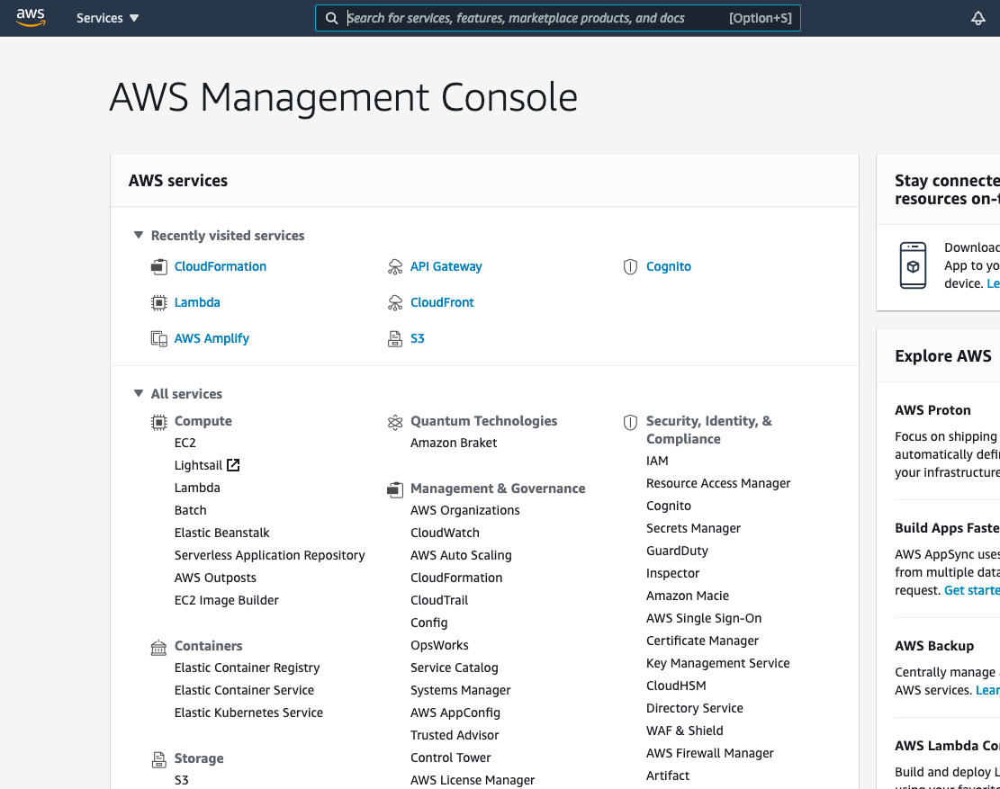
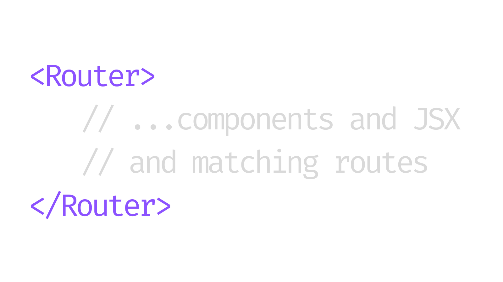
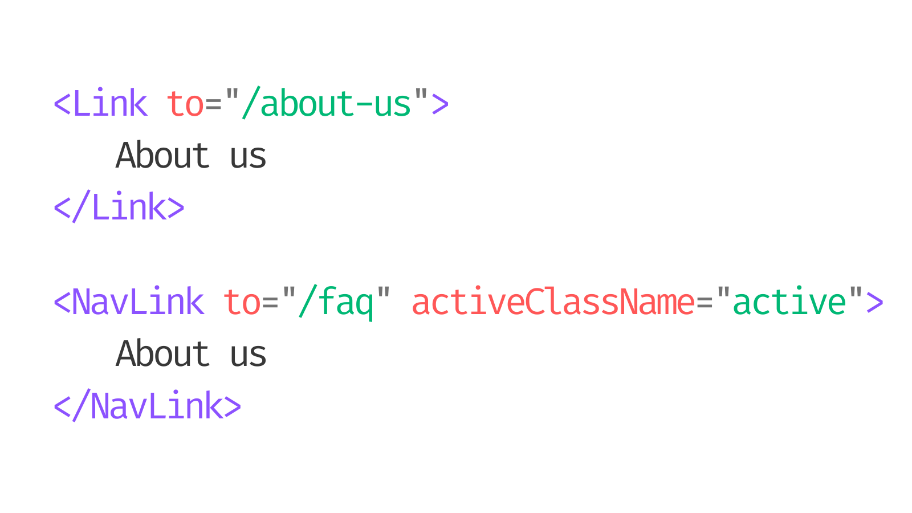
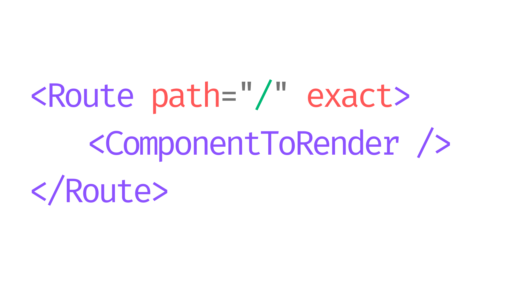
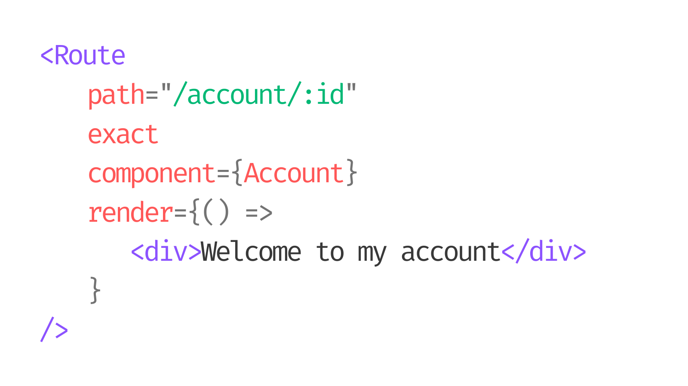
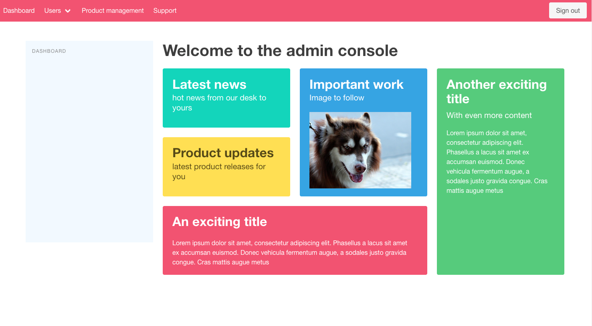

# React Router: Navigation

In this lesson you explore the third party `React Router` library to add a routing and navigation system to your applications.

As you’ve already discovered, frameworks and libraries such as `React` are referred to as Single Page Applications (SPAs). The very nature of an SPA means the application deals with a single page. There is no navigation associated with it. 

However, this creates a problem. As your applications grow in size and complexity, it is imperative you employ some sort of navigation mechanism to get around them. This is vital for many reasons, but the two most important are:

1. It allows you to better define distinct areas of responsibility within the app, separating them out into smaller areas that can be better managed and maintained

2. It helps your users to get around your apps via a central navigation system and even bookmark favorite areas using friendly URLs (e.g. ‘/app.com/account/profile’)

## Navigation in the Wild

Take a brief look at some examples in the wild where some self-contained, otherwise single page applications employ navigation and how essential it is.

### Amazon’s AWS Console

Amazon’s AWS console, while not built using React, is for all a web-application that looks and feels very similar to an SPA. It is a self-contained management application for administering various AWS services. 



However, the take-away point if you were to build this using a library like React, it would quickly become impossible to manage the code base without some navigation to break up the many areas of responsibility the different services offer.

### Dev.to

Another good example that is actually React-based is the wonderful [Dev.to website](https://d2uusema5elisf.cloudfront.net/courses/beginners-guide-to-real-world-react/module_08/lesson_01/public/assets/dev-dashboard.png). Although the look and feel is of a traditional website, the Dev platform is built upon React and makes heavy use of navigation and URL routing.

Although browsing around the Dev site might feel like you’re using a regular website, you can see there are many different areas to explore: 

- Browsing articles

- Reading individual articles

- Account management and profile editing

- Creating posts and articles

- …and much more

Again, even though this is less complex than the AWS console, having all of this functionality crammed into a single page would be a nightmare for everyone involved (both users and us developers). 

## Navigation in React

You can see how vital navigation is and what a key part it plays in building any successful app. However, React doesn’t provide any form of navigation out-of-the-box. So, what are your options?

Essentially, when it comes to building out a navigation mechanism in your React app, you have two choices:

- Leverage React’s component mounting system to swap out various components.

or

- Employ a third-party bolt-on to support your development.

Look at the first option before you dive into the third-party libraries, which you'll spend the rest of this lesson exploring.

### Mock Navigation

For less complex apps, or situations where you don’t need a navigation structure, React provides a robust system built into the library from the get-go: the component mounting system. You’ve already seen this in action in previous lessons, but essentially it works like this:

1. The app displays a default component, say for the dashboard or home page.

2. When the user clicks a button or navigation link, you capture the `name` or `id` value of the link in state.

3. As the component re-renders, state is referenced and the current `name` or `id` value is compared in, for example, a switch statement.

4. When there is a match, a different component is rendered to the user. 

In practice, it could look like this:

```
export default function App() {
  const [route, setRoute] = useState("/");

  return (
    <div className="App">
      <nav>
        <a onClick={() => setRoute("/")}>
          Home
        </a>
        <a onClick={() => setRoute("/about")}>
          About us
        </a>
        <a onClick={() => setRoute("/contact")}>
          Contact
        </a>
      </nav>

      {route === "/" && <h1>Welcome to the home page</h1>}
      {route === "/about" && <h1>About our app</h1>}
      {route === "/contact" && <h1>Get in touch</h1>}
    </div>
  );
}
```

You have your `nav` block with some anchor elements at the top. For each `onClick` handler, you’re performing a simple inline arrow function that updates the state value, `route` to a particular string value that looks like a URL. 

Further down, you have a series of evaluation statements that compare the `route` value with a string for a match. If there is one, then the right-hand side of the expression is evaluated, which will output some JSX. 

So, if you click the anchor element with the `‘/about’` string assigned to it, `route` will match this and display the `<h1>` element with the text ‘`About our app`’. 

There are a number of different ways to approach this. Instead of those repeated route evaluations, you could use a function that runs a switch statement to return the correct JSX. 

Also, you’re not limited to simple JSX such as the `<h1>` element. These could have been full-blown components, each having their own navigation elements within them, implemented in a similar way. However, this could quickly become too complex to manage and make maintaining the software a challenge. 

The `route` value is set to what looks like a URL, because that’s exactly the case: it’s a string value at heart, not a URL. Sure, the display changes and new information is loaded in, but the URL of our app won’t change. 

In this little example this isn't a problem, and it may not be a problem in larger apps, but you do lose certain inherent features and behaviors that come with regular URL routing: features such as navigation history, and URLs that can be bookmarked.

That said, this is a useful means of basic navigation within an app and shouldn’t be discounted entirely. However, given the example apps we saw in the wild, you should be starting to see how this becomes an issue as the complexity of our apps grows.

### Other options

One of the best parts of frontend development is the sheer variety of choice you have at your feet. There are many options available and in reference to React and its navigation, it is no different.

To bolster React’s core offering with some robust and easy-to-use navigation system, you’re going to look at `React Router`. 

## Introducing React Router
React Router is a routing and navigation library that bolts onto to React. You'll explore what it is and how it works.

[React Router](https://reactrouter.com/web/guides/quick-start) is generally the go-to choice for developers looking to implement a solid navigation system in React. It’s an open-source product of the React Training team which features some impressive and well-known figures in the developer world, including Ryan Florence, Brad Westfall, and Cassidy Williams. 

The React Router library is one of several choices (and I’d always encourage you to review your options and make the right choice for you and your project), but arguably very few of them are as battle-tested and easy to implement.

React Router has been around for quite some time. It’s very robust and proven to work in just about any project scenario, playing well with different projects types, keeping out of your way and allowing for a very flexible implementation. What’s more, it has excellent [developer docs](https://reactrouter.com/web/guides/quick-start) and I’d recommend you explore them. 

### When to use React Router

As you’ve already seen in the previous lesson, as soon as your app starts to grow to even a moderate size and complexity, swapping out components using some sort of state value isn’t going to cut it. 

With React Router you get access to a superb routing system that primarily relies on the native HTML history API to provide access to browser history, as well as a host of other convenient and helpful features:

- Location history

- Hash-routing to enable navigation by URLs containing (‘#’) hashtags

- Integration with Redux (which we’ll explore in a later lesson)

- Static routes

- Parameterized URL routing for URLs such as `/user/:userid` where the `:userid` part is dynamic and unknown

- Non-matching or 404 route handling

- Support for complex, layered navigation such as in sub areas and layouts

You may never need to use many of the features React Router offers, but it really does provide for any routing scenario you can throw at it. Getting to know the far ends of React Router is a course in itself, so for now, you’ll be focusing on the main elements you need to employ React Router in your app and make it work.

## Use React Router

To use React Router, first install it into the project (which you’ll do as you build your demo), and then, for basic use, you’ll be concerned with three main elements:

1. `BrowserRouter`

2. `Link` or `NavLink`

3. `Route`

They each play a vital part in the routing landscape, so walk through each one to see how it works and what role it occupies.

### BrowserRouter



The `BrowserRouter` component (often imported as just `Router` as shown here) is the main parent of the routing system. It doesn’t have many additional options or attributes, and the few it does have, you’ll most likely rarely use.

You will most commonly find the `Router` or `BrowserRouter` element wrapped around the main application entry point. For example, in your demos so far, you’d have wrapped a `<Router>` component around either the `<App/>` component in your `index.js` file, or directly in the `App.js` file itself.

Either way, you’ll usually find this at the topmost level of your app, so any child components further down the tree have access to the routing system. 

### Link and NavLink



The `Link` and `NavLink` components replace the more common `<a>` elements within your JSX, ostensibly offering the same functionality. You click them, and they route you to another URL. 

In that sense, they’re fairly simple and straightforward. Anywhere you wish to place a link a user can click to be transported to another location, you’ll use the `Link` component. 

It accepts a number of attributes, but the primary one for now is the `to` attribute. You can pass it a simple string value as you have here. So, if the user clicks the link with ‘`About us`’ on it, the `Link`’s to attribute will navigate the routing system over to the `'/about-us`' URL. 

The `to` attribute isn’t limited to just strings. You can pass it an object containing other route properties, such as `search` or `hash` values, as well as a function that can determine the destination URL dynamically. You really have a lot of flexibility to define links to various parts of your app as you wish.

The main difference between the `Link` and `NavLink` components is that `NavLink` provides an `activeClassName` attribute which adds styling attributes to the rendered element when it matches the current URL. This is very handy for the typical top-level navigation you may find in a page header.

### Route



The `Route` component is arguably the most important component you’ll use as part of `React Router`. It’s responsible for matching a given route and rendering a specific component. 

Here, in its simplest form, you take the `Route` component and wrap it around whichever component you want to render. You provide a path attribute of the URL you want to match, and you’re also supplying the optional exact attribute.

So, if a user navigates to the URL `/` (which is usually the home page), this `Route` component will be matched and the `<ComponentToRender />` component will be displayed. Because you’ve included the exact attribute, you can be sure the route that is matched will be exactly `/` and not any other route containing a forward slash, such as `/about` or `/pages/1`.



For more flexibility or to provide for more complex needs, the `Route` component provides several additional attributes. Let’s talk about them so you can understand how they work:

- `path` - This should contain the URL path you wish to match a given route against. It can also handle route parameters. For example, you can see here you’re aiming to match the `/account` URL that contains an `:id` parameter. So, it would match URLs like `/account/123` or `/account/7`, etc.

- `exact` - This ensures the path supplied to the path attribute is matched exactly. 

- `component` - If you don’t wish to supply a child component to the `Route` component, then supply it via this attribute. This allows you to define inline `Route` elements which can neaten your codebase. Behind the scenes this uses `React.createElement` to create a new React element from the given component.

- `render` - This allows for inline rendering and wrapping without undesired remounting that you will get with the component attribute.

Each of the child-rendering methods (i.e. a child component wrapped by a Route component, and the component  and render  attributes) pass a route props object along to them that contains `match`, `location`, and `history` items. 

Look at and use some of these as you build out your example routing app, but for now just know that if you need to perform some logic around the current location or history information, it will be passed along to the rendered component by `React Router`.

With the basics under your belt, push on and take a look at what you’ll be building to cement your knowledge.

## L07HandsOnAssignment Admin Console App

Look at what you’ll be building:



You’ve got a colorful mocked-out version of an admin dashboard style app. If you browse through the various sections, notice how the URL changes to reflect the page you’re on. 

It’s worth pointing out that although some of the sections might look full of populated data, this is not a data-driven app. Everything here is hard-coded and leaned heavily on the Bulma framework to help style the various sections.

You’ll be quickly building out the JSX, which is relatively unimportant and just for display purposes in this particular demo, and focusing more on the underlying routing parts. 

 Dive in.

 ## Build Admin Console App

Start to build your routing demo admin dashboard. You’re going to use `create-react-app` again to quickly provide a scaffolded starting point. 

### Project Setup

Open a terminal window and navigate to the parent folder you want to create the new project in. Next, type the `create-react-app` command as follows:

```
npm create-react-app routing-demo
```

Let the command line finish installing the dependencies. Wait until you see the ‘success’ message and npm commands to start and build the app.

### Test the New Project

As you’ve done before, spin up the default app you just made to make sure you’re starting from a working base.

Follow the advice in your terminal output and enter the following commands:

```
cd routing-demo
npm start
```

Once the project’s built and launched, you should be able to fire up http://localhost:3000 in a browser and look for the familiar dark background and spinning React logo.

### Clean up the Starter Project

You need to make a few changes to get everything cleaned up and ready for your new routing app.

First, open `index.js`, located in `/routing-demo/src/` and remove the following, which should be on line 3:

`import ‘./index.css'  `

This just removes a link to the default styles from the project we won’t need. 

After that, locate and delete `/src/index.css` and `/src/App.css` files.

Finally, open the main `App.js` file located at `/src/App.js`. Highlight everything in this file and delete it, saving the empty file, ready to be populated with your new routing demo code.

Your project still contains a few default files, components, and assets, but don't worry about them for now as they’re not doing any harm just sitting there and they’re not currently being loaded anyway.

## Adding Project Dependencies

Create and edit the files you need to get your project running, but first you need to add a couple of dependencies to your project. 

### Bring React Router Onboard

The first dependency to add is the React Router Dom NPM package. There is a React Native version of React Router, but the web version is what you need, and that’s `React Router Dom`. 

Back in a terminal window, make sure you’re in the root project location and enter the following command:

```
npm add react-router-dom
```
With that done, now import the main package export, `BrowserRouter` and all the associated components such as `Link`. 

### Add Bulma

For this project, change things up a little with Bulma. This time, instead of referencing the Bulma framework in the `index.html` file via a `<link />` element, add Bulma via its NPM package. 

Still in the terminal window, add Bulma like this:

`npm add bulma`

### Add Sass

In conjunction with your Bulma via Node approach, also add some project styles via Sass this time. Sass is still a popular choice for adding styles to projects, but it requires an additional library, Node Sass, to be added to the Create React App project. Whenever you reference a `.scss` file in your files, node-sass will automatically compile it and include the output CSS.

Again, still in the terminal, add the Node Sass package:

```
npm add --dev node-sass
```

Add the `-—dev`  flag this time because you don't want this dependency bundled into the final output of the project if you were to build and deploy it.## Creating our app’s files

## Create your app’s Files

With all your dependencies added, create the files you need for the project and work through them one-by-one.

Note that just about all of the components under the `/components` folder will be presentational, containing hard-coded JSX, apart from those explained in further detail, which are mainly concerned with navigational aspects.

1. `App.js` — the familiar project starting point where all the magic happens. It will take care of setting up the main React Router routing function as well as handling the diverse URL paths you will be using.

2. `/assets/styles.scss` — the Sass version of your standard `styles.css` file where you’ll set some default styles and import the Bulma library.

3. `/components/AccountManagement.jsx `

4. `/components/CreateUser.jsx`

5. `/components/Dashboard.jsx` 

6. `/components/Invoicing.jsx`

7. `/components/Nav.jsx` — the `Nav` component will be used and displayed as part of the header for your dashboard. It will work with your routes file (explained in a moment) to render out top level navigation items and their sub-navigation items as a drop down menu.

8. `/components/Products.jsx`

9. `/components/Sidebar.jsx` — with this component, you’ll dynamically render any sub-navigation items relevant to the particular area you’re currently viewing. It will use a few routing Hooks that React Router provides.

10. `/components/SignOut.jsx` 

11. `/components/Support.jsx`

12. `/components/Users.jsx`

13. `routes.js` - you’re going to keep your app’s routes (and matching components) in this file so you can dynamically list them in your `App.js` file. 

With all the files created, work through them to flesh them out. 

### Styles.scss

Open the `/assets/styles.scss` and copy in the following styles:

**src/assets/style.scss**

```
// IMPORTS
@import "../../node_modules/bulma/css/bulma.min.css";

// VARIABLES
$font-family: "Helvetica neue", Tahoma, sans-serif;
$font-size: 16px;

// GENERAL STYLES
body {
    font-family: $font-family;
    font-size: $font-size;
}

aside {
    &.menu {
        background: aliceblue;
        padding: 1em;
        min-height: 50vh;
    }
}
```

The import statement at the top of the file brings the Bulma CSS framework styles into the project. Next, set a couple of SCSS variables and a scant couple of styles to mildly color the sidebar and menu that we’ll be fleshing out later.

## Build the Presentational Component

The vast majority of your components are purely presentational and have zero working parts. Since they have hard-coded JSX markup peppered with a few Bulma styles, you’re going to move a little quicker to fill them out so you can spend more time focused on the pivotal components that handle the routing logic and navigation elements.

### AccountManagement.jsx

Open the `/components/AccountManagement.jsx` component and scaffold the basic default export as follows:

```
import React from 'react'

export default () => (
	<>
	</>
);
```

**NOTE!**

You’ll be making use of this exact same template for the remaining presentational components so it might be worth copying and pasting it somewhere as you build these out, before you fill in the specific JSX.

Speaking of which, here’s the JSX you need to complete the `AccountManagement` component.

**src/components/AccountManagement.jsx**

```
import React from 'react';

export default () => (
    <>
        <h1 className="title is-size-2">Manage user account</h1>
        <p>
            Lorem ipsum dolor sit amet, consectetur adipiscing elit. Phasellus a lacus sit amet ex accumsan euismod. Donec vehicula fermentum augue, a sodales 
            justo gravida congue. Cras mattis augue metus, vitae facilisis odio condimentum et. Sed elementum quam ac turpis blandit, eget tincidunt est convallis.
        </p>
        <div className="field">
            <label className="label">Name</label>
            <div className="control">
                <input className="input" type="text" placeholder="Sally Appleseed" value="Sally Appleseed" />
            </div>
        </div>

        <div className="field">
            <label className="label">Username</label>
            <div className="control">
                <input className="input" type="text" placeholder="sal12_00" value="sal12_00"/>
            </div>
        </div>

        <div className="field">
            <label className="label">Email</label>
            <div className="control">
                <input className="input" type="email" placeholder="Email" value="sally@mail.com"/>                
            </div>
        </div>

        <div className="field">
            <label className="label">Department</label>
            <div className="control">
                <div className="select">
                    <select value="Management">
                        <option>Select dropdown</option>
                        <option>Management</option>
                        <option>Logistics</option>
                        <option>Marketing</option>
                        <option>Maintenance</option>
                    </select>
                </div>
            </div>
        </div>

        <div className="field is-grouped">
            <div className="control">
                <button className="button is-link">Update user</button>
            </div>
            <div className="control">
                <button className="button is-link is-light">cancel</button>
            </div>
        </div>
    </>
);
```

You have a title and dummy intro paragraph, followed by a couple of form fields, including a select element. You’ve given each of the forms fields here a value so it looks like you’ve loaded in some account data to be able to edit, but again, it’s just smoke and mirrors for your purposes.

Finally, at the bottom, you have two dummy buttons that aren’t hooked up to anything.

### CreateUser.jsx

For the `CreateUser` component, start with the default export template just mentioned, then fill in the rest of the JSX as follows:

**src/components/CreateUser.jsx**

```
import React from 'react';

export default () => (
    <>
        <h1 className="title is-size-2">Create a new user</h1>
        <div className="field">
            <label className="label">Name</label>
            <div className="control">
                <input className="input" type="text" placeholder="Sally Appleseed" />
            </div>
        </div>

        <div className="field">
            <label className="label">Username</label>
            <div className="control">
                <input className="input" type="text" placeholder="sal12_00" />
            </div>
        </div>

        <div className="field">
            <label className="label">Email</label>
            <div className="control">
                <input className="input" type="email" placeholder="Email" />                
            </div>
        </div>

        <div className="field">
            <label className="label">Department</label>
            <div className="control">
                <div className="select">
                    <select>
                        <option>Select dropdown</option>
                        <option>Management</option>
                        <option>Logistics</option>
                        <option>Marketing</option>
                        <option>Maintenance</option>
                    </select>
                </div>
            </div>
        </div>

        <div className="field is-grouped">
            <div className="control">
                <button className="button is-link">Create user</button>
            </div>
            <div className="control">
                <button className="button is-link is-light">cancel</button>
            </div>
        </div>
    </>
);
```

After the title `<h1>` you have some very similar fields to the `AccountManagement` component, but this time without the value attributes, just placeholders for us this time.

### Dashboard.jsx

Open the `Dashboard.jsx` file in the `/components` folder and fill out the JSX as follows:

**src/components/Dashboard.jsx**

```
import React from 'react';

export default () => (
    <>
    <h1 className="title is-size-2">Welcome to the admin console</h1>
    <div className="tile is-ancestor">
        <div className="tile is-vertical is-8">
            <div className="tile">
                <div className="tile is-parent is-vertical">
                    <article className="tile is-child notification is-primary">
                        <p className="title">Latest news</p>
                        <p className="subtitle">hot news from our desk to yours</p>
                    </article>
                    <article className="tile is-child notification is-warning">
                        <p className="title">Product updates</p>
                        <p className="subtitle">latest product releases for you</p>
                    </article>
                </div>
                <div className="tile is-parent">
                    <article className="tile is-child notification is-info">
                        <p className="title">Important work</p>
                        <p className="subtitle">Image to follow</p>
                        <figure className="image is-4by3">
                            
                        </figure>
                    </article>
                </div>
            </div>
            <div className="tile is-parent">
                <article className="tile is-child notification is-danger">
                    <p className="title">An exciting title</p>                
                    <div className="content">
                        <p>
                            Lorem ipsum dolor sit amet, consectetur adipiscing elit. Phasellus a lacus sit amet ex accumsan euismod. Donec vehicula fermentum augue, a sodales justo gravida congue. Cras mattis augue metus
                        </p>
                    </div>
                </article>
            </div>
        </div>
        <div className="tile is-parent">
            <article className="tile is-child notification is-success">
                <div className="content">
                    <p className="title">Another exciting title</p>
                    <p className="subtitle">With even more content</p>
                    <div className="content">
                        <p>
                            Lorem ipsum dolor sit amet, consectetur adipiscing elit. Phasellus a lacus sit amet ex accumsan euismod. Donec vehicula fermentum augue, a sodales justo gravida congue. Cras mattis augue metus
                        </p>
                    </div>
                </div>
            </article>
        </div>
    </div>
    </>
);
```

The dashboard is arguably the most complex-looking as far as JSX structure goes. Generally, dashboards contain well-structured information in bite-size chunks. To simulate that, you’ve used Bulma’s Tile system, which helps to create interesting, grid-like layout structures using a series of `<div>` elements with the tile CSS class applied to them. 

It is the nesting of these tiled elements that makes the JSX structure look more complex than it really is, but you should be able to follow what’s going on. The end result is quite striking, especially with the different background colors you’ve applied. 

However, as before, everything in here is dummy text, placeholder images, and hard-coded information.

### Invoicing.jsx

Open the `Invoicing.jsx` file and complete the JSX for the component:

**src/components/Invoicing.jsx**

```
import React from 'react';

export default () => (
    <>
        <h1 className="title is-size-2">User invoices</h1>
        <table className="table">
            <thead>
                <tr>
                    <th>Invoice id</th>
                    <th>Description</th>
                    <th>Value</th>
                    <th>Status</th>
                    <th>Actions</th>                    
                </tr>
            </thead>        
            <tbody>
                <tr>
                    <th>INV_0001123</th>
                    <td>Work order 2345</td>        
                    <td>£398.78</td>
                    <td><span className="has-text-primary has-text-weight-bold">PAID</span></td>
                    <td>
                        <div className="buttons">
                            <a className="button is-danger is-small">archive</a>
                        </div>
                    </td>
                </tr>
                <tr>
                    <th>INV_0001187</th>
                    <td>Work order 12345</td>        
                    <td>£1268.78</td>
                    <td><span className="has-text-warning has-text-weight-bold">SENT</span></td>
                    <td>
                        <div className="buttons">
                            <a className="button is-primary is-small">mark paid</a>
                            <a className="button is-link is-small">resend</a>
                            <a className="button is-danger is-small">archive</a>
                        </div>
                    </td>
                </tr>
                <tr>
                    <th>INV_0001123</th>
                    <td>Work order 9945</td>        
                    <td>£422.99</td>
                    <td><span className="has-text-primary has-text-weight-bold">PAID</span></td>
                    <td>
                        <div className="buttons">
                            <a className="button is-primary is-small">mark paid</a>
                            <a className="button is-link is-small">resend</a>
                            <a className="button is-danger is-small">archive</a>
                        </div>
                    </td>
                </tr>
                <tr>
                    <th>INV_0001123</th>
                    <td>Work order 9455</td>        
                    <td>£1118.49</td>
                    <td><span className="has-text-danger has-text-weight-bold">REFUNDED</span></td>
                    <td>
                        <div className="buttons">
                            <a className="button is-danger is-small">archive</a>
                        </div>
                    </td>
                </tr>
            </tbody>
        </table>
    </>
);
```

You have a page title and a Bulma-styled table which contains a few action buttons to simulate possible invoicing actions your users may wish to take, such as resending an invoice or marking it as paid. 

Again, you’ve leaned on the Bulma framework to make your buttons small and colored which adds visual weighting to otherwise boring, regular buttons.

### Products.jsx

For the `Products` component, the JSX looks like this:

**src/components/Products.jsx**

```
import React from 'react';

export default () => (
    <>
        <h1 className="title is-size-2">Products</h1>
        <table className="table">
            <thead>
                <tr>
                    <th>Product id</th>
                    <th>Name</th>
                    <th>SKU</th>                    
                    <th>Description</th>
                    <th>Stock level</th>            
                </tr>
            </thead>        
            <tbody>
                <tr>
                    <th>12</th>
                    <td>Large welding torch</td>        
                    <td>SKU_011234</td>
                    <td>Lorem ipsum dolor sit amet, consectetur adipiscing elit.</td>
                    <td>56</td>      
                </tr>
                <tr>
                    <th>13</th>
                    <td>Soft hammer</td>        
                    <td>SKU_01189</td>
                    <td>Lorem ipsum dolor sit amet, consectetur adipiscing elit.</td>
                    <td>12</td>      
                </tr>
                <tr>
                    <th>14</th>
                    <td>Calculator, scientific</td>        
                    <td>SKU_023334</td>
                    <td>Lorem ipsum dolor sit amet, consectetur adipiscing elit.</td>
                    <td>43</td>      
                </tr>
                <tr>
                    <th>15</th>
                    <td>Coffee machine</td>        
                    <td>SKU_010134</td>
                    <td>Lorem ipsum dolor sit amet, consectetur adipiscing elit.</td>
                    <td>120</td>      
                </tr>
                <tr>
                    <th>16</th>
                    <td>Botanitcal house plant</td>        
                    <td>SKU_01873</td>
                    <td>Lorem ipsum dolor sit amet, consectetur adipiscing elit.</td>
                    <td>450</td>      
                </tr>
            </tbody>
        </table>
    </>
);
```

You have a page title followed by a regular HTML table that contains a mocked list of possible products. It’s all standard HTML (well, JSX, but it looks identical), barring the addition of the Bulma table CSS class that makes the magic happen.

### SignOut.jsx

This is far and away the simplest component you’ll be making. All you’re adding to the template default export is a level 1 heading to inform the user they’ve been logged out of your app.

**src/components/SignOut.jsx**

```
import React from 'react';

export default () => (
    <h1 className="title is-size-2">
        You have been signed out!
    </h1>
);
```

### Support.jsx

Open the `Support.jsx` file and complete the JSX like this:

**src/components/Support.jsx**

```
import React from 'react';

export default () => (
    <>
        <h1 className="title is-size-2">Support</h1>
        <div className="field">
            <label className="label">Name</label>
            <div className="control">
                <input className="input" type="text" placeholder="Sally Appleseed" />
            </div>
        </div>

        <div className="field">
            <label className="label">Email</label>
            <div className="control">
                <input className="input" type="email" placeholder="Email" />                
            </div>
        </div>

        <div className="field">
            <label className="label">Type of issue</label>
            <div className="control">
                <div className="select">
                    <select>
                        <option>Select dropdown</option>
                        <option>Website</option>
                        <option>Technical</option>
                        <option>Product A</option>
                        <option>Product B</option>
                    </select>
                </div>
            </div>
        </div>

        <div className="field">
            <label className="label">Describe the issue in detail</label>
            <div className="control">
                <textarea className="textarea" placeholder="Textarea"></textarea>
            </div>
        </div>

        <div className="field is-grouped">
            <div className="control">
                <button className="button is-link">Create ticket</button>
            </div>
            <div className="control">
                <button className="button is-link is-light">cancel</button>
            </div>
        </div>
    </>
);
```

The `Support` component will look quite similar to the `CreateUser` and `AccountManagement` components. You have the ubiquitous page title, and a number of form fields to enable users to send a message requesting support.

### Users.jsx

For the `Users` component, flesh things out with the following JSX:

**src/components/Users.jsx**

```
import React from 'react';

export default () => (
    <>
        <h1 className="title is-size-2">Team users</h1>
        <table className="table">
            <thead>
                <tr>
                    <th>User id</th>
                    <th>Name</th>
                    <th>Email</th>
                    <th>Department</th>
                    <th>Employment date</th>            
                </tr>
            </thead>        
            <tbody>
                <tr>
                    <th>8</th>
                    <td>Sally Appleseed</td>        
                    <td>sally@mail.com</td>
                    <td>Management</td>
                    <td>01 Jan 2014</td>      
                </tr>
                <tr>
                    <th>13</th>
                    <td>Dave Davis</td>        
                    <td>dave.davis@mail.com</td>
                    <td>Management</td>
                    <td>07 Mar 2017</td>      
                </tr>
                <tr>
                    <th>11</th>
                    <td>Alexis Macintosh</td>        
                    <td>amac@gmail.com</td>
                    <td>Logistics</td>
                    <td>24 Apr 2020</td>      
                </tr>
                <tr>
                    <th>2</th>
                    <td>Mark Studdart</td>        
                    <td>mark@studdart.co.uk</td>
                    <td>Marketing</td>
                    <td>19 May 2016</td>      
                </tr>
                <tr>
                    <th>56</th>
                    <td>Don Swanson</td>        
                    <td>d.swanson@goodbuildingcompany.com</td>
                    <td>Maintenance</td>
                    <td>13 Feb 2018</td>      
                </tr>
            </tbody>
        </table>
    </>
);
```

After a typical level 1 page heading, you have an HTML table filled with simulated user details. To make this table look fitting, all you have to add is the single CSS class, table, and Bulma does the heavy styles lifting for you. 

## Routes.js

Now proceed to the slightly more advanced components and supporting files that will require a little more thought and focus. They’re concerned with your app’s navigation. 

You’ll start with the `routes.js` file located in the main code folder `/src`. You can, of course, use React Router as we’ve seen in the previous lessons: you define `Link` components with string path attributes, and matching Route components that handle those paths when the URL changes. 

But you’re learning about real world React here and want to challenge yourself. With your `routes.js file`, you want a central place to manage routes and navigation. It will hold an array of routes that function as navigation items. Each route object will have a name for the menu item, a URL property for the path you want this item to have, and a component you want to render when the path matches.

In a real application, you might strip this back a little to a JSON file without the components, or you might have several of these files to represent different areas of your app. Either way, you’re granted two benefits by structuring your routing information like this:

1. Any routing changes you need to make, such as to the path or matching component, can be made in a single place, the `routes.js` file.

2. The implementation of React Router’s `Route` component can now be much more dynamic and programmatic, removing the need for large lists of very similar components.

Open the `routes.js` file and start filling it out.

Start with all of the presentational components you’ve just finished creating. This is a regular JavaScript file so you can import your components as you’ve always done with the familiar format `import [component name] from ‘../file-path’`.

**src/routes.js**

```
// Components
import Users from './components/Users';
import CreateUser from './components/CreateUser';
import AccountManagement from './components/AccountManagement';
import Invoicing from './components/Invoicing';
import Support from './components/Support';
import Dashboard from './components/Dashboard';
import Products from './components/Products';
```

Next, define a `routes` variable which will be an array of routing objects.

**src/routes.js**

```
const routes = [
    {
        name: "Dashboard",
        url: "/dashboard",
        component: <Dashboard />
    },
    {
        name: "Users",
        url: "/users",
        exact: true,
        component: <Users />,
        subnav: [
            {
                name: "Create a user",
                url: "/create",                
                component: <CreateUser />
            },
            {
                name: "Invoicing",
                url: "/invoicing",
                component: <Invoicing />
            },
            {
                name: "Account management",
                url: "/account-management",
                component: <AccountManagement />
            }
        ]
    },
    {
        name: "Product management",
        url: "/products",
        component: <Products />
    },
    {
        name: "Support",
        url: "/support", 
        component: <Support />
    }
];

export default routes;
```

Each routing object is fairly straightforward; nothing but standard JS objects here. You have a set of object properties that will function as follows:

- `name` - use this property value directly in the `nav` menu so users know how to get to each section.

- `url` - this value will be used behind the scenes of each menu item to direct the user to a new URL. When `Link` components are rendered to the user in the front end as anchor tags, the `href` property will be filled out with this property value here. What’s more, it’ll be used by the underlying routing system to swap out components and match the correct routing paths.

- `component` - when a URL path matches the associated url value, this is the component that will be rendered.

- `exact` - a simple true/false value that determines if this route path should be matched exactly — just as you saw in the previous lessons. If the property isn’t present, it will default to false for our purposes.

- `subnav` - if you want any particular route to have sub-routes or child pages, this property will capture an array of route objects that represent them. You’ll see how this mechanism works when you come to build out the components that consume the `routes.js` file shortly.

#### Complete routes.js File

With that done, the complete `routes.js` looks like this:

**src/routes.js**

```
// Components
import Users from './components/Users';
import CreateUser from './components/CreateUser';
import AccountManagement from './components/AccountManagement';
import Invoicing from './components/Invoicing';
import Support from './components/Support';
import Dashboard from './components/Dashboard';
import Products from './components/Products';

const routes = [
    {
        name: "Dashboard",
        url: "/dashboard",
        component: <Dashboard />
    },
    {
        name: "Users",
        url: "/users",
        exact: true,
        component: <Users />,
        subnav: [
            {
                name: "Create a user",
                url: "/create",                
                component: <CreateUser />
            },
            {
                name: "Invoicing",
                url: "/invoicing",
                component: <Invoicing />
            },
            {
                name: "Account management",
                url: "/account-management",
                component: <AccountManagement />
            }
        ]
    },
    {
        name: "Product management",
        url: "/products",
        component: <Products />
    },
    {
        name: "Support",
        url: "/support", 
        component: <Support />
    }
];

export default routes;
```

## Nav.jsx

The `Nav` component will be used and displayed as part of the header for your dashboard. It is your app’s main navigational element and will work with your `routes.js` file to render out top-level navigation items and their sub-navigation items as a drop-down menu.

### Imports Section

Get started with some imports:

**src/components/Nav.jsx**

```
import React from 'react';

// Routing
import { Link } from 'react-router-dom';
```

Of course you need `React` in the mix, but you’re also pulling in your first React Router component, the `Link`. You’re surrounding it with curly braces because `Link` is a named export from the `react-router-dom` library. 

### SubNav Helper

Next, you’re going to define a helper function that will take care of the rendering of any sub-navigation that a particular route may have.

**src/components/Nav.jsx**

```
const SubNav = ({ routes, parentRoutePath }) => (
    <>
        {
            routes.map(route => (
                <Link to={`${parentRoutePath}${route.url}`} className="navbar-item">
                    {route.name}
                </Link>
            ))
        }
    </>
);
```

`SubNav` is a genuine, bona fide `React` component, but it is only employed here as a helper component to reduce code complexity in the main `Nav` component. That’s why you’re not going to export it and it is not defined in a separate file. 

It’s going to accept a `routes` array and a `parentRoutePath` as destructured props. You’ll loop through the `routes` array and render out a `Link` component from the React Router library, adding a class name of `navbar-item` which Bulma provides to help style individual navigation items in a nav bar element.

Use the `parentRoutePath` value to build a complete URL path for the `Link` component’s `to` attribute. This includes this parent value, and the url value of the current route in the loop. 

Thinking back to the `routes.js` file, you didn’t define complete URL path values for children of a particular route. For example the `/users` route has three children, one of which is `/create`. You want the complete URL path to read `/users/create` when you come to render navigation links, which is why you need to go the extra step in the `SubNav` component to build this full, rounded-out URL. 

You could have just fleshed out the entire URLs in the `routes.js file`, of course, but it creates extra work if you need to change, say, the `/users`  URL, as you’d then have to update all the child routes too. 

### Main Nav Component

Now you’re ready to build out the default export, our `Nav` component. Start with the skeleton body and Bulma-styled JSX:

**src/components/Nav.jsx**

```
const Nav = ({ routes }) => (
    <nav className="navbar is-danger" role="navigation" aria-label="main navigation">
      <div className="navbar-menu">
        <div className="navbar-start">
				{/*
					...TODO: routing contents
				*/}
        </div>
        <div className="navbar-end">
            <div className="navbar-item">
                <div className="buttons">
                    <Link to="/signout" className="button is-light">
                        Sign out
                    </Link>
                </div>
            </div>
        </div>
    </div>
  </nav>
);

export default Nav;
```
Nothing fancy just yet. This is all standard JSX with the particular structure and styles applied that Bulma dictates for its nav bar element. This will give a tidy, clean, and well-styled header navigation bar at the top of your admin console app. 

Now you need to process and render some navigation items:

**src/components/Nav.jsx**

```
            {
                routes.map(route => {
                    if(route.subnav) {
                        return (
                            <div className="navbar-item has-dropdown is-hoverable">
                                <Link to={route.url} className="navbar-link">
                                    {route.name}
                                </Link>
                                <div className="navbar-dropdown">
                                    <SubNav routes={route.subnav} parentRoutePath={route.url} />
                                </div>
                            </div>
                        );
                    }

                    return (
                        <Link to={route.url} className="navbar-item">
                            {route.name}
                        </Link>
                    );                    
                })
            }
```

You take the `routes` array the component has been passed as part of its props and loop through it using the `.map()` function. For each route you check to see if there is a `subnav` property. 

If not, things are quite simple: return a `Link` component passing the route’s url value to the `Link` component’s `to` attribute, and using the name value to display a meaningful label to the user.

If you do have `subnav` property, then create a top-level `Link` component, but it is wrapped in a `<div>` element that functions as a drop-down container, again relying on the Bulma CSS framework to style all these things up for us. 

For the drop-down part of this menu item,  render the `SubNav` helper component you created earlier, passing in the `subnav` array. 

You absolutely could have just scrapped the `SubNav` component and placed its code right here instead. However, as soon as you start nesting multiple `.map()` statements, loops, or other complex logic, things can get really messy really fast. It’s definitely a preference call, but for me, by separating out this additional logic into a helper component, you keep the main `Nav` component much cleaner and simpler to read.

### Complete Nav Component

The complete `Nav` component looks like this:

**src/components/Nav.jsx**

```
import React from 'react';

// Routing
import { Link } from 'react-router-dom';

const SubNav = ({ routes, parentRoutePath }) => (
    <>
        {
            routes.map(route => (
                <Link to={`${parentRoutePath}${route.url}`} className="navbar-item">
                    {route.name}
                </Link>
            ))
        }
    </>
);

const Nav = ({ routes }) => (
    <nav className="navbar is-danger" role="navigation" aria-label="main navigation">
      <div className="navbar-menu">
        <div className="navbar-start">
            {
                routes.map(route => {
                    if(route.subnav) {
                        return (
                            <div className="navbar-item has-dropdown is-hoverable">
                                <Link to={route.url} className="navbar-link">
                                    {route.name}
                                </Link>
                                <div className="navbar-dropdown">
                                    <SubNav routes={route.subnav} parentRoutePath={route.url} />
                                </div>
                            </div>
                        );
                    }

                    return (
                        <Link to={route.url} className="navbar-item">
                            {route.name}
                        </Link>
                    );                    
                })
            }
        </div>
    
        <div class="navbar-end">
            <div class="navbar-item">
                <div class="buttons">
                    <Link to="/signout" className="button is-light">
                        Sign out
                    </Link>
                </div>
            </div>
        </div>
    </div>
  </nav>
);

export default Nav;
```

## Sidebar.jsx

The Sidebar component’s main function is to render out a title for the particular section of your app that you’re visiting, as well as any sub-navigation links that may exist. This is a nicety for our users as it’s more than likely they’ll want to perform multiple actions within a given section of the app and this way they don’t have to search around in the top-level navigation to access them.

### Imports

Open the `Sidebar.jsx` file from your `/components` folder and start with the imports:

**src/components/Sidebar.jsx**

```
import React from 'react';

// Routing
import { NavLink, useLocation } from 'react-router-dom';

// Data
import routes from '../routes';
```

Naturally you have `React`, and you’re bringing in the `routes` data from your `routes.js` file. You’ll be using this to match the current URL to one of the top-level URLs from the `routes` array, allowing you to grab the relevant sub-navigation list for a specific route.

You’ll also notice that you bring in the `NavLink` component from React Router. It will take care of any URL path-matching, applying an active CSS class, which you’ll see in a moment. 

What is the `useLocation` item you’re also importing?

### React Router Hooks

React Router has started moving to a Hooks-based model in a similar vein to React itself. It offers several routing Hooks that give easy, clean access to various parts of the routing system, such as location and parameter information.

For the `Sidebar` you need to know more about the current location, specifically the name of the path the visitor is currently visiting. You can access location information in React Router using the `useLocation` Hook.

### Main Component Export

Now for the main body of the `Sidebar` component, define its skeleton and default export for this file:

**src/components/Sidebar.jsx**

```
const Sidebar = () => {
    return ( 
        <></>
    );
}

export default Sidebar;
```

First, you need to create two variables:

**src/components/Sidebar.jsx**

```
const Sidebar = () => {

    const location = useLocation();
    const areaRoute = routes.find(route => route.url === `/${location.pathname.split('/')[1]}`);
```

With `location` you’re calling the `useLocation()` Hook. How simple is that?! React Router’s handy `location` Hook will return a location object you can use in the next variable, `areaRoute`. 

The `areaRoute` variable will hold the matching top-level route object that is returned from the `routes.find()` function call. With this, you’re looping through each of the route objects in the `routes.js` file, and performing a comparison between each item’s url property, and the `pathname` value from your `location` variable (e.g. information returned from the `useLocation` Hook). 

You’re splitting the `pathname` value by forward slash which gives an array. Then grab the second member of this array (the value at position 1), which will give the top-level URL path. It’s key to note that the `pathname` property returned by the `useLocation` Hook includes the domain as part of the path. 

For example, for the `/users/create` path, you are provided a `pathname` that looks like `localhost:3000/users/create`. This is why you must grab the second value in the string array to ensure you have your true, top-level route URL to match against.

### Add the JSX

All that’s left is to drop in the JSX:

**src/components/Sidebar.jsx**

```
    return (
        <aside className="menu">
            <p className="menu-label">
                {areaRoute && areaRoute.name}
            </p>
            <ul className="menu-list">
                {
                    areaRoute && 
                    areaRoute.subnav && 
                    areaRoute.subnav.map(route => (
                        <li>
                            <NavLink to={`${areaRoute.url}${route.url}`} activeClassName="is-active">
                                {route.name}
                            </NavLink>
                        </li>
                    ))
                }
            </ul>
        </aside>
    );
```

You have an `<aside>` element, a paragraph, and an unordered list, each styled with Bulma classes. 

In the paragraph tag you’re using another React short-circuit display trick, evaluating the `areaRoute` value and if it’s truthy, evaluating the right-hand part of the expression, which will output the `name` value i.e. the name of the area you’re visiting.

For the contents of the unordered list,  check to see if the currently found `areaRoute` value isn’t null and if it has any subnav items. If it does, loop through them and render a `NavLink` component, constructing an appropriate URL string to supply to its `to` attribute, and providing the is-active CSS class to its `activeClassName` attribute. 

It’s such a small but powerful change to be able to use the `NavLink` component instead of `Link` which you’ve used elsewhere. There’s nothing wrong with the `Link` component being used here, but to apply some sort of active highlight styling to the currently visited URL, you would’ve had to do some inline logic using string matching to work this out. 

Fortunately, the `NavLink` component automatically does this. You just have to supply it a CSS class name that will be applied to any matching rendered elements.

#### Completed sidebar Component

Once all the code is in, the finished component should look like this:

**src/components/Sidebar.jsx**

```
import React from 'react';

// Routing
import { NavLink, useLocation } from 'react-router-dom';

// Data
import routes from '../routes';


const Sidebar = () => {

    const location = useLocation();
    const areaRoute = routes.find(route => route.url === `/${location.pathname.split('/')[1]}`);

    return (
        <aside className="menu">
            <p className="menu-label">
                {areaRoute && areaRoute.name}
            </p>
            <ul className="menu-list">
                {
                    areaRoute && 
                    areaRoute.subnav && 
                    areaRoute.subnav.map(route => (
                        <li>
                            <NavLink to={`${areaRoute.url}${route.url}`} activeClassName="is-active">
                                {route.name}
                            </NavLink>
                        </li>
                    ))
                }
            </ul>
        </aside>
    );
}

export default Sidebar;
```

## App.js

At this point in your demo build you have presentational components to display for given routes, some navigation to display in your app’s header, and a nice sidebar section to hold any sub-navigation. 

But all of that is for naught if you don’t build anything to handle the routes you visit. You can add all the `Link` or `NavLink` components you want and your app will render no problem. However, if you go clicking around on those links, you’ll be greeted with errors galore. 

That’s where your `App` component comes in. In the `App.js` file you’ll be capturing and handling any and all routes your user attempts to visit, including catering for default routes and routes that don’t exist!

### Imports

Open the `App.js` file in the root of your code folder and begin with those all-important imports:

**src/App.js**

```
import React from 'react';

// Routing
import { BrowserRouter as Router, Route, Switch } from 'react-router-dom';

// Data
import routes from './routes';

// Styles
import './assets/style.scss';

// Components
import Nav from './components/Nav';
import Sidebar from './components/Sidebar';
import Dashboard from './components/Dashboard';
import SignOut from './components/SignOut';
```

Ignoring the imports from `react-router-dom` (you’ll address those shortly), you’ve got `React`, the `routes` data from your `routes.js` file, your `styles.scss` (which will be automatically compiled from Sass into CSS), and your `layout` and `navigation` components that aren’t handled within any of your routes objects.

None of that should be out of place or unfamiliar, but it’s the imports you’re bringing in from the React Router package that are of note here. These are the key components you'll use to build your routing structure and that will handle your users’ navigation around the app. 

Breaking them down:

- `BrowserRouter` - this is the main routing provider component and needs to wrap all of the other routing components. You’ve brought it in and renamed it as `Router` which is so common it’s almost a convention to do so.

- `Route` - this is a component you'll use to capture each navigable route your user can visit. It’ll also be used for 404 routes and default pages you want to show when the app starts. Essentially, wherever you want a route handled, you need the `Route` component.

- `Switch` - the `Switch` component is another wrapper you will wrap around a collection of `Route` components. It matches the first child `Route` that matches the current location. Without it, you have to be more careful in composing your route handling because multiple child Route components may be matched and output. The React Router [Switch documentation](https://reactrouter.com/web/api/Switch) has some great examples that go into more detail about this. Suffice to say you’re using it here to prevent unwanted results and to gain more exact route matches.

### Main App Component Export

With your imports at the ready, define the skeleton component body and default export:

```
const App = () => {
  return (
    <Router>
    </Router>
  );
};

export default App;
```

Nothing happening yet, but you’ve added your `Router` component in the `return()` statement ready to be populated with your route-handling work.

#### Variables

**src/App.js**

```
const App = () => {
  const allRoutes = routes.reduce((routeCollection, currentItem) => {
    routeCollection.push(currentItem);

    if(currentItem.subnav) {
      currentItem.subnav.forEach(item => 
        routeCollection.push(
          {
            ...item,
            url: `${currentItem.url}${item.url}`,
          }
        )
      );
    }

    return routeCollection;
  }, []);
```

The single variable you’re going to define here is `allRoutes`. You’re using the `Array.reduce()` method here to essentially flatten your currently-nested route data from the `routes.js` file imported earlier. There are other ways to achieve this, but I’ve chosen to use `reduce()` - it’s efficient and you can easily see what’s going on during each iteration.

The `reduce()` method scares some people, but it’s not that bad. In fact here it’s really handy. You loop through each item in the route data (an array of objects), adding it to an accumulated array. When you hit a route object that has a `subnav` array, you loop through that, adding it to the same, flat, accumulated array as its parent, but making sure to override the url property to the full path which includes the parent URL string.

### JSX

You’re almost ready to launch your app and feast your eyes on your marvelous routing handiwork. However, before you start popping the champagne, you need to add the last bit of JSX into the mix.

**src/App.js**

```
  return (
    <Router>
        <header>
            <Nav routes={routes} />
        </header>
        <section className="section">
            <div className="container">
                <div className="columns">
                    <div className="column is-one-quarter">
                        <Sidebar />
                    </div>
                    <div className="column">
                        <Switch>
                            <Route path="/signout">
                                <SignOut />
                            </Route>
                            {
                              allRoutes && allRoutes.map(item => (
                                  <Route
                                    render={() => item.component}
                                    key={item.name}
                                    path={item.url}
                                    exact={item.exact}
                                  />
                                )
                              )
                            }
                            <Route exact path="/">                              
                                <Dashboard />
                            </Route>
                            <Route>
                                <h1 className="title is-size-2">
                                    404 - Page not found
                                </h1>
                            </Route>
                        </Switch>
                    </div>
                </div>
            </div>
        </section>
    </Router>
  );
```

Inside of your `Router` component, you have a regular HTML `<header>` element where you’ve placed your `Nav` component. It’s supplied with the route data from the `routes.js` file and takes care of itself.

**src/App.js**

```
    <Router>
        <header>
            <Nav routes={routes} />
        </header>
```

Next you have a common layout trope of a container with some columns, the first smaller one containing your `Sidebar` component and the next, larger one being where all of the routing magic happens.

This starts with React Router’s `Switch` component. It doesn’t need any additional attributes; just like `Router` it can be employed just so, as a wrapper, because it handles what it needs to on its own. 

**src/App.js**

```
                        <Switch>
                            <Route path="/signout">
                                <SignOut />
                            </Route>
                            {
                              allRoutes && allRoutes.map(item => (
                                  <Route
                                    render={() => item.component}
                                    key={item.name}
                                    path={item.url}
                                    exact={item.exact}
                                  />
                                )
                              )
                            }
                            <Route exact path="/">                              
                                <Dashboard />
                            </Route>
                            <Route>
                                <h1 className="title is-size-2">
                                    404 - Page not found
                                </h1>
                            </Route>
                        </Switch>
```

What follows is a mixture of different ways you can use `Route` components to declaratively build out whatever routing and navigation handling structure you wish.

You have a simple `Route` component up top that handles the `/signout` path. You’ve supplied it with the `Signout` component as a child. 

**src/App.js**

```
                            <Route path="/signout">
                                <SignOut />
                            </Route>
```

You’ve done a similar thing further down with the `Route` that handles the single forward slash. This one renders the `Dashboard` component. Notice the exact attribute here. Without this, you would likely catch some undesirable routes or unknown routes that would then display a dashboard, when you ideally want some different behavior, such as a 404 page. 

Speaking of which, under here, you have a lonely `Route` component that has no attributes. If no other routes have been matched, this route will be triggered and its children rendered out to the user. For example, if you visited `‘/users/spoons’`, which you know definitely doesn’t exist, that route would be caught here and the simple `<h1>` element displayed. You’ll see this in action during your demo in a moment.

**src/App.js**

```
                            <Route>
                                <h1 className="title is-size-2">
                                    404 - Page not found
                                </h1>
                            </Route>
```

Hopping back up a little, take a look at the very interesting block in the middle of the JSX. This is another way you can handle routing, using dynamic or programmatic rendering. With your flattened `allRoutes` array, you call upon the trusty `map()` function to iterate through each route object. 

**src/App.js**

```

                            {
                              allRoutes && allRoutes.map(item => (
                                  <Route
                                    render={() => item.component}
                                    key={item.name}
                                    path={item.url}
                                    exact={item.exact}
                                  />
                                )
                              )
                            }
```

For each item, you output a `Route` component, assigning various route object property values to corresponding component attributes. You’ve added the `key` attribute which is a React staple when rendering components as part of a loop - it helps React identify and keep track of those components.

Notice how you’re using the `render` attribute on the `Route` component instead of the `component` attribute. Using an inline function passed to the `render` attribute prevents unnecessary re-renders of any components youpass to it. You could also have passed the matching components as children, but this way is neater, self-contained, and highlights different options available via React Router.

Also take note of how you’re looping over the route items in a single loop. This is the result of flattening the route array data earlier in the component. Without taking this step, you would’ve had to loop through each top-level route object, then check for sub-navigation items, loop through those, and so on, each time rendering a `Route` component. You could do it that way, of course, and it would work just the same. But the JSX becomes very cluttered and harder to read. 

What’s really nice about this programmatic routing approach is it can handle virtually any number of routes you throw at it, without having to change any of your code here. If you want to add new routes, you can amend the `routes.js` file and that’s it! The navigation will be updated and the matching route will be handled appropriately.

This approach won’t work for every project and every scenario, but you can see how flexible and declarative both React and React Router are. They allow you to compose your components however you wish, to suit your coding style and project needs.

#### Completed App Component

With everything done and dusted in the `App` component, it should look like this:

**src/App.js**

```
import React from 'react';

// Routing
import { BrowserRouter as Router, Route, Switch } from 'react-router-dom';

// Data
import routes from './routes';

// Styles
import './assets/style.scss';

// Components
import Nav from './components/Nav';
import Sidebar from './components/Sidebar';
import Dashboard from './components/Dashboard';
import SignOut from './components/SignOut';


const App = () => {
  const allRoutes = routes.reduce((routeCollection, currentItem) => {
    routeCollection.push(currentItem);

    if(currentItem.subnav) {
      currentItem.subnav.forEach(item => 
        routeCollection.push(
          {
            ...item,
            url: `${currentItem.url}${item.url}`,
          }
        )
      );
    }

    return routeCollection;
  }, []);

  return (
    <Router>
        <header>
            <Nav routes={routes} />
        </header>
        <section className="section">
            <div className="container">
                <div className="columns">
                    <div className="column is-one-quarter">
                        <Sidebar />
                    </div>
                    <div className="column">
                        <Switch>
                            <Route path="/signout">
                                <SignOut />
                            </Route>
                            {
                              allRoutes && allRoutes.map(item => (
                                  <Route
                                    render={() => item.component}
                                    key={item.name}
                                    path={item.url}
                                    exact={item.exact}
                                  />
                                )
                              )
                            }
                            <Route exact path="/">                              
                                <Dashboard />
                            </Route>
                            <Route>
                                <h1 className="title is-size-2">
                                    404 - Page not found
                                </h1>
                            </Route>
                        </Switch>
                    </div>
                </div>
            </div>
        </section>
    </Router>
  );
};

export default App;
```

### Run the Demo

Enough code; time to run your app!

Fire up the terminal and run the `npm start` command, and you’ll see the finished app in the browser. Take a browse through the various sections using the navigation menu in the header. Notice how the URL updates as you do so, along with the page contents displayed on screen.

If you head over to any of the `User` pages, notice how your sidebar is populated with other sibling links for this section. If you move through these pages, notice the `NavLink` component in action, automatically updating the currently active page, highlighting it in the sidebar.

Next you’re going to augment your base app here with some simulated user data and add in some dynamic, parameterized routing.

## Extend the Admin Console App

You should be pretty happy with yourself at this point. Not only have you built a realistic admin console using React and some of its clever features, you’ve also fitted a complete routing system with working navigation.

Now you’re going to extend and augment the existing console with a few additions:

- A data list of users to dynamically populate the existing `Users` component and a new `EditUser` component.

- Parameterized, dynamic routing that will pluck a specific user from our data list.

3. A mechanism to handle query string parameters, which are a common requirement in most navigation systems.

Dive right in and edit your project, back in VS Code.

### Creat users.json

You're going to replace the static, hard-coded user data in the `Users.jsx` file with dynamically-generated data. This will simulate a realistic app where you may fetch data from an API or otherwise load it from an external source. 

Create a new folder called `/data` under the `/src` folder. In this new folder create a new file called `users.json`. 

Unsurprisingly, you’re going to populate this file with some JSON data, namely an array of user objects. Nothing tricky here, just some regular JS objects representing individual users with properties like `name`, `email`, and `department`.

#### Complete Contents of users.json

The entire JSON file for your users should look like this:

```
{
    "data": [
        {
            "id": 8,
            "name": "Sally Appleseed",
            "email": "sally@mail.com",
            "department": "Management",
            "employment_date": "01 Jan 2014"
        },
        {
            "id": 13,
            "name": "Dave Davis",
            "email": "dave.davis@mail.com",
            "department": "Management",
            "employment_date": "07 Mar 2017"
        },
        {
            "id": 11,
            "name": "Alexis Macintosh",
            "email": "amac@gmail.com",
            "department": "Logistics",
            "employment_date": "24 Apr 2020"
        },
        {
            "id": 2,
            "name": "Mark Studdart",
            "email": "mark@studdart.co.uk",
            "department": "Marketing",
            "employment_date": "19 May 2016"
        },
        {
            "id": 56,
            "name": "Don Swanson",
            "email": "d.swanson@goodbuildingcompany.com",
            "department": "Maintenance",
            "employment_date": "13 Feb 2018"
        }
    ]
}
```

### Edit Users.jsx

The current `Users` component contains a static HTML table with some user data hard-coded in it.  

Change this to simulate a realistic fetching of some data and dynamically map some user data into the existing table.

What’s more, you’re going to add a new actions column to the table. In here, you’ll be placing a button that will allow you to click through to the editing component that you’ll build out later on.

### Update the Imports

Because you want to use a button that directs users to another URL, you’ll bring in the `Link` component from `react-router-dom`. 

You also need to bring in the user data from the `users.json` file just created, so you do that here too. 

```
import React from 'react';
import { Link } from 'react-router-dom';

// Data
import users from '../data/users.json';
```

### Helper functions

Outline a single helper function here, `getEditTime()`. This is a really simple function that creates a new `Date()` object, and then crafts a return string from various Date functions. The returned string represents the current time.

**src/components/Users.jsx**

```
const getEditTime = () => {
    const now = new Date();
    return `${now.getHours()}:${now.getMinutes()}:${now.getMilliseconds()}`;
};
```

You'll be using this function to provide an edit time in your table’s action links and it’ll be passed to the routing system as a query string parameter value.

### Update the JSX

Make three edits here. 

1. First, remove all of the existing table data, i.e. everything inside of the `<tbody>` tag. 

2. Next, add a new header row to your table and name it `Actions`.

3. The final edit involves adding new body contents for the table. It’ll look like this:

**src/components/Users.jsx**

```
        <table className="table">
            <thead>
                <tr>
                    <th>User id</th>
                    <th>Name</th>
                    <th>Email</th>
                    <th>Department</th>
                    <th>Employment date</th>
                    <th>Actions</th>
                </tr>
            </thead>        
            <tbody>
                {
                    users.data.map(user => (
                        <tr>
                            <th>{user.id}</th>
                            <td>{user.name}</td>        
                            <td>{user.email}</td>
                            <td>{user.department}</td>
                            <td>{user.employment_date}</td>
                            <td>
                                <Link to={`/users/${user.id}?edited=${getEditTime()}`}>
                                    edit
                                </Link>
                            </td>
                        </tr>
                    ))
                }
            </tbody>
        </table>
```

It looks the same as any single row from the hard-coded version, but this time you're outputting each row as a result of the `map()` function, iterating over your users that we brought in as part of the imports section.

Notice that you've replaced the static strings with their dynamic counterparts from each user data object.

You also added an additional `<td>` element here too, that will represent your `Actions` column data. In this case, it’s a Link component. 

You're building up a dynamic URL path to pass to the Link component which will end up looking like this:

- /users/1?edited=12:01:03

- /users/2?edited=12:02:08

- /users/3?edited=12:03:04

- …and so on

You haven’t defined any route to handle this type of URL path just yet. For now, it’s enough to know that you're generating a number of similar URL paths, each with a different user id value, appended with a query string parameter, edited - the value of which is set to the current time returned from our helper function. 

### The cCmplete Updated Component

If you’ve followed all the amendments as above, your complete component should now look like this:

**src/components/Users.jsx**

```
import React from 'react';
import { Link } from 'react-router-dom';

// Data
import users from '../data/users.json';

const getEditTime = () => {
    const now = new Date();
    return `${now.getHours()}:${now.getMinutes()}:${now.getMilliseconds()}`;
};

export default () => (
    <>
        <h1 className="title is-size-2">Team users</h1>
        <table className="table">
            <thead>
                <tr>
                    <th>User id</th>
                    <th>Name</th>
                    <th>Email</th>
                    <th>Department</th>
                    <th>Employment date</th>
                    <th>Actions</th>
                </tr>
            </thead>        
            <tbody>
                {
                    users.data.map(user => (
                        <tr>
                            <th>{user.id}</th>
                            <td>{user.name}</td>        
                            <td>{user.email}</td>
                            <td>{user.department}</td>
                            <td>{user.employment_date}</td>
                            <td>
                                <Link to={`/users/${user.id}?edited=${getEditTime()}`}>
                                    edit
                                </Link>
                            </td>
                        </tr>
                    ))
                }
            </tbody>
        </table>
    </>
);
```

## Create EditUser.jsx

Before you update your `routes.js` file, create a component to handle the routes that are created dynamically in your `Users` component. They’ll be in the format `/users/[user id]?edited=[HH:MM:SS]`.

The query string part has no effect on the routing, it’s just a series of values passed as part of the URL. With the query string taken out, write the URL like this:

`/users/:id`

This is a parameterized URL where the `:id` value is unknown until it is requested, but you want to match a URL path that looks like this, ahead of time. When a user visits a URL that looks like `/users/123`, it’s going to be handled by the `EditUser` component you're going to build now. 

Create a new file in the `/components` folder called `EditUser.jsx` and let’s get editing.

### Imports

Start with the imports at the top of the file which look like this:

**src/components/EditUser.jsx**

```
import React from 'react';
import { useParams, useLocation } from 'react-router-dom';

// Data
import users from '../data/users.json';
```

Aside from the ever-present React, you pull in `useLocation` (which you've seen before) and another Hook from React Router, `useParams`, which returns a `key:value` paired object of all the parameters supplied to the route. You loop through them as with any regular JavaScript object, or use the destructuring syntax to grab specific `key:value` pairs as you wull do in a moment.

You also plug in your users JSON data from the `users.json`  file.

## Helper Functions

Even though the `useLocation` Hook gives easy access to any query string value via its `.search` property, the query string is returned in its raw, rather ugly and unhelpful state - something like this: `?item1=xyz&item2=abc`.

To get a specific value from this jumble of characters, create a helper function,  `getQSValue` which looks like this:

**src/components/EditUser.jsx**

```
const getQSValue = (queryString, searchTerm) => {
    const allTerms = queryString.replace('?', '').split('&');
    const foundTerm = allTerms.find(termPair => termPair.split('=')[0] === searchTerm);

    if(foundTerm) {
        return foundTerm.split('=')[1];
    }

    return '';
};
```

The `getQSValue` function accepts two string parameters,  `queryStrin`g and `searchTerm`. The job of this function is to look at the query string value you pass it, break it into chunks of `key:values`, and find a match against the `searchTerm` parameter. 

### Default Export and Variables

Define the default export for the component as follows:

```
export default () => {
    return (
        <>
        </>
    );
};
```

Add some variables to kick things off:

**src/components/EditUser.jsx**

```
export default () => {
    const params = useLocation();
    const { id } = useParams();
    const user = users.data.find(user => user.id.toString() === id.toString()) || users.data[0];
```

You're using the `useLocation` Hook and stuffing it into a params variable. Next, use the `useParams` Hook and grab the `id` value from the URL’s parameters (remember in the URL `/users/123`, the `id` part will be returned to us as `123`). 

Finally, find the specific user information the URL you're viewing requires. To do that, ysearch through our users array using the `Array.find()` method, matching the `user.id` value against the `id` value from the route parameter of the same name.

If you don’t find one, we just pick the first user from the bunch.

### Add in the JSX

Finally, outline some JSX for the UI:

**src/components/EditUser.jsx**

```
    return (
        <>
            <h1 className="title is-size-2">Editing {user.name}, {user.id}</h1>
            <h2 className="subtitle">
                Last edit made on <strong>{getQSValue(params.search, 'edited') || 'unknown'}</strong>
            </h2>
            <div className="field">
                <label className="label">Name</label>
                <div className="control">
                    <input className="input" type="text" placeholder="Sally Appleseed" value={user.name} />
                </div>
            </div>

            <div className="field">
                <label className="label">Employment date</label>
                <div className="control">
                    <input className="input" type="text" placeholder="01 Jan 2010" value={user.employment_date}/>
                </div>
            </div>

            <div className="field">
                <label className="label">Email</label>
                <div className="control">
                    <input className="input" type="email" placeholder="Email" value={user.email}/>                
                </div>
            </div>

            <div className="field">
                <label className="label">Department</label>
                <div className="control">
                    <input className="input" type="text" placeholder="Office" value={user.department}/>                
                </div>
            </div>

            <div className="field is-grouped">
                <div className="control">
                    <button className="button is-link">Update user</button>
                </div>
                <div className="control">
                    <button className="button is-link is-light">cancel</button>
                </div>
            </div>
        </>
    );
```

You have a series of simple labels with HTML inputs whose values are set to the relevant properties of the selected user object.

The main point of note here is that the `<h2>` element contains information about when this user was last edited. Notice how you're using the `getQSValue` function with the `params.search` value to grab the edited query string value that will be passed to the route in the URL. 

This value is still just mocked of course (as you saw in the Users component), but it illustrates how to easily grab query string values from route information using React Router and the Hooks it provides.

#### The completed Component

With all the code added to your new `EditUser` component, it should be looking like this:

**src/components/EditUser.jsx**

```
import React from 'react';
import { useParams, useLocation } from 'react-router-dom';

// Data
import users from '../data/users.json';

const getQSValue = (queryString, searchTerm) => {
    const allTerms = queryString.replace('?', '').split('&');
    const foundTerm = allTerms.find(termPair => termPair.split('=')[0] === searchTerm);

    if(foundTerm) {
        return foundTerm.split('=')[1];
    }

    return '';
};

export default () => {
    const params = useLocation();
    const { id } = useParams();
    const user = users.data.find(user => user.id.toString() === id.toString()) || users.data[0];

    return (
        <>
            <h1 className="title is-size-2">Editing {user.name}, {user.id}</h1>
            <h2 className="subtitle">
                Last edit made on <strong>{getQSValue(params.search, 'edited') || 'unknown'}</strong>
            </h2>
            <div className="field">
                <label className="label">Name</label>
                <div className="control">
                    <input className="input" type="text" placeholder="Sally Appleseed" value={user.name} />
                </div>
            </div>

            <div className="field">
                <label className="label">Employment date</label>
                <div className="control">
                    <input className="input" type="text" placeholder="01 Jan 2010" value={user.employment_date}/>
                </div>
            </div>

            <div className="field">
                <label className="label">Email</label>
                <div className="control">
                    <input className="input" type="email" placeholder="Email" value={user.email}/>                
                </div>
            </div>

            <div className="field">
                <label className="label">Department</label>
                <div className="control">
                    <input className="input" type="text" placeholder="Office" value={user.department}/>                
                </div>
            </div>

            <div className="field is-grouped">
                <div className="control">
                    <button className="button is-link">Update user</button>
                </div>
                <div className="control">
                    <button className="button is-link is-light">cancel</button>
                </div>
            </div>
        </>
    );
};
```

## Edit routes.js

So, you have a nice new dynamic component, `Users` and a component that will handle your parameterized routes. However, all of that is for nothing if you don’t update our list of routes. 

Open the `routes.js` file. Believe it or not, because of your hard work in the last lesson, you have very little to do here to wire up your new route. 

Add a new import that brings your `EditUser` component in:

```
import EditUser from ‘./components/EditUser';
```

The last thing to do is to create a new routing object under the `/users` section:

**src/routes.js**

```
            {
                name: "Edit User",
                url: "/:id",
                component: <EditUser />
```

The name for the menu item will be ‘`Edit User`’ and you need the sub-URL to just contain the parameterized part, which is `/:id` . Useuse the newly-imported `EditUser` component for this route and save the file.

That’s it. Really! You don’t need to update the `App.js` file with the new route, because that’s all handled programmatically thanks to the work you carried out in the last lesson. 

### Run Your uUdated app

For the last time in this lesson, head back into the terminal and run the `npm start` command.

Everything should work much as it did before. However, this time around, when you head to the `/users` URL, you see your user table is now populated from the JSON data in the `users.jso`n file, and you have a shiny new edit button. 

Click any of the edit buttons and notice the new URL that’s updated in the browser’s address bar. It’ll contain a particular user id and you should see the correct user data being populated in your mock edit form fields. 

And that’s it for another lesson. You have learned a lot about how to add routing into a React app using the popular React Router library. You covered basic routing and more complex topics such as parameterized routing and query strings.

I’ll look forward to seeing you in the next lesson as you continue your React journey.


