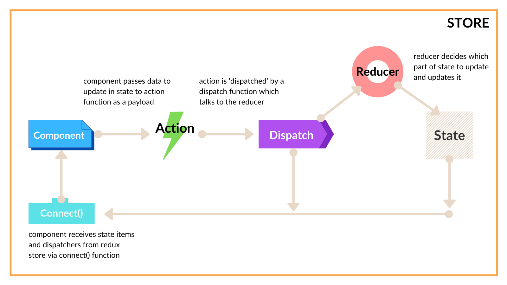
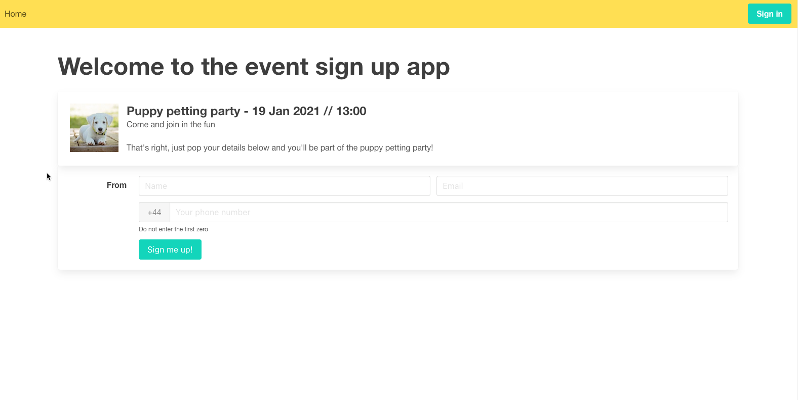

# Redux

One of the best ways to manage your apps' centralized state is with the redux pattern. In this lesson you'll deep dive into redux and how you can use it for managing state.

### What is Redux?

Redux is an open-source library (based on Facebook’s Flux design pattern) that deals with shared state management. Specifically, it helps by giving a robust state management design pattern that ultimately leads to a predicable state container for our JavaScript apps. 

Its power comes from the predictability it provides when it comes to state. You can write applications that behave consistently, especially when run in different environments (such as client, server, native, etc.). You also remove the otherwise tight coupling between components, their state management responsibilities, and all the extra code they would need to carry this out.

Think of Redux as a state management concierge. You tell it what action you’d like to take against your app state, supply it with some new data, and it takes care of the rest.

It’s helpful to know that Redux isn’t a React-specific thing. The main Redux library is indeed aimed at any JavaScript-based app, but other frameworks have their own flavor of Redux too. For example, Vue.js has Vuex which is very similar to the Redux pattern.

Of course, you’ll be learning about it with your React hat on, but the core principles remain relevant to just about any JavaScript project involving views. 

### Redux and its Moving Parts

Redux’s implementation and key concepts can be tricky to get to grips with, but you’ll go through each of the moving parts and explain what they are and how they operate.

Take a look at this diagram:



This represents a typical state interaction between a component wanting to receive particular items from state and make changes to it, and the Redux ecosystem that allows it to happen. 

The key players here include:

- **State** - the centralized area for our app’s shared data.

- **Action** or **action creator** - usually a function that a component passes its proposed changes in state data to.

- **Dispatch** - another function that takes the result of the Action and dispatches this to a specific reducer.

- **Reducer** - the main player; responsible for physically applying the changes to state.

- **Connect** - a function that maps selected items of state and the dispatch method to a component’s props, so it can use them when the time is right.

- **Store** - much like the `Context.Provider` in the Hooks lesson, a Redux Store provides a wrapper around our main app to wire all the pieces together.

Let’s take a walk through these various parts of the redux lifecycle and connect up the pieces of the puzzle, exploring them a little deeper as we go.

## Store and Application State

The most straightforward of the bunch to get to grips with is application state. It is simply a centralized object with various properties that represent the ‘`state`’ of your application at a given moment. It can contain anything your app needs, but typically it could contain collections of items, settings, preferences and so on. In a typical React project this is literally a regular old JavaScript object.

In more complex applications you might find that state is broken into small sections (often referred to as ‘slices’ in Redux land) which are then stitched together when the application is served.

The Redux **store** is like the master state, holding the entire state tree for your application. More than this, however, it wires up the various moving parts, such as **reducers**, **dispatchers**, and **actions**, to the centralized state. 

In React, the **store** is usually passed to a provider that wraps around the main app mounting point.

### Reducers

Next move on to **reducers** because, while they might look more complex than actions or dispatch functions, they are at the top of the tree, so to speak. Once you understand **reducers**, the rest will make more sense.

**Reducers** are functions that modify your state. They might look a bit much at first glance, but in a nutshell this is their entire, single purpose: modifying state.

They usually accept an output of an **action creator** (which you’ll learn about in a moment) and use this to determine what action to take on our state.

You might see something like this:

```
function mySuperReducer(state = 0, action) {
  switch (action.type) {
    case ‘INCREMENT’:
      return state + 1;
    default:
      return state;
  }
}
```

For some state changes, however, you also need to modify your state based on a passed-in value. For this, you’ll use an action that contains a **payload**.

A **payload** could be anything: a value, string, integer, array, object, etc. It’s passed in with the action object into the reducer and is used to modify state.

It might look like this:

```
function mySuperReducer(state = [], action) {
    switch(action.type) {
        case ‘ADD_USER’:
            return […state, action.payload.newUser]
        default:
            return state;
    }
}
```

You can see that you have a regular `switch()` statement that matches the action’s type value. If this type is a string ‘`ADDUSER`’, then return a new array which contains a copy of the current state, _plus your action’s payload, `newUser`. 

### Actions

Action creators are functions that create actions. That doesn't help us much though!

They are quite simple functions that return an object. This object usually contains two things:

1. The type of action you want to take (often a string constant, like “`ADD_ITEM`”)

2. The value you want to act with (we’ve just seen this in the reducers section)

Since you shouldn’t directly modify state yourself within a Redux store, use actions to inform the global store of what happened within your app. 

When you pass an action (which is the result of an action creator) into a reducer, it is the action type that determines what will happen to state, and (if required/available) what value will be used as part of the state changes.

What they look like varies from use to use, but in a relatively standard Redux set-up, they’ll usually look like this:

```
const ADD_USER = 'ADD USER'; // our string constant part

// our action creator, which returns an action
function addUser(newUser) {
    return { type: ADD_USER, newUser };
}
```

### Dispatchers

The final piece of the puzzle is dispatchers. Dispatchers are the gophers between actions and reducers. Essentially, dispatchers are functions that trigger or kick-off all state updates.

You call a dispatch function, passing in the result of an action. The dispatch function takes the action to the reducer and the reducer modifies the state.

Using a dispatcher might look like this:

```
// Here’s our action
function addUser(newUser) {
    return { type: ‘ADD_USER’, newUser };
}

// here’s a new user object
const user = {
    name: ‘rob kendal’,
    age: 380,
    dob: 01/01/1901
}

// and here’s the dispatch to trigger things
dispatch(addUser(user));
```

You don’t typically make a dispatch function - they are provided by the redux store and are bound to components using the `connect()` function you saw in the diagram earlier. 

However, you can see here that you have our action creator, which returns an action object, which contains the type of action you want to perform against state, and the value or data you want to use as part of this state update.

In this case, your dispatch function call is comparatively simple: call it passing the result of the `addUser` action function, which is, in turn, passed a user object. 

When this happens, the dispatch function will rush off to tell your reducer that a change has occurred and that it needs to do something.

### Why is Redux Useful?

All of this might seem very complicated and unnecessary so far, especially when it comes to thinking about the kind of React apps you’ve made so far. In fact, if you’re asking yourself "why is Redux useful?" or even "what on earth is the point of it?" then I wouldn’t blame you!

In fact, this isn’t a bad question to ask in general since a lot of projects can be quick to jump to a complex state management solution such as Redux before they really need one. 

So take a look at why and when Redux is useful.

Redux is most useful in cases when:

- Your app has vast amounts of state needed in many places across the app

- Your application’s state is going to be updated frequently

- Updating that state involves really complex logic (think back to the tight coupling and excess logic in components)

- You have a medium or large codebase being worked on by several devs

- You need to track how that state is being updated over a period of time

### Do I need Redux?

Now you've got a good idea of why Redux is so useful, but you should still be asking  "do I really need Redux?".

From the [official Redux.js](https://redux.js.org/faq/general#when-should-i-use-redux) website:

Redux deals in shared state management. Much like the `useContext` Hook, it might be that your app and components could use a refactor or composition overhaul before reaching for Redux. You might even be able to use a built-in React offering such as `Context` if you just need to be able to pass a few details around your app, without all the extra complexity that Redux brings.

That said, there is a high chance you will be working with some implementation of Redux in larger, commercial apps in your role as a developer, so being familiar with the specifics is essential to being a well-rounded React developer.

### Popular Redux Libraries

Redux is a design pattern first and foremost. However, there are two main Redux libraries that help to implement this pattern, and they are:

- [React Redux](https://react-redux.js.org/)

- [Redux Toolkit](https://redux-toolkit.js.org/)

React Redux is a standard React-oriented implementation of the redux pattern. It’s not super opinionated but it gives tools to create a `store` with all the necessary trimmings, wire them together, and make the pattern work. 

The Redux Toolkit, on the other hand, offers a much more opinionated approach, taking a lot of the heavy lifting and more complex implementation off your hands, allowing you to focus on the core app logic without all the fluff that comes with Redux. Indeed, in its own words, the Redux Toolkit is "the official, opinionated, batteries-included toolset for efficient Redux development".

Coming up next, you start looking at your first app using React Redux, before moving on to refactor this to use the Redux Toolkit, so you can see the differences and make your own choices for your own projects.


## Event SignUp App

You will build an Event SignUp App. You'll have a listing for an event with a few form fields, where users can tell you they’re attending. 

Let’s take a look at how this finished app will function:



You have your event listing and user signup form. But what’s nice here, is that once you have a few signups, you can switch over to an admin area (as a pretend admin user) and view your event attendees in a list.

You’ll be using the Create React App starter project again, and employing the vanilla React Redux library to create your store and get things working. 

In the steps that follow, you’ll switch over to the more developer-friendly Redux Toolkit, before taking a look at how you can use React’s built-in Context and the `useReducer` Hook as an alternative.

## Build the Event SignUp app

For the remaining of this lesson you will build three approaches to using Redux. In the first, you're going to build arguably the most complex of the three approaches. You’ll be using the React Redux library, before transitioning to the Redux Toolkit for the next one. 

Finally, you will implement the redux pattern without any additional libraries using React’s built-in `useReducer` Hook and the `Context` system.

First, though, get going with building the Event SignUp app and the vanilla React Redux package. 

## L08HandsOnAssignment SignUp App

### Requirements

1. Follow guided learning
2. Create code for each hook

### Project Setup

Use Create React App for the remaining sections and the setup process should be starting to feel familiar by now. 

Open a terminal window to the parent folder you want to create the new project in and run the following command:

:writing_hand:

```
npm create react-app event-signup-project
```
Once the command finishes and your app base is installed, run it to test it’s set up correctly with:

:writing_hand:

```
cd event-signup-demo
npm start
```

View the running starter app in your browser at http://localhost:3000 

### Clean Up the Starter Project

Just like in previous lessons, clean up the starter app by doing the following:

- :writing_hand: Open `index.js` and remove the reference to `import ‘./index.css'`

- :writing_hand: Delete the `/src/index.css` and `/src/App.css` files

- :writing_hand: Open the main `App.js` file and empty the file so you can add your project-specific code later on.

## Add Project Dependencies

Before you create the files you need for your project, bring Redux, React Redux, and Redux Thunk Onboard.

The first dependencies to add are `Redux`, `React Redux`, and `Redux Thunk` (we’ll explain this last one when we come to configure your redux store). Back in a terminal window, make sure you’re in the root project location and enter the following command:

:writing_hand:

```
npm add redux react-redux redux-thunk
```

With that done, you can access the various methods and helpers that React Redux provides.

### Add UUID

Since you’ll be adding event attendees to your fake event, it’s good practice to give each of them a unique `ID` value. You could just increment the `ID` to the next highest in the array of event attendees, but to make it more realistic you’ll assign a uniquely generated `ID instead. 

To do that, import the very helpful React UUID package with the following command:

:writing_hand:

```
 npm add react-uuid
 ```
### Add Bulma

Stick with the Node version of Bulma for this project,and  add it to your project using this command:

:writing_hand:

```
npm add bulma
```

### Add Sass

Finally, add in Node Sass to compile your `.scss` files. Bring in the final package as a dev-only dependency as follows:

:writing_hand:

```
npm add --dev node-sass
```

## Create Your app’s Files

With your dependencies added, create all the files you need for the project and build them out.

- :writing_hand: `index.js` - make a scant few changes here to wire up your redux store with the rest of the application.

- :writing_hand: `App.js`  - the main starting point of your app.

- :writing_hand: `/assets/style.scss` - add in some basic styling niceties in the scss version of Sass.

- :writing_hand: `/components/EventDetails.jsx`  - a presentational component that will display details of an individual event.

- :writing_hand: `/components/EventSignUpForm.jsx` - a Bulma-styled form component whose logic will enable you to add new attendees to the global store via redux methods.

- :writing_hand: `/components/EventSignUpList.jsx` - the other side of the event form coin. This component will allow administrators to edit attendees, remove them, and see their details at a glance in a list format.

- :writing_hand: `/components/Header.jsx` - another presentational component with scant logic that will act as a `navbar` and display a message to the user if they’re logged in.

- :writing_hand: `/config/configureStore.js` - a small but mighty JavaScript file that configures the redux store at the heart of the redux pattern.

- :writing_hand: `/data/initialState.js` - a starting point for the global state in your app.

- :writing_hand: `/reducers/eventReducer.js` - this will hold all the reducer functions, state-altering magic, and actions for dealing with the event portion of your app’s state.

- :writing_hand: `/reducers/reducers.js` - this will be the main reducer file you associate with your store and app’s redux - effectively it acts as a container for the other, more specific reducers, such as the event reducer.

With the files created, work through them to add in the details needed.

### Style.scss

Open up `/assets/style.scss` and copy in the following styles:

:writing_hand:

**src/assets/style.scss**

```
// IMPORTS
@import "../../node_modules/bulma/css/bulma.min.css";

// VARIABLES
$font-family: "Helvetica neue", Tahoma, sans-serif;
$font-size: 16px;

// GENERAL STYLES
body {
    font-family: $font-family;
    font-size: $font-size;
}

// OVERRIDES
.field-label {
    flex-grow: 0.5;
}
```

The import statement at the top of the file brings the Bulma CSS framework styles into the project. Next, set a couple of SCSS variables and a couple of styles to bring a little nicety to your base app.

### initialState.js

Your app’s state represents a central data storage facility you can use to house any relevant data you need to share and use across our app. When you create your redux store, you’ll supply it with an initial dataset that represents a starting point; the initial state of your state as it were.

The `/data/initialState.js` file is going to house such a starting point, so open it up and enter in the following:

:writing_hand:

**src/data/initialState.js**

```
const initialState = {
    events: {
        loading: false,
        eventAttendees: [],
    }
};

export default initialState;
```

There’s very little here, just a plain vanilla JavaScript object you’re exporting to use elsewhere. You’ll notice that you’ve created an events property on the object that will hold any state data relevant to the events section of the app. You can define your app’s state however you like, but I prefer to have a single initial state file and split it into slices like this.

### reducers.js

Now tackle the `reducers.js` file. A redux store can only deal with a single reducer. This presents a problem when you have a larger app working on affecting different slices of the app’s state with very different reducer statements and actions and other moving redux parts. 

If you were to have only a single reducer, you can imagine this would grow huge over time and become a maintenance nightmare for us developers. A much better approach would be to have multiple reducers that only deal with a distinct area of the app, however you would then fall foul of the ‘single reducer to a store’ rule…

Fortunately, the React Redux library provides a handy function, `combineReducers` , which allows you to define your reducer files separately and combine them into a single master reducer (of sorts) that you can then pass into the redux store.

That’s what you’ll be doing with the `reducers.js` file. First, import the `combineReducers` function from the ‘`redux`` package:

:writing_hand:

**src/reducers/reducers.js**

```
import { combineReducers } from 'redux';

// Reducers
import events from './eventReducer';
```

Import the `eventReducer` from the `/reducers/eventReducer.js` file. In a bigger app you might have more reducers, but you’ve only got the one here.

Finally, export the result of the `combineReducers` function which accepts an object of `key:value` pairs, each key being the reference name of that slice of state the reducer affects, and each value being the reducer that affects it. In your case here, they’re one and the same so you can use the shorthand JavaScript object property notation.

:writing_hand:

**src/reducers/reducers.js**

```
import { combineReducers } from 'redux';

// Reducers
import events from './eventReducer';

export default combineReducers({
    events,
});
```

### eventReducer.js

Now the main event, Eeen though you’re only a couple of files into the project and have a few more to complete. However, logically, it makes sense to work through the `eventReducer` file now and cement the key concepts about Redux in place before creating and wiring up the other parts of the redux puzzle.

Open the `/reducers/eventReducer.js` file and begin with the imports:

:writing_hand:

**src/reducers/eventReducer.js**

```
import uuid from 'react-uuid';

// Data
import initialState from '../data/initialState';
```

You’re pulling in the uuid library and your `initialState` file here. The uuid package will be used to generate a unique `ID` value when you come to add a new event attendee into state via the upcoming reducer function.

### Action Types

Action types are simple string constants that describe the type of action you want to perform against state. You do not have to do this, or use action types at all, they are just a well-adopted convention. If you choose not to use them then you’ll have to pass around string values here and there. This introduces lots of potential for mistakes such as spelling errors, and that’s without considering that you might want to change any of those strings — in this case, you only have to change them in one place.

Define the action types for the `eventReducer` now:

:writing_hand:

**src/reducers/eventReducer.js**

```
// Action types
export const actions = {
    ADD_EVENT_ATTENDEE: 'add-event-attendee',
    TOGGLE_EVENT_ATTENDANCE: 'toggle-event-attendance',
    DELETE_EVENT_ATTENDEE: 'delete-event-attendee',
};
```

Nothing but a simple JavaScript object whose properties describe the action you want to take.

### Actions

Actions are different from action types which are simple describing strings. Actions are functions that return both the type of change you want to perform against your app’s state (such as adding a new user, deleting a row or fetching a result), and a payload, an object containing the changes to state . 

For example, if you wanted to add a new user, you’d create an action that had a type of add-new-user and a payload that was a new user object. 

Again, you don’t have to actually do this. However, ultimately you’re going to call a dispatch function (provided by the Redux library) which dispatches a notification to the reducer to make some changes to your app’s state. This dispatch function requires a type of action (as you’ve already created) and a payload. 

Without creating any action functions, you’d have to call each and every dispatch like this:

**EXAMPLE ONLY**

```
function handleNewUserClick(userData) {
	dispatch({
		type: 'add-new-user',
		payload: {
			newUser: userData,
		}
	});
}
```

As it stands, this might not look like much, but imagine you have a bunch of these updates in the same component and across multiple areas of the app. It’ll start to become cumbersome and bloated to keep doing this as time goes on. Plus, you’re back to the potential for errors and making it harder to make changes; if you wanted to change the payload here, you’d have to find every single instance of this and change it across multiple files.

Compare this with having a single function call that is passed any data changes as parameters:

**EXAMPLE ONLY** 

```
function handleNewUserClick(userData) {
	dispatch(addNewUserAction(userData));
}
```

It’s much easier and cleaner to define and export a series of action functions in each relevant reducer file that accepts one of more state data changes as parameters, and that return a nicely formatted action object. 

That’s what you’ll do now. You’re going to create three action functions here:

- `addEventAttendee` for adding new event attendees

- `toggleEventAttendance` for toggling whether or not someone is coming to the event

- `deleteEventAttendee` to remove anyone who is no longer needed from your event signup list


:writing_hand:

<details>
<summary>src/reducers/eventReducer.js</summary>

```
// Actions
export const addEventAttendee = content => ({
    type: actions.ADD_EVENT_ATTENDEE,
    payload: {
        id: uuid(),
        content
    }
});

export const toggleEventAttendance = (id) => ({
    type: actions.TOGGLE_EVENT_ATTENDANCE,
    payload: {
        id
    }
});

export const deleteEventAttendee = id => ({
    type: actions.DELETE_EVENT_ATTENDEE,
    payload: {
        id
    }
});
```
</details>

You’re exporting each function so you can call it across your app in whichever component needs to use it. You can see they’re all pretty straightforward arrow functions. There’s nothing specific to Redux here, but you’ve formatted the return object with a type property (using one of the action types defined earlier) and a payload which contains any relevant data that needs to be used by the upcoming reducer to affect your state. 

### Reducer

The reducer is where all roads point to, and is responsible for making the changes and updates in state. 

It’s going to look a little unwieldy at first, but stick with it and you’ll soon make sense of it as the pattern will become familiar. You’ll also be looking at the Redux Toolkit in the next section, which reduces a lot of this initial complexity in writing reducers.

Define the reducer function with just a single action handler in it:

:writing_hand:

<details>
<summary>src/reducers/eventReducer.js</summary>

```
// Reducer
const eventReducer = (state = initialState.events, action) => {
    
    switch (action.type) {
        case actions.ADD_EVENT_ATTENDEE: {     
            const { id, content } = action.payload;
            
            return {
                ...state,
                eventAttendees: [
                    ...state.eventAttendees,
                    {
                        ...content,
                        attending: true,
                        id,
                    }
                ],
                loading: false,
            };
        }
```
</details>

Again, the reducer is a standard arrow function that accepts a value for state and an action. These values will be passed to the reducer by the React Redux library when everything is wired up so the only thing you have to do at this stage is supply an initial value for state. In your case, this will be the events portion of the `initialState` object imported earlier.

The main body of the reducer will be a `switch` statement that checks the incoming action argument’s type property for a match. When you find a match (in this case when `action.typ`e equals `actions.ADD_EVENT_ATTENDEE`) you can perform some updates to state.

First, pull out the `id` and `content` values from the action’s payload property via destructuring. Then, return a new, updated copy of state with your changes applied. 

Notice that you’re including the copy of existing state using the `...` spread syntax. Also keep in mind that this reducer will be acting upon the events portion of the overall state. This is wired up via the Redux library, but it stems from your inclusion of the `state = initialState.events` when you defined this reducer function.

Update the `eventAttendees` property (an array) so you use the spread syntax again and add the new event attendee info from the content object. Add the id value too and set a new property, attending to true because when someone signs up for the first time you assume they’re attending. 

Next, you’ll sort out the code to handle the `TOGGLE_EVENT_ATTENDANCE and DELETE_EVENT_ATTENDEE` actions. 

:writing_hand:

<details>
<summary>src/reducers/eventReducer.js</summary>

```
// Reducer
const eventReducer = (state = initialState.events, action) => {
    
    switch (action.type) {
        case actions.ADD_EVENT_ATTENDEE: {     
            const { id, content } = action.payload;
            
            return {
                ...state,
                eventAttendees: [
                    ...state.eventAttendees,
                    {
                        ...content,
                        attending: true,
                        id,
                    }
                ],
                loading: false,
            };
        }
        case actions.TOGGLE_EVENT_ATTENDANCE: {
            const { id } = action.payload;
            const updatedEventAttendees = state.eventAttendees.map(item => {
                    if(item.id === id) {
                        item.attending = !item.attending;
                    }

                    return item;
                });

            return {
                ...state,
                eventAttendees: updatedEventAttendees,
                loading: false,
            }
        }
        case actions.DELETE_EVENT_ATTENDEE: {
            const { id } = action.payload;
            const updatedEventAttendees = state.eventAttendees.filter(item => item.id !== id);
            
            return {
                ...state,                
                eventAttendees: updatedEventAttendees,
                loading: false,
            }
        }
        default:
            return state;
    }
};

export default eventReducer;
```
</details>

OK, so things are starting to look a little messy and that’s a fair criticism levelled at redux from time to time. However, you can start to see a similar pattern between these different action matches. For the `TOGGLE_EVENT_ATTENDANCE` case:

- Pull out the id value and use it to search for a matching event attendee during an `Array.map()` loop. 

- When you find a match, update the attending property to its reverse. 

- Finally, return a new state copy once more with your `updatedEventAttendees` variable assigned to the `eventAttendees` state property.

With `DELETE_EVENT_ATTENDEE` you’re performing a very similar process to the one you've just done, only this time the `updatedEventAttendees` variable will be populated via `Array.filter()`, removing the event attendee whose id value matches the one supplied to the reducer.

Well done! You’ll be pleased to know that wyou’re done with the reducer file and it’s all downhill from here, as we build out the remaining files.

#### Completed Reducer File

With all the code in, the finished and complete `eventReducer.js` file will look like this:

:writing_hand:

<details>
<summary>src/reducers/eventReducer.js</summary>

```
import uuid from 'react-uuid';

// Data
import initialState from '../data/initialState';

// Action types
export const actions = {
    ADD_EVENT_ATTENDEE: 'add-event-attendee',
    TOGGLE_EVENT_ATTENDANCE: 'toggle-event-attendance',
    DELETE_EVENT_ATTENDEE: 'delete-event-attendee',
};

// Actions
export const addEventAttendee = content => ({
    type: actions.ADD_EVENT_ATTENDEE,
    payload: {
        id: uuid(),
        content
    }
});

export const toggleEventAttendance = (id) => ({
    type: actions.TOGGLE_EVENT_ATTENDANCE,
    payload: {
        id
    }
});

export const deleteEventAttendee = id => ({
    type: actions.DELETE_EVENT_ATTENDEE,
    payload: {
        id
    }
});

// Reducer
const eventReducer = (state = initialState.events, action) => {
    
    switch (action.type) {
        case actions.ADD_EVENT_ATTENDEE: {     
            const { id, content } = action.payload;
            
            return {
                ...state,
                eventAttendees: [
                    ...state.eventAttendees,
                    {
                        ...content,
                        attending: true,
                        id,
                    }
                ],
                loading: false,
            };
        }
        case actions.TOGGLE_EVENT_ATTENDANCE: {
            const { id } = action.payload;
            const updatedEventAttendees = state.eventAttendees.map(item => {
                    if(item.id === id) {
                        item.attending = !item.attending;
                    }

                    return item;
                });

            return {
                ...state,
                eventAttendees: updatedEventAttendees,
                loading: false,
            }
        }
        case actions.DELETE_EVENT_ATTENDEE: {
            const { id } = action.payload;
            const updatedEventAttendees = state.eventAttendees.filter(item => item.id !== id);
            
            return {
                ...state,                
                eventAttendees: updatedEventAttendees,
                loading: false,
            }
        }
        default:
            return state;
    }
};

export default eventReducer;
```
</details>

## configureStore.js

Open the `/config/configureStore.js` file and fill out the following code:

:writing_hand:

<details>
<summary>src/config/configureStore.js</summary>

```
import { createStore, applyMiddleware, compose } from 'redux';
import thunkMiddleware from 'redux-thunk';

import rootReducer from '../reducers/reducers';
import initialState from '../data/initialState';

const configureStore = () => {    
    const middlewareEnhancer = applyMiddleware(thunkMiddleware);
    const composedEnhancers = compose(middlewareEnhancer);

    const store = createStore(rootReducer, initialState, composedEnhancers);
    return store;
};

export default configureStore;
```
</details>

What you’re doing in this file is stitching together your root reducer, initial state values, and what you call enhancers. Enhancers are higher-order functions that enhance a redux store, adding in middleware, persistence capabilities or other additional capabilities that you may want uour store to have.

In your case you’re adding a very common middleware, Redux Thunk, which you pulled into your project in the dependencies section. The Thunk middleware allows for asynchronous actions during redux operations. Granted, it’s not something you’re doing here in this project, but you’ll use this frequently, especially when dealing with API calls or other asynchronous mechanisms in larger projects out in the real world.

So, pull in your imports, the root reducer, and initial state. 

Next, define an arrow function that creates a middleware enhancer by calling the `applyMiddleware` function and passing it the `thunkMiddleware` import. 

The `composedEnhancers` is a little redundant here as you only have the one, but you call the compose function from redux and pass it the result of the `middlewareEnhancer` variable. 

All that remains is to call the `createStore` function and pass it your reducer, starting state, and the `composedEnhancers` variable, returning the store value to the caller.

:writing_hand:

**src/config/configureStore.js**

```
    const store = createStore(rootReducer, initialState, composedEnhancers);
    return store;
```

You can find more information on [applying middleware](https://redux.js.org/api/applymiddleware) at the official Redux documentation, especially in the [glossary](https://redux.js.org/understanding/thinking-in-redux/glossary) section.

It might look a little alien at this point, but for now, just be aware that adding middleware to your redux stores is quite common in a lot of projects and the process is usually the same:

1. Define a store-configuring function

2. Within it, apply any middleware you need

3. Compose an enhancer from the applied middleware

4. Create a redux store that wires up your reducers, initial state and enhancers

5. Return the store for use

### Header.jsx

Your `Header` component will be a straightforward website header with some navigation elements in it. Open the `/components/Header.jsx` file and start with the classic React import line.

After this, let’s define the entire presentational component like this:

:writing_hand:

<details>
<summary>src/components/Header.jsx</summary>

```
import React from 'react';

const Header = ({ isSignedIn, handleSignInClick, handleSignOutClick }) => (
    <nav className="navbar is-warning" role="navigation" aria-label="main navigation">
        <div id="navbarBasicExample" className="navbar-menu">
            <div className="navbar-start">
                <a className="navbar-item">
                    Home
                </a>
            </div>           

            <div className="navbar-end">
                {
                    isSignedIn && (
                        <div className="navbar-item">
                            Welcome user, you are logged in
                        </div>
                    )
                }                
                <div className="navbar-item">                    
                    <div className="buttons">
                        {
                            !isSignedIn ? (
                                <a className="button is-primary" onClick={handleSignInClick}>
                                    <strong>Sign in</strong>
                                </a>
                            )
                            : (
                                <a className="button is-primary" onClick={handleSignOutClick}>
                                    <strong>Sign out</strong>
                                </a>
                            )
                        }
                    </div>
                </div>
            </div>
        </div>
    </nav>
);

export default Header;
```
</details>

You’re destructuring three properties from props here. `isSignedIn` will be a boolean value to determine if you’re logged in to the admin side of things. `handleSignInClick` and `handleSignOutClick` will be used to handle the button clicks for signing in and out respectively. 

:writing_hand:

**src/components/Header.jsx**

```
                {
                    isSignedIn && (
                        <div className="navbar-item">
                            Welcome user, you are logged in
                        </div>
                    )
                }                
```

With the JSX, you have a nav element styled up with Bulma classes. In the `navbar-end` section, you toggle the display of a welcome message for a signed-in user depending on the value of `isSignedIn`. 

:writing_hand:

**src/components/Header.jsx**

```
                        {
                            !isSignedIn ? (
                                <a className="button is-primary" onClick={handleSignInClick}>
                                    <strong>Sign in</strong>
                                </a>
                            )
                            : (
                                <a className="button is-primary" onClick={handleSignOutClick}>
                                    <strong>Sign out</strong>
                                </a>
                            )
                        }
```

Finally, display either a Sign In or Sign Out button, depending on `isSignedIn`’s value. Each button’s click event is attached to one of the click handlers pulled from props, and this is fired up to the parent component on the actual button click.

### EventDetails.jsx

Over in the `/components/EventDetails.jsx` file, create another purely presentational component as follows:

:writing_hand:
<details>
<summary>src/components/EventDetails.jsx</summary>

```
import React from 'react';

export default () => (
    <div className="card">  
        <div className="card-content">
            <div className="media">
                <div className="media-left">
                    <figure className="image is-96x96">
                        
                    </figure>
                </div>
                <div className="media-content">
                    <p className="title is-4">Puppy petting party - <time dateTime="2021-1-19">19 Jan 2021 // 13:00</time></p>
                    <p className="subtitle is-6">Come and join in the fun</p>
                    <p>
                        That's right, just pop your details below and you'll be part of the puppy petting party!
                    </p>
                </div>
            </div>
        </div>
    </div>
);
```
</details>

You bring in React, and then define a card element using Bulma’s HTML structure and CSS classes. In the JSX, you’re adding in a cute puppy placeholder image, and adding in some fabricated event details, such as a title, time, and description.

Save the file and let’s move on.

## EventSignUpList.jsx

Now things are getting a little interesting. Open the `/components/EventSignUpList.jsx` file. This component is the first one where you’ll be using all of our hard work in setting up the various redux elements. 

### Imports Section

Start with the imports:

:writing_hand:

**src/components/EventSignUpList.jsx**

```
import React from 'react';
import { connect } from 'react-redux';

// Actions
import { deleteEventAttendee, toggleEventAttendance } from '../reducers/eventReducer';
```

You have React and this new connect function from the react-redux library. What connect allows is quite literally connect components with both your redux state and the dispatch mechanism. 

When using connect, the common convention is to define your component and then create another two functions that map state and dispatch to the component, passing both those and the component itself into the connect function before exporting that as the file’s default export. 

After this, you pull in your action functions from `eventReducer.js1 file. Use these shortly to tell the redux system what actions you’d like to perform against your app state. 

### Define the Component Body

Following tradition, define the `EventSignUpList` component body now:

:writing_hand:

<details>
<summary>src/components/EventSignUpList.jsx</summary>

```
const EventSignUpList = ({ eventAttendees, deleteEventAttendee, toggleEventAttendance }) => (
    <div className="box">        
        {
            eventAttendees && eventAttendees.length ?
            <>
                <h2 className="subtitle is-size-5">Hurrah, {eventAttendees.length} {eventAttendees.length > 1 ? "people have" : "person has"} signed up to our event!</h2>
                <table className="table is-striped is-fullwidth">
                    <thead>
                        <tr>
                            <th>Name</th>
                            <th>Email</th>
                            <th>Number</th>
                            <th>Attending</th>
                            <th>Actions</th>
                        </tr>
                    </thead>
                    <tbody>
                        {
                            eventAttendees.map(item => (
                                <tr key={item.id}>
                                    <td>{item.name}</td>
                                    <td>{item.email}</td>
                                    <td>{item.number}</td>
                                    <td><span className={`has-text-${item.attending ? 'success' : 'danger'}`}>{item.attending ? "Yes" : "No"}</span></td>
                                    <td>
                                        <div className="buttons">
                                            <button className="button is-info is-small" onClick={() => toggleEventAttendance(item.id)}>change attendance</button>
                                            <button className="button is-danger is-small" onClick={() => deleteEventAttendee(item.id)}>delete</button>
                                        </div>
                                    </td>
                                </tr>
                            ))
                        }
                    </tbody>
                </table>
            </>
            : <h2>Oh dear...looks like no one has signed up yet :(</h2>
        }
    </div>
);
```
</details>

You’re extracting `eventAttendees`, `deleteEventAttendee` and `toggleEventAttendance` from props. These will be passed to the component later by the connect function. `eventAttendees` is the state array of currently-attending signups to the event, while the remaining two are self-explanatory events defined in the reducer.

Next, you have a Bulma box element whose contents involve a short message highlighting the number of signups, followed by a regular old table element. Inside the table you map each event attendee to a table row, extracting various properties such as name, id, and phone number into table cells.

:writing_hand:

**src/components/EventSignUpList.jsx**

```
 <button className="button is-info is-small" onClick={() => toggleEventAttendance(item.id)}>change attendance</button> 
<button className="button is-danger is-small" onClick={() => deleteEventAttendee(item.id)}>delete</button>
```

The key point of note here, is you have two buttons, one to toggle the attendance, and one to remove this attendee from state. See how you’re assigning the props functions to the buttons’ click handlers? Because of the action-creating functions you made earlier in your `eventReducer`, all you have to do here is pass in the correct parameter values — in this case each item’s id. Without the action creator function, you’d have to pass in the action type and a payload object into this function. 

However, on their own, these functions won’t trigger anything in the redux pipeline. To do that, you need to wire them up to redux’s dispatch. To do that, you’re going to move on to our redux mappings.

### Redux Mapping Functions

To wire your Redux system into this component, you need to create two mapping items:

:writing_hand:

<details>
<summary>src/components/EventSignUpList.jsx</summary>

```
const mapStateToProps = state => ({
    eventAttendees: state.events.eventAttendees,
});

const mapDispatchToProps = {
    deleteEventAttendee, 
    toggleEventAttendance
};
```
</details>

You have two items here, a `mapStateToProps` function and a `mapDispatchToProp`s object. The point of both of these items is to wire up the redux state and dispatch mechanisms to your component. 

Starting with the `mapStateToProps`, this is a function that will be passed your app's state and should return an object that contains any items from state that your component needs. In this case, you only want the `eventAttendees` array, but you could take anything you need from state and it would be passed to your component’s props object under whatever property name you choose to give it.

With `mapDispatchToProps` you create an object filled with properties that will be functions with redux’s dispatch mechanism wired up into them automatically, and passed along to your component’s props. You don’t have to do this, but it provides a very declarative approach in-keeping with React’s overall principles. 

Without this approach, you’d have to pass dispatch into the component and then call it directly, passing in your action function. For example, instead of calling `toggleEventAttendance(item.id)`, you’d have to call `dispatch(() => toggleEventAttendance(item.id))`. Another bonus is this approach gives an at-a-glance look at what’s wired into the redux system and provided to props without having to scan the component and work things out.

With your two mapping items present and correct, the last piece of the puzzle is to create your default export for the component:

:writing_hand:

**src/components/EventSignUpList.jsx**

```
export default connect(
    mapStateToProps,
    mapDispatchToProps
)(EventSignUpList);
```

You call the connect function which accepts a state mapping function, then a dispatch connection object. The function returns a wrapper function that takes your component and wraps it with the additional props you need. That’s what you do after calling it, add in your `EventSignUpList` component, which completes the component code and wires it all up to the redux store.

#### The Complete EventSignUpList Component

With everything in place, here’s what the entire component should look like:

:writing_hand:

<details>
<summary>src/components/EventSignUpList.jsx</summary>

```
import React from 'react';
import { connect } from 'react-redux';

// Actions
import { deleteEventAttendee, toggleEventAttendance } from '../reducers/eventReducer';

const EventSignUpList = ({ eventAttendees, deleteEventAttendee, toggleEventAttendance }) => (
    <div className="box">        
        {
            eventAttendees && eventAttendees.length ?
            <>
                <h2 className="subtitle is-size-5">Hurrah, {eventAttendees.length} {eventAttendees.length > 1 ? "people have" : "person has"} signed up to our event!</h2>
                <table className="table is-striped is-fullwidth">
                    <thead>
                        <tr>
                            <th>Name</th>
                            <th>Email</th>
                            <th>Number</th>
                            <th>Attending</th>
                            <th>Actions</th>
                        </tr>
                    </thead>
                    <tbody>
                        {
                            eventAttendees.map(item => (
                                <tr key={item.id}>
                                    <td>{item.name}</td>
                                    <td>{item.email}</td>
                                    <td>{item.number}</td>
                                    <td><span className={`has-text-${item.attending ? 'success' : 'danger'}`}>{item.attending ? "Yes" : "No"}</span></td>
                                    <td>
                                        <div className="buttons">
                                            <button className="button is-info is-small" onClick={() => toggleEventAttendance(item.id)}>change attendance</button>
                                            <button className="button is-danger is-small" onClick={() => deleteEventAttendee(item.id)}>delete</button>
                                        </div>
                                    </td>
                                </tr>
                            ))
                        }
                    </tbody>
                </table>
            </>
            : <h2>Oh dear...looks like no one has signed up yet :(</h2>
        }
    </div>
);

const mapStateToProps = state => ({
    eventAttendees: state.events.eventAttendees,
});

const mapDispatchToProps = {
    deleteEventAttendee, 
    toggleEventAttendance
};

export default connect(
    mapStateToProps,
    mapDispatchToProps
)(EventSignUpList);
```
</details>

## EventSignUpForm.jsx

Over in your `EventSignUpForm` component, you’re going to have a few more moving parts, but you’ll start to see a very familiar pattern emerging in how you use the redux actions and mapping functions.

### Imports Section

Let’s start with your imports:

:writing_hand:

**src/components/EventSignUpForm.jsx**

```
import React, { useState } from 'react';
import { connect } from 'react-redux';

// Actions
import { addEventAttendee } from '../reducers/eventReducer';

// Components
import EventDetails from './EventDetails';
```

You’re bringing in React and the connect function from react-redux. Next, just like in the `EventSignUpList` component, you’re bringing in one of your action functions, in this case `addEventAttendee`. You’ll be using this very shortly to dispatch an action to the redux system, telling it to add a new event signup.

After that you’re importing the simple presentational component,`EventDetails` defined earlier.

### Component Body

Before you define the main body you first need to create a quick base form field object:

:writing_hand:

**src/components/EventSignUpForm.jsx**

```
const _baseFormFields = {
    name: '',
    email: '',
    number: ''
};
```

This object will represent the default fields and values tyou want to capture in your event signup form. You’re going to use them here as a kind of reset object so that once a form is submitted, you can put it back to its beginning state for another submission to be made with clean data.

Now onto the `EventSignUpForm` component body:

:writing_hand:

**src/components/EventSignUpForm.jsx**

```
const EventSignUpForm = ({ addEventAttendee }) => {

    return (
        <>   
        </>
    );
};
```

This is your skeleton component body. you’re destructuring props to grab the `addEventAttendee` action function that will be passed into the component via the redux mapping functions you’ll define later - just like in the previous component.

Let’s add in the variables and component functions:

:writing_hand:

<details>
<summary>src/components/EventSignUpForm.jsx</summary>

```
    const [signUpComplete, setSignUpComplete] = useState(false);
    const [formFields, setFormFields] = useState(_baseFormFields);
    
    const handleOnChange = evt => {
        setFormFields({
            ...formFields,
            [evt.target.id]: evt.target.value, 
        });
    };

    const handleFormSubmit = evt => {
        evt.preventDefault();
        
        addEventAttendee({...formFields});    
        setSignUpComplete(true);    
    };

    const resetForm = () => {
        setFormFields({..._baseFormFields});
        setSignUpComplete(false);
    };
```
</details>

You have two sets of variables and three functions. Starting with the variables, you have two uses of the `useState` Hook. The first, `signUpComplete`,  holds a simple boolean value that you’ll use to show or hide some part of the UI depending on the value set. With `formFields` this should look familiar from your forms in previous lessons. Use this to capture and edit any field values entered into the form by the user.

The functions, the first one, `handleOnChange`, should also look familiar from previous forms in other lessons. It will be assigned to the `onChange` event of each of our form’s fields to update the field’s value in state. 

With `handleFormSubmit` you’re going to capture the form submission event. It cancels the default behavior first, which will prevent unwanted page refreshes. Next you call your first redux action function, `addEventAttendee`. It will take care of the behind-the-scenes redux work, creating an action object with a type and payload, and calling the redux dispatch function, to eventually arrive at y`our eventReducer`, where state will be updated. 

However, all you have to worry about is passing an object to `addEventAttendee` and for that you’ll be creating a new object using the `...` spread syntax and the values from the `formFields` object in state. 

The function `resetForm` does exactly what it says on the tin: it updates the local component state values for `formFields` and `signUpComplete`, back to their starting points. Notice how you’re using that base object values variable we created earlier, `_baseFormFields`?

### Component JSX

With the logic out of the way, define the component’s JSX:

:writing_hand:

<details>
<summary>src/components/EventSignUpForm.jsx</summary>

```
            <EventDetails />            
            <div className="box">
                {
                    !signUpComplete && (
                        <form onSubmit={handleFormSubmit}>
                            <div className="field is-horizontal">
                                <div className="field-label is-normal">
                                    <label className="label">From</label>
                                </div>
                                <div className="field-body">
                                    <div className="field">
                                        <p className="control is-expanded">
                                            <input className="input" type="text" placeholder="Name" id="name" value={formFields.name} onChange={handleOnChange}  />                                
                                        </p>
                                    </div>
                                    <div className="field">
                                        <p className="control is-expanded">
                                            <input className="input" type="email" placeholder="Email" id="email" value={formFields.email} onChange={handleOnChange} />                                
                                        </p>
                                    </div>
                                </div>
                            </div>

                            <div className="field is-horizontal">
                                <div className="field-label"></div>
                                <div className="field-body">
                                    <div className="field is-expanded">
                                        <div className="field has-addons">
                                            <p className="control">
                                                <a className="button is-static" href="#nogo">
                                                    +44
                                                </a>
                                            </p>
                                            <p className="control is-expanded">
                                                <input className="input" type="tel" placeholder="Your phone number" id="number" value={formFields.number} onChange={handleOnChange} />
                                            </p>
                                        </div>
                                        <p className="help">Do not enter the first zero</p>
                                    </div>
                                </div>
                            </div>

                            <div className="field is-horizontal">
                                <div className="field-label"></div>
                                <div className="field-body">
                                    <div className="field">
                                        <div className="control">
                                            <button className="button is-primary">
                                                Sign me up!
                                            </button>
                                        </div>
                                    </div>
                                </div>
                            </div>
                        </form>
                    )
                }                
                {
                    signUpComplete && (
                        <>
                            <p className="is-subtitle is-size-4 has-text-primary">
                                Thanks for signing up! We'll see you soon
                                <button className="button is-link is-pulled-right" onClick={resetForm}>Add another</button>
                            </p>
                        </>
                    )
                }                
            </div>
```
</details>

It looks like there’s a lot going on here, but that’s always the case with forms and form HTML. This is doubly true when using a CSS framework; they always add a little more markup to achieve their styling aims, and Bulma is no exception.

You first have the `EventDetails` presentational component that will display the details of the event to the user. Next, you contain the entire form in a `div` element with a `.box` class that will just give it a little border and shadow styling.

Check the `signUpComplete` value in state and if it’s false, then show the form. The form itself holds fields for the name, email address, and phone number of your event guest. Notice that the three inputs’ value and `onChange` attributes are wired up to their respective values in the component’s state and the `handleOnChange` event. 

:writing_hand:

**src/components/EventSignUpForm.jsx**

```
     <div className="field">
    	  <p className="control is-expanded">
            <input className="input" type="text" placeholder="Name" id="name" value={formFields.name} onChange={handleOnChange}  />                                
        </p>
    </div>
```
Also take note that you’re not hooking up the form’s default button to anything. You can see it at the end of the form. By default, the generated HTML will trigger a form submission event just by clicking this button without having to wire it up to a click event. You do, however, connect the form’s `onSubmit` event to the `handleFormSubmit` we already defined.

:writing_hand:

**src/components/EventSignUpForm.jsx**

```
     <button className="button is-primary">
       Sign me up!
    </button>
```

The last thing to take a look at is the final logic brackets here where you check the `signUpComplete` value again, and if it’s true (i.e. the user has submitted a form), show a little "thanks for the submission" style message and a button that triggers the `resetForm` function to do exactly that.

:writing_hand:

**src/components/EventSignUpForm.jsx**

```
                {
                    signUpComplete && (
                        <>
                            <p className="is-subtitle is-size-4 has-text-primary">
                                Thanks for signing up! We'll see you soon
                                <button className="button is-link is-pulled-right" onClick={resetForm}>Add another</button>
                            </p>
                        </>
                    )
                }                
```

### Redux Mapping Functions

With everything done, the last thing to take care of is wire up the redux store with the component via the mappings functions:

:writing_hand:

**src/components/EventSignUpForm.jsx**

```
const mapDispatchToProps = {
    addEventAttendee
};
```

The `mapDispatchToProps` function works exactly as it did in the `EventSignUpList` component. Pass it any functions you want connecting to the redux dispatch mechanism, and the connect function does the magic for you. In your case you want the imported `addEventAttendee` function wiring up, so add it here. 

Since you don’t need access to any state values from the global store, you’re not going to define a `mapStateToProps` function like you did in the last component. Instead, simply pass `null` to the connect function which you’ll define now:

:writing_hand:

**src/components/EventSignUpForm.jsx**

```
export default connect(
    null,
    mapDispatchToProps
)(EventSignUpForm);
```

Just like in the last component, you call `connect` passing it a `null` value for state-to-props mapping, and the `mapDispatchToProps` function, and then wrap it with the `EventSignUpForm` component before exporting the whole lot.

#### Completed Component

Once you have done everything, the entire component should look like this:

:writing_hand:

<details>
<summary>src/components/EventSignUpForm.jsx</summary>

```
import React, { useState } from 'react';
import { connect } from 'react-redux';

// Actions
import { addEventAttendee } from '../reducers/eventReducer';

// Components
import EventDetails from './EventDetails';

const _baseFormFields = {
    name: '',
    email: '',
    number: ''
};

const EventSignUpForm = ({ addEventAttendee }) => {
    const [signUpComplete, setSignUpComplete] = useState(false);
    const [formFields, setFormFields] = useState(_baseFormFields);
    
    const handleOnChange = evt => {
        setFormFields({
            ...formFields,
            [evt.target.id]: evt.target.value, 
        });
    };

    const handleFormSubmit = evt => {
        evt.preventDefault();
        
        addEventAttendee({...formFields});    
        setSignUpComplete(true);    
    };

    const resetForm = () => {
        setFormFields({..._baseFormFields});
        setSignUpComplete(false);
    };

    return (
        <>
            <EventDetails />            
            <div className="box">
                {
                    !signUpComplete && (
                        <form onSubmit={handleFormSubmit}>
                            <div className="field is-horizontal">
                                <div className="field-label is-normal">
                                    <label className="label">From</label>
                                </div>
                                <div className="field-body">
                                    <div className="field">
                                        <p className="control is-expanded">
                                            <input className="input" type="text" placeholder="Name" id="name" value={formFields.name} onChange={handleOnChange}  />                                
                                        </p>
                                    </div>
                                    <div className="field">
                                        <p className="control is-expanded">
                                            <input className="input" type="email" placeholder="Email" id="email" value={formFields.email} onChange={handleOnChange} />                                
                                        </p>
                                    </div>
                                </div>
                            </div>

                            <div className="field is-horizontal">
                                <div className="field-label"></div>
                                <div className="field-body">
                                    <div className="field is-expanded">
                                        <div className="field has-addons">
                                            <p className="control">
                                                <a className="button is-static" href="#nogo">
                                                    +44
                                                </a>
                                            </p>
                                            <p className="control is-expanded">
                                                <input className="input" type="tel" placeholder="Your phone number" id="number" value={formFields.number} onChange={handleOnChange} />
                                            </p>
                                        </div>
                                        <p className="help">Do not enter the first zero</p>
                                    </div>
                                </div>
                            </div>

                            <div className="field is-horizontal">
                                <div className="field-label"></div>
                                <div className="field-body">
                                    <div className="field">
                                        <div className="control">
                                            <button className="button is-primary">
                                                Sign me up!
                                            </button>
                                        </div>
                                    </div>
                                </div>
                            </div>
                        </form>
                    )
                }                
                {
                    signUpComplete && (
                        <>
                            <p className="is-subtitle is-size-4 has-text-primary">
                                Thanks for signing up! We'll see you soon
                                <button className="button is-link is-pulled-right" onClick={resetForm}>Add another</button>
                            </p>
                        </>
                    )
                }                
            </div>
        </>
    );
};

const mapDispatchToProps = {
    addEventAttendee
};

export default connect(
    null,
    mapDispatchToProps
)(EventSignUpForm);
```
</details>

## App.js

You’re in the home stretch now as you define your final component, `App`. All of the complex redux work happens in the files you’ve already built out, so the remaining work in the `App` component will be relatively straightforward.

### Imports

Open the `App.js` file and let’s do your imports. 

:writing_hand:

**src/App.js**

```
import React, { useState } from 'react';

// Styles
import './assets/style.scss';

// Components
import EventSignUpForm from './components/EventSignUpForm';
import EventSignUpList from './components/EventSignUpList';
import Header from './components/Header';
```

First up is React and `useState`, shortly followed by our `app`’s styles. The last things to import are the main components you’ve been busy defining up until this point.

### Component Body

The `App` component’s body looks like this:

:writing_hand:

<details>
<summary>src/App.j</summery>

```
const App = () => {

  const [userSignedIn, setUserSignedIn] = useState(false);

  return (
    <>
      <Header
        isSignedIn={userSignedIn}
        handleSignInClick={() => setUserSignedIn(true)}
        handleSignOutClick={() => setUserSignedIn(false)}
      />
      <div className="section">
        <div className="container">
          <h1 className="title is-size-1">Welcome to the event sign up app</h1>
          {
            userSignedIn && <EventSignUpList />
          }
          {
            !userSignedIn && <EventSignUpForm />
          }
        </div>
      </div>
      
    </>
  );
}

export default App;
```
</details>

Authentication is a complex business and outside the scope of this course, so you’re going to fake the signin process with a simple boolean value. In this case `userSignedIn` will be used to hold a value in the local component state to indicate if you’ve clicked the Sign In button created in the `Header` component. 

Speaking of which, add the `Header` component first, passing in the `userSignedIn` value. For the `handleSignInClick` and `handleSignOutClick` event handlers, you’re passing in an inline arrow function that just updates the `userSignedIn` directly in state. 

Next, show a welcome message and then use two logical operator shortcut statements with `userSignedIn` to either display the list of event signups, or the signup form to simulate what an admin user might see if they were signed in.

#### Complete App Component Code

With everything in place, the complete App component looks like this:

:writing_hand:

<details>
<summary>src/App.js</summary>

```
import React, { useState } from 'react';

// Styles
import './assets/style.scss';

// Components
import EventSignUpForm from './components/EventSignUpForm';
import EventSignUpList from './components/EventSignUpList';
import Header from './components/Header';

const App = () => {

  const [userSignedIn, setUserSignedIn] = useState(false);

  return (
    <>
      <Header
        isSignedIn={userSignedIn}
        handleSignInClick={() => setUserSignedIn(true)}
        handleSignOutClick={() => setUserSignedIn(false)}
      />
      <div className="section">
        <div className="container">
          <h1 className="title is-size-1">Welcome to the event sign up app</h1>
          {
            userSignedIn && <EventSignUpList />
          }
          {
            !userSignedIn && <EventSignUpForm />
          }
        </div>
      </div>
      
    </>
  );
}

export default App;
```
</details>

### Index.js

The very last thing to do to make any of this happen is wrap your app in the redux store. Everything you’ve done so far hinges on this very last step being complete. It is the magic that makes all of the redux system tick. 

Open the `index.js` file and import two new things:

:writing_lab:

**src/index.js**

```
// Redux
import { Provider } from 'react-redux';

import configureStore from './config/configureStore';
```

You bring in the redux provider from react-redux first. You need this to wrap around your app to provide access to the redux store, dispatch functions, and state. Speaking of redux store, that’s what you’ll bring in next, the `configureStore` function you created right at the beginning of the lesson. 

Next call the `configureStore` function to provide a shiny new store that you can pass to the provider  imported a moment ago.

:writing_lab:

**src/index.js**

```
const store = configureStore();
```

Call it like the function it is and stash the result in a store variable. Next up, you just need to amend the `ReactDOM.render()` method to add in your provider and store.

:writing_lab:

**src/index.js**

```
ReactDOM.render(
  <React.StrictMode>
    <Provider store={store}>
      <App />
    </Provider>
  </React.StrictMode>,
  document.getElementById('root')
);
```

The provider you imported works just like the `Context.Provider` component you saw during the `useContext` Hooks lesson. You use it just like any other component and pass it the store variable via the `store={}` attribute.

And that, believe it or not, is it!You’re all done, so now it’s time to test your hard work and sign up for some events.

### Run the Project

Fire up the terminal and pop in the `npm start` command, waiting until it loads in your browser.

All things being equal you should see your glorious signup app staring back at you.

.png)

Sign up two or three times as new people who’d like to come along to your puppy petting party. Notice how the display changes between the signup form and the "thanks" message as you sign up and then reset the form. 

There’s not much to see for now, but once you hit the Sign In button in the nav bar, this is where the magic is!

You’re now ostensibly logged in and so your app switches to showing a list of event attendees using the `EventSignUpList` component. See how you have your guests all populated in a nicely formatted list? They’re coming directly from the global redux state; not from an API or from the component itself. 

Make some changes to the list, removing someone and changing the attendance status of another. Notice how the change is persisted as you swap back to the signup form and then back into the list component?

You’ve come a long way since your humble beginnings with a simple greeting app, but you should give yourself a huge pat on the back for making it through this topic. Redux is not always easy to get to grips with, and is one of the most common stumbling blocks for any new React developer. It requires a lot of work upfront before you can see any pay-off and some of the terminology and mechanisms can seem alien and confusing.

However, what you’ve achieved in this lesson is to create a new redux store, action functions that describe the changes to state, and an entire reducer that carries out those changes for you. Not only that, but you’ve used arguably the most challenging implementation of the redux pattern, using React Redux’s very unopinionated skeleton framework. 

In the next lesson, we’ll be modifying what you have here to use the Redux Toolkit, a much more opinionated approach to Redux that removes a lot of the setup and state modification complexity. 

#### Submission

1. Zip project folder
2. Upload folder